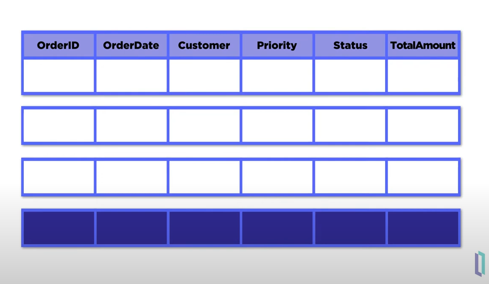
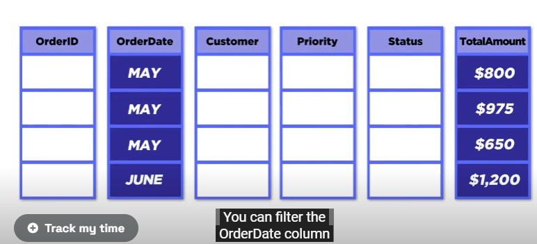
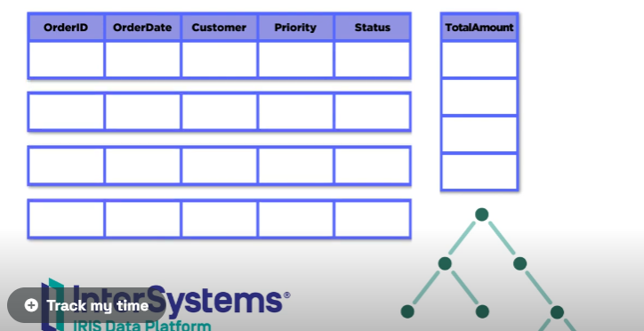

**NOSQL(not only sql) characteristics**  
- Scalability
- Availability, replication, and eventual consistency
- Replication models(Master-slave , Master-master)
- Sharding of files
- High performance data apcess(Hashing , Range partitioning)
- simple query only and constrian in the application not in the server like sql server 

Most NOSQL systems are **distributed databases** or **distributed storage systems**

**Strong consistency** guarantees that every read operation returns the latest write operation’s result, regardless of the node on which the read operation is executed. This is typically achieved using consensus algorithms like Paxos or Raft1.  
**Sequential consistency** implies that there is some order without any timing guarantees. For example, let’s say we have a system where nodes have some state machines and these machines process some events. In a sequentially consistent system, all these events have the same processing order - A,B,C,D - hence state machines execute exactly the same sequence. But if you ask a specific node about its state, you can get any of those, as there is no timing guarantee2.  
**Eventual consistency** guarantees that updates will propagate through the system and eventually be applied to all nodes, given enough time. In other words, if no new updates are made to a particular data item, eventually, all nodes will converge on the same value for that item. However, this may allow the system to have temporary inconsistencies  

**CAP theorem**  
Consistency, availability, and partition tolerance
- Not possible to guarantee all three simultaneously In distributed system with data replication

**Consistency** means that all the computers in the network have the same data at the same time. For example, if you update your profile picture on a social media app, consistency means that everyone who sees your profile will see the same picture, no matter which computer they use.  
**Availability** means that the system can respond to any request from the users, even if some of the computers in the network are not working. For example, if you send a message to your friend on a chat app, availability means that your friend will receive your message, even if some of the computers that handle the messages are down.  
**Partition tolerance** means that the system can continue to work even if there are problems with the network connections between the computers. For example, if you are watching a video on a streaming app, partition tolerance means that you can still watch the video, even if some of the computers that deliver the video are disconnected from each other.

------
## columnar database 

| Feature          | Columnar Database                                      | Row Database                                         |
|------------------|--------------------------------------------------------|------------------------------------------------------|
| **Data Storage**     | Stores data by columns.                                | Stores data by rows.                                 |
|Data Block Usage  |Each data block holds column field values for multiple rows.	|Data blocks store values sequentially for each consecutive column, making up the entire row.	|
|Block Size vs. Record Size|Columnar storage allows each data block to hold column field values for as many as three times the number of records compared to row-based storage		|If the block size is smaller than the size of a record, storage for an entire record may span(divide) multiple blocks. Conversely, if the block size is larger than the record size, it results in inefficient use of disk space..|
| **Speed**            | Fast for reading and analyzing specific columns of data. | Fast for adding, updating, or deleting rows of data. |
|**Use Case**         | Ideal for analytical queries(data warehouse) where specific columns are accessed. | Suited for transactional processing(OLTP) with frequent row-level updates. |
| I/O Operations   | Requires fewer I/O operations for column-specific queries. | Requires more I/O operations for full-row retrievals. |
| Compression      | Can compress data more efficiently due to similar data in columns. | Less efficient compression as rows contain varied data types. |
| Indexing         | Often requires less indexing.                          | Often heavily indexed to optimize performance.       |
| Memory Efficiency     |Retrieving and storing data in memory benefits from columnar storage, requiring a fraction(less) of the I/O operations.                              |  |
| **Advantages**   | - Efficient for read-heavy **analytical** queries **because you’re only working with a few columns** <br> - High compression ratios due to **similar data type in columns**<br>- Less I/O for column-specific operations **because you’re only working with a few columns**<br>- Better performance for queries involving large datasets | - Efficient for write-heavy **transactional** workloads<br>- Quick at adding, updating, or deleting rows of data<br>- Better suited for OLTP (Online Transaction Processing) systems |
| **Disadvantages**| - Not optimal for frequent inserts and updates<br>- Deletes require tombstones, affecting compression<br>- Inserts require row reconstruction              | - Slower for analytical queries that only need specific columns<br>- More I/O for full-row retrievals<br>- Less efficient compression as rows contain varied data types |


**use case example** 
- Consider a company that keeps **data for all orders** it receives using row-based storage,tracking data such as the OrderlD, OrderDate, Customer,Priority, Status, and TotalAmount.  
- Each row of data logically corresponds to an **order(transaction)**,and all data in a single row is physically stored together.
- This model makes it easy to quickly add or update orders.Orders can be added one at a time,and each database write corresponds to exactly one row.With transactions like this, there is no need to access or update any data in the table except the row you are changing.

  

- Say the company wants to find the average earnings per sale in each month For this, you would only need the information from two columns:OrderDate and TotalAmount.(However, with row-based storage, you must retrieve all the data for each order to get this information.if you use an index on the order date column you would still need to read the full Row for each order within the date range to get the total amount with a large number of orders this can be very inefficient).  
- this is where columnar storage comes into play **rather than storing data together by row data is stored together by column** logically the table and the associations between the data remain the same it is only the physical storage method that changes.



nterSystems IRIS allows for a flexible data storage approach by using globals, which can store data in both row-based and columnar formats. **This means you can choose to store specific data**   
- like the total amount, in columnar storage for quick analytical queries
- while other data, such as priority and status that may change frequently, can be stored in row format for fast transactional updates.
- Implementing columnar storage is straightforward: simply add storage type = columnar to your table definition. This won’t affect how you query your data, enabling you to perform fast analytics immediately after setting up your table with columnar storage.


----------

# MongoDB Cheat Sheet

## Show All Databases

```
show dbs
```

## Show Current Database

```
db
```

## Create Or Switch Database

```
use acme
```

## Drop

```
db.dropDatabase()
```

## Create Collection

```
db.createCollection('posts')
```

## Show Collections

```
show collections
```

## Insert Row

```
db.posts.insert({
  title: 'Post One',
  body: 'Body of post one',
  category: 'News',
  tags: ['news', 'events'],
  user: {
    name: 'John Doe',
    status: 'author'
  },
  date: Date()
})
```

## Insert Multiple Rows

```
db.posts.insertMany([
  {
    title: 'Post Two',
    body: 'Body of post two',
    category: 'Technology',
    date: Date()
  },
  {
    title: 'Post Three',
    body: 'Body of post three',
    category: 'News',
    date: Date()
  },
  {
    title: 'Post Four',
    body: 'Body of post three',
    category: 'Entertainment',
    date: Date()
  }
])
```
## Find Statment
   - The `query` parameter is an object that defines conditions for matching documents.
   - Common query operators include:
     - **`$gt`**, **`$lt`**, **`$gte`**, **`$lte`**: Greater than, less than, greater than or equal, less than or equal.
     - **`$in`**, **`$nin`**: Matches values within or not within an array.
     - **`$or`**, **`$and`**, **`$not`**: Logical operators for combining conditions.

  - The `projection` parameter specifies which fields to include (or exclude) in the result.
  - Use `1` to include a field and `0` to exclude it.
``` JS
db.users.find({ age: { $gt: 18 } }, { name: 1, age: 1 })  // Shows only name and age fields
```
## Get All Rows

```
db.posts.find()
```

## Get All Rows Formatted

```
db.posts.find().pretty()
```

## Find Rows

```
db.posts.find({ category: 'News' })
```

## Sort Rows

```
# asc
db.posts.find().sort({ title: 1 }).pretty()
# desc
db.posts.find().sort({ title: -1 }).pretty()
```

## Count Rows

```
db.posts.find().count()
db.posts.find({ category: 'news' }).count()
```

## Limit Rows

```
db.posts.find().limit(2).pretty()
```

## Chaining

```
db.posts.find().limit(2).sort({ title: 1 }).pretty()
```

## Foreach

```
db.posts.find().forEach(function(doc) {
  print("Blog Post: " + doc.title)
})
```

## Find One Row

```
db.posts.findOne({ category: 'News' })
```

## Find Specific Fields

```
db.posts.find({ title: 'Post One' }, {
  title: 1,
  author: 1
})
```
## update statment

## the parameter it take 
```javascript
db.posts.update(
  { title: 'Post Two' },                   // filter
  { $inc: { likes: 5 } },                  // update
  { multi: true, upsert: false }           // options
)
```

### 1. `filter` (or `query`)

The first parameter is the filter, which specifies the criteria to find the document(s) to update. It is typically an object with key-value pairs defining the fields to match. For example:

```javascript
{ title: 'Post Two' }
```

This filter targets documents where the `title` field equals `"Post Two"`. You can use complex conditions with operators like `$gt`, `$lt`, `$in`, etc.

### 2. `update` (or `update operations`)

The second parameter defines the modifications to apply to the matched documents. This can include update operators like `$set`, `$inc`, `$unset`, etc. Examples:

- **`$set`**: Sets the value of a field. If the field doesn’t exist, it will create it.
  ```javascript
  { $set: { title: "New Title" } }
  ```

- **`$inc`**: Increments a field by a specified amount.
  ```javascript
  { $inc: { likes: 1 } }
  ```

- **`$unset`**: Removes a field from the document.
  ```javascript
  { $unset: { dislikes: "" } }
  ```

### 3. `options` (third parameter)

This is an optional parameter that allows you to specify additional options to control the behavior of the `update` operation. Some common options are:

- **`multi`** (boolean): Updates multiple documents that match the filter criteria instead of just the first one. The default is `false`.
  ```javascript
  { multi: true }
  ```

- **`upsert`** (boolean): If set to `true`, MongoDB will insert a new document if no document matches the filter. The new document will contain fields from the filter and the update operation. The default is `false`.
  ```javascript
  { upsert: true }
  ```

- **`arrayFilters`** (array): Specifies filters for updating specific elements in an array when using positional update operators (`$[]` or `$[<identifier>]`). This is helpful for nested arrays.
  ```javascript
  { arrayFilters: [{ "elem.age": { $gt: 18 } }] }
  ```
## Update Row

```
db.posts.update({ title: 'Post Two' },
{
  title: 'Post Two',
  body: 'New body for post 2',
  date: Date()
},
{
  upsert: true
})
```

## Update Specific Field

```
db.posts.update({ title: 'Post Two' },
{
  $set: {
    body: 'Body for post 2',
    category: 'Technology'
  }
})
```

## Increment Field (\$inc)

```
db.posts.update({ title: 'Post Two' },
{
  $inc: {
    likes: 5
  }
})
```
 - This means that MongoDB should increment the `likes` field in the matched document by `5`. If the document already has a `likes` field (e.g., `likes: 3`), it will increase to `8`. If the field does not exist, MongoDB will add `likes` with a value of `5`.


## Rename Field

```
db.posts.update({ title: 'Post Two' },
{
  $rename: {
    likes: 'views'
  }
})
```

## Delete Row

```
db.posts.remove({ title: 'Post Four' })
```

## Sub-Documents

```
db.posts.update({ title: 'Post One' },
{
  $set: {
    comments: [
      {
        body: 'Comment One',
        user: 'Mary Williams',
        date: Date()
      },
      {
        body: 'Comment Two',
        user: 'Harry White',
        date: Date()
      }
    ]
  }
})
```
- if the Comments field does not exist, it will create it. The `comments` array includes two objects 

## Find By Element in Array (\$elemMatch)
  - `$elemMatch` is a MongoDB operator used to match specific elements within an array. It ensures that at least one element within the array meets the defined conditions.
  - Without `$elemMatch`, MongoDB would check each element in the `comments` array separately and may only return documents where *all* conditions are met across the array. `$elemMatch` is useful when you want to find documents with at least one array element that meets specific criteria.
```
db.posts.find({
  comments: {
     $elemMatch: {
       user: 'Mary Williams'
       }
    }
  }
)
```

## Add Index

```
db.posts.createIndex({ title: 'text' })
```

## Text Search

```
db.posts.find({
  $text: {
    $search: "\"Post O\""
    }
})
```

## Greater & Less Than

```
db.posts.find({ views: { $gt: 2 } })
db.posts.find({ views: { $gte: 7 } })
db.posts.find({ views: { $lt: 7 } })
db.posts.find({ views: { $lte: 7 } })
```

# pipline

In MongoDB, an **aggregation pipeline** is a way to process data in stages, similar to an assembly line. Each stage transforms the data, then passes it to the next stage. By the end of the pipeline, you get results that are shaped and filtered according to all the steps along the way.

### Basic Structure of a Pipeline

The structure of a pipeline in MongoDB looks like this:

```javascript
db.collection.aggregate([
  { <stage1> },
  { <stage2> },
  { <stage3> },
  // Add more stages as needed
])
```

Each **stage** is represented by a different operator, like `$match`, `$group`, or `$sort`, and each operator transforms the data in a specific way.

### Common Pipeline Stages

Let’s go through the most common stages in the pipeline:

1. **`$match`**: Filters documents to pass only those that meet certain conditions.
   - Example: `{ $match: { status: "active" } }`
   - This stage works like a `WHERE` clause in SQL, limiting the data to only what’s relevant.

2. **`$group`**: Groups documents together to perform calculations, like sums or averages.
    #### Basic Syntax
    ```javascript
    db.collection.aggregate([
      { 
        $group: { 
          _id: <expression>,           // Specifies the field(s) to group by
          <field1>: { <accumulator1> }, // Defines aggregated fields and accumulators
          <field2>: { <accumulator2> }
        } 
      }
    ])
    ```

    - **`_id`**: This field represents the grouping key. It can be a single field, multiple fields, or even an expression. Using `null` as `_id` groups all documents into a single group.
    - **Accumulator Expressions**: These are functions that calculate values for each group, such as `$sum`, `$avg`, `$min`, `$max`, `$push`, and `$addToSet`.

    ### Common Accumulator Operators

    - **`$sum`**: Calculates the total sum of a field within each group.
    - **`$avg`**: Calculates the average of a field.
    - **`$min`** / **`$max`**: Finds the minimum or maximum value of a field.
    - **`$push`**: Adds values to an array for each group.
    - **`$addToSet`**: Adds unique values to an array for each group (like a set).

    ### Example of `$group`


    Let’s say you have a `sales` collection with documents like this:

    ```javascript
    { item: "apple", quantity: 5, price: 10 }
    { item: "banana", quantity: 7, price: 15 }
    { item: "apple", quantity: 3, price: 10 }
    ```

    To find the total quantity sold for each item:

    ```javascript
    db.sales.aggregate([
      { 
        $group: { 
          _id: "$item",                             // Group by `item`
          totalRevenue: { $sum: { $multiply: ["$price", "$quantity"] } }, // Calculates total revenue
          avgPrice: { $avg: "$price" }              // Calculates average price
        } 
      }
    ])
    // result 
    { _id: "apple", totalRevenue: 80, avgPrice: 10 }
    { _id: "banana", totalRevenue: 105, avgPrice: 15 }


    // OR group all documnet together 
    db.sales.aggregate([
      { 
        $group: { 
          _id: null,                       // Group all documents together
          totalQuantity: { $sum: "$quantity" }
        } 
      }
    ])

    // result 
    { _id: null, totalQuantity: 15 }

    ```

3. **`$project`**: Selects specific fields to include or exclude in the results, or creates new fields.
   - Example: `{ $project: { name: 1, total: 1, avgScore: { $avg: "$scores" } } }`
   - This is like selecting specific columns in SQL and lets you shape the final output by adding, renaming, or transforming fields.

4. **`$sort`**: Sorts the documents based on one or more fields.
   - Example: `{ $sort: { date: -1 } }`
   - Sorts the results in ascending (`1`) or descending (`-1`) order based on specified fields.

5. **`$limit`**: Limits the number of documents that pass through.
   - Example: `{ $limit: 5 }`
   - This is like setting a row limit in SQL, returning only a fixed number of results.

6. **`$skip`**: Skips a specified number of documents, useful for pagination.
   - Example: `{ $skip: 10 }`
   - Works with `$limit` to paginate results (e.g., skip the first 10 results, then limit to 5).

### Example Pipeline

Let’s put it all together with an example. Suppose you want to find the top 3 most expensive products in a certain category, only if they are in stock.

```javascript
db.products.aggregate([
  { $match: { category: "Electronics", inStock: true } },  // Stage 1: Filter
  { $sort: { price: -1 } },                                // Stage 2: Sort by price (descending)
  { $limit: 3 },                                           // Stage 3: Limit to top 3
  { $project: { name: 1, price: 1, _id: 0 } }              // Stage 4: Select fields to display
])
```

#### What Each Stage Does Here:

1. **`$match`**: Filters only electronics that are in stock.
2. **`$sort`**: Sorts those products by price, from highest to lowest.
3. **`$limit`**: Limits the results to the top 3 most expensive products.
4. **`$project`**: Selects only the `name` and `price` fields to show in the final result.

### Why Use Pipelines?
  - **Efficiency**: Each stage only processes data passed down to it, making large transformations manageable.
  - **Flexibility**: You can build complex data queries by chaining multiple stages, filtering, aggregating, and transforming data.
  - **Scalability**: Pipelines work directly within MongoDB, leveraging its performance to process large datasets quickly.


### 7. **`$unwind`** 
- It breaks down an array field into multiple documents, each containing one element from the array.
### Example

Suppose we have a `posts` collection, and each post has a `comments` array with multiple comments:

```javascript
{
  title: "Post One",
  comments: [
    { user: "Alice", body: "Great post!" },
    { user: "Bob", body: "Very informative." }
  ]
}
```

If we run:

```javascript
db.posts.aggregate([
  { $unwind: "$comments" }
])
```

### Result

This will transform the document with multiple comments into separate documents, like this:

```javascript
{
  title: "Post One",
  comments: { user: "Alice", body: "Great post!" }
}
{
  title: "Post One",
  comments: { user: "Bob", body: "Very informative." }
}
```
### Practical Use Cases for `$unwind`
- **Analyzing Individual Array Elements**: For example, if each document represents an order with an array of items, `$unwind` lets you analyze each item independently.
- **Filtering Array Elements**: After unwinding, you can apply filters to work with specific elements within arrays.
- **Grouping and Aggregating**: Use `$unwind` before `$group` to perform aggregations on each element within an array (e.g., counting occurrences of each item type across all orders).

### Advanced Usage with $unwind
```javascript
{ 
  $unwind: { 
    path: "$comments",           // The array field to unwind
    preserveNullAndEmptyArrays: true  // Optional: keeps documents without the array
  }
}
```

- **`path`**: Specifies the array field to unwind.
- **`preserveNullAndEmptyArrays`**: When set to `true`, it keeps documents without the array field or with an empty array, returning them as they are.

### Example Scenario

Suppose you have the following documents in the `posts` collection:

```javascript
{
  title: "Post One",
  comments: [
    { user: "Alice", body: "Great post!" },
    { user: "Bob", body: "Very informative." }
  ]
},
{
  title: "Post Two",
  comments: []  // Empty comments array
},
{
  title: "Post Three"
  // No comments field
}
```

Using this pipeline:

```javascript
db.posts.aggregate([
  {
    $unwind: {
      path: "$comments",
      preserveNullAndEmptyArrays: true
    }
  }
])
```
### Result
```js
{
  title: "Post One",
  comments: { user: "Alice", body: "Great post!" }
}
{
  title: "Post One",
  comments: { user: "Bob", body: "Very informative." }
}
{
  title: "Post Two",
  comments: []  // Preserved as-is because of `preserveNullAndEmptyArrays: true`
}
{
  title: "Post Three"
  // Preserved as-is because of `preserveNullAndEmptyArrays: true`
}
```