**Candidate Key** A key is a column or set of columns in a table that uniquely identifies each row in that table. It helps in organizing and retrieving data efficiently. There can be multiple keys in a table, but typically, one of them is chosen as the primary key It is often the least number of columns of the keys and less data type.  

**Primary Key**  is a special type of key in a relational database. It **uniquely identifies each record (row)** in a table and ensures that there are no duplicate values in the primary key column(s). 
Key characteristics of a primary key:
1. Must contain unique values (no duplicates).
2. Cannot have NULL values (every row must have a value for the primary key).
3. Uniquely identifies each row in the table.

**Foreign Key** A foreign key is a column or a set of columns in a table that refers to the primary key of another table. <u>And it will be subset from the primary key</u>. It establishes a link between two tables, creating a relationship between them. The foreign key constraints ensure that the data in the foreign key column(s) of one table matches the data in the primary key column(s) of another table. This enforces referential integrity in the database.
Key characteristics of a foreign key:
1. It references the primary key of another table.
2. It helps maintain referential integrity, preventing orphaned records.
3. It can have NULL values, allowing for optional relationships (if specified as NULLable). + and can be duplicated.  

**ON UPDATE/ON delete >> NO ACTION the default behavior of the sql server ,The table that contain primary key is parent and the table that contain foreign key is child we can't remove  data from parent that have child.**  

**When you create a relationship between two tables, you can specify the actions that should occur when records in the referenced (parent) table are affected by an UPDATE or DELETE operation. These actions are defined through the ON UPDATE and ON DELETE clauses**  
1. **ON UPDATE CASCADE**:This option means that if a primary key value in the referenced table (parent) is updated, the corresponding foreign key values in the referencing table (child) will also be updated to match the new primary key value.  
```sql
CREATE TABLE ParentTable (
    ParentID INT PRIMARY KEY
);

CREATE TABLE ChildTable (
    ChildID INT PRIMARY KEY,
    ParentID INT FOREIGN KEY REFERENCES ParentTable(ParentID) ON UPDATE CASCADE
);
```
2. **ON UPDATE SET NULL**:This option means that if a primary key value in the referenced table is updated, the corresponding foreign key values in the referencing table will be set to NULL. This is useful when you want to allow records in the child table to exist independently of the referenced table.    
```sql
CREATE TABLE ParentTable (
    ParentID INT PRIMARY KEY
);

CREATE TABLE ChildTable (
    ChildID INT PRIMARY KEY,
    ParentID INT FOREIGN KEY REFERENCES ParentTable(ParentID) ON UPDATE SET NULL
);
```  
2. **ON UPDATE SET Default**:The SET DEFAULT option specifies that, if the referenced values in the parent table are updated or deleted, the related values in the child table with foreign key columns will be set to their default values1. The default value is the value that is assigned to the column when a new row is inserted and no value is specified for that column    
```sql
CREATE TABLE Products (
  ProductID int PRIMARY KEY,
  ProductName varchar(50) NOT NULL,
  Category varchar(20) DEFAULT 'Others' NOT NULL -- should make default value if you wnat to use  SET Default
);
INSERT INTO Products (ProductID, ProductName, Category)
VALUES
(1, 'Laptop', 'Electronics'),
(2, 'Book', 'Books'),
(3, 'Pen', 'Stationery');

CREATE TABLE Orders (
  OrderID int PRIMARY KEY,
  CustomerName varchar(50) NOT NULL,
  ProductID int FOREIGN KEY REFERENCES Products(ProductID) ON UPDATE SET DEFAULT ON DELETE SET DEFAULT
);

UPDATE Products
SET ProductID = 4
WHERE ProductID = 1;
```  
*****

 ## SQL language

| DDL (Data Definition Lang) | DML (Data Manipulation lang) | DQL (Data Query lang) | TCL (Tansactionl Control Lang) | DCL (Data Control Lang) |
| -------- | -------- | -------- | -------- | -------- |
| Create, Alter, Drop, Select into | Insert, update, delete, merge | SELECT + agg fun, grouping join union subqery| begin transaction, commit, rollback | Grant, deny, Revoke |

char(2):static يعنى هيحجز 2 فى الميمورى لو حطيت واحد هياخدد اتنين بردو      
VARCHAR(24):variable يعنى هيحجز 24 فى الميمورى لو حطيت واحد هياخدد واحد بس
### DDL (meta data (information about information))
- **CREATE**
```sql
CREATE TABLE Persons (
    id INT IDENTITY(1,1) PRIMARY KEY,
    name VARCHAR(24)
);
```
**identity vs Sequence Object**  
**identity**: Use an Identity column when you need a unique, automatically incremented value for each row in a specific table. usualy used in primary key.  
**Sequence Object**: Sequence Object is a database object that generates a sequence of numerical values according to a defined pattern. It's essentially a generator of sequential numbers that can be used for various purposes within a database.  
1- Sequential Number Generation: A Sequence Object generates a sequence of numeric values in ascending or descending order, following a specified pattern.  
2- Defined **Range** and Increment: When creating a Sequence Object, you can specify the starting value, the increment value (how much to increase or decrease by), the minimum and maximum values, and whether the sequence should cycle or not (restart from the beginning after reaching the maximum or minimum value).  
3- **Independence** from Tables: Unlike auto-increment columns in tables, a Sequence Object is independent of any specific table. It generates sequential numbers separately from the data in the database and **can be used across multiple tables or even databases**.  
4-Usage Scenarios: Sequence Objects are handy when you need to generate unique identifiers for rows in a table, create a series of numbers for various purposes (such as invoice numbers, order numbers, or unique keys), or **maintain a specific sequence** for specific operations without relying on the data in a table.  

```sql
--Create Sequence Object 
Create SEQUENCE MySequence
START WITH 1
INCREMENT BY 1
MinValue 1
MaxValue 5
CYCLE; --default
-- you can reset you sequence easly
alter SEQUENCE MySequence
ReSTART WITH 1 --changed from start to restart
INCREMENT BY 1
CYCLE; --default  

drop SEQUENCE MySequence 

-- Create Temp Table the sequence can be used across multiple tables or even databases
create TABLE person1
(ID int,
FullName nvarchar(100) NOT NULL);

create TABLE person2
(ID int,
FullName nvarchar(100) NOT NULL);

INSERT into person1
VALUES (NEXT VALUE FOR MySequence, 'ahmed')

INSERT into person2
VALUES (NEXT VALUE FOR MySequence, 'ahmed1')
```

- **tables**  
**table variable** 
it run on the level of batch only (you should select it to get known with remained selected query )   
table variables don't affected by db transactions and Triggers  
```sql 
USE tempdb
go
CREATE TABLE test1 (id int)
go
DECLARE @test2 TABLE(id int)
BEGIN TRANSACTION
	INSERT INTO test1 VALUES(1)
	INSERT INTO @test2 VALUES(2)
ROLLBACK
	SELECT * FROM test1
	SELECT * FROM @test2
```
**global temp tables**
```sql
--2)
------shared by all users per server (session ends when all users that connect to server using this table disconnect from server )

create table ##share_table
(
sid int 
)
--droping
drop table ##share_table
```    
**local table (session based)**
```sql 
--until session ends when you disconnect from server
--use any database
create table #session
(
sid int
)
insert into #session values(1)
select * from #session
--droping
drop table #session
--Disconnecting server "end session"
```

-----
- **ALTER**
The ALTER statement is used to **modify the structure of database objects** such as tables, views, indexes, and more. **Add or remove columns**, **Modify the data type of columns**, A**dd or remove keys**, **Add or remove constraints**.
```sql
ALTER TABLE author
ADD telephone_number BIGINT; -- he add by default column

ALTER TABLE author
ALTER(Modify) COLUMN telephone_number CHAR(20);

ALTER TABLE author
DROP COLUMN telephone_number;
```
-----
- **DROP**
It delete the table can't rollback as it DDL **it Modify the structure of database objects**
```SQL
DROP TABLE <table name>;
```
-----
- **TRUNCATE**
The TRUNCATE statement is used to remove all rows from a table or Column, effectively resetting the table to its initial state(reset identity to its intial state from 1 not like delete statment)
TRUNCATE does not support a WHERE clause or the ability to delete specific rows based on a condition.
```sql
TRUNCATE TABLE author
IMMEDIATE;
```
-----
### DML 
- **INSERT**
```SQL
INSERT INTO AUTHOR (AUTHOR_ID, LASTNAME, FIRSTNAME, EMAIL, CITY, COUNTRY)
VALUES ('A1', 'Chong', 'Raul', 'rfc@ibm.com', 'Toronto', 'CA'),('A2', 'Chongg', 'Raulll', 'abc@ibm.com', 'torot', 'Ch');
```
**INSERT INTO SELECT:to copy only the schema from another table**
```SQL
iNSERT INTO new_student_table   -- it need the table to be created before
SELECT * FROM student;
WHERE 1 = 0;
`OR`
SELECT *
INTO new_student_table  -- into it will creat new table 
FROM student
WHERE 1 = 0;

-- When creating a table using SELECT INTO, the rows are inserted in no particular order, regardless of any ORDER BY clause in the query.


-- TO Update the content of the table as if i run the above query again it will give me error as it already exist
IF OBJECT_ID('new_student_table','U') IS NOT NULL
    DROP TABLE new_student_table;
GO
SELECT *
INTO new_student_table  -- into it will creat new table 
FROM student

```
 **BULK INSERT statement to insert data from a file into a table**
```sql
 BULK INSERT SampleTable
FROM 'C:\path\to\data.txt'
WITH (
    FIELDTERMINATOR = ',', --FIELDTERMINATOR: Specifies the field terminator that separates the fields in the data file (e.g., comma, tab, etc.)
    ROWTERMINATOR = '\n',  --Specifies the row terminator that separates the rows in the data file (e.g., newline character).
    FIRSTROW = 2,  -- Skip the first row if it contains headers
    MAXERRORS = 0  -- Maximum number of errors allowed
);
```
**INSERT bassed on execute**
```sql 
--insert bassed on execute
create proc GetStbyAge @agel int,@age2 int
AS
    select st_id,st_fname
    from Student
    where st_age betw een @agel and @age2

insert into tab4 (st_id, st_fname)
execute GetStbyAge 23, 28  -- you should write execute
```

----
- **UPDATE**
```SQL
UPDATE AUTHOR
SET LASTNAME = 'KATTA',
    FIRSTNAME = 'LAKSH'
WHERE AUTHOR_ID = 'A2';   مهمه جدا مع الUPDATA  , DELETEE    

-- Update Using JOIN:
UPDATE e
SET e.employee_name = 'n/a'
FROM Employees e
JOIN Departments d ON e.department_id = d.department_id
WHERE d.department_name = 'Sales';
```   
**delete the data in a specific column of a table without removing the column's schema**
```SQL
UPDATE student
SET address = NULL;
```
---
- **Delete**  
- DELETE is a row-by-row operation and supports a WHERE clause to specify which rows to delete.  
- DELETE can be rolled back within a transaction, while TRUNCATE cannot becuse it doesn't affect the structure of the table.   
- can't delete column using delete.   
- DELETE can fire triggers, while TRUNCATE usually doesn't.  
```sql
DELETE FROM AUTHOR
WHERE AUTHOR_ID IN ('A2', 'A3');  'or'

-- Delete Using JOIN: Remove rows from one table based on related records in another table using a JOIN.
DELETE e
FROM Employees e
JOIN Departments d ON e.department_id = d.department_id
WHERE d.department_name = 'Sales';
-- All employees who work in the "Sales" department will be deleted. The JOIN ensures that only related records are targeted.

--Delete with OUTPUT: Capture the rows that are deleted and store them elsewhere for audit or logging purposes.
DELETE FROM Employees
OUTPUT DELETED.employee_id, DELETED.email INTO DeletedEmployees;
-- The rows deleted from the Employees table are also inserted into the DeletedEmployees table for tracking.
```
- **Merge** 
In SQL Server, the MERGE statement is a powerful SQL operation that allows you to perform multiple DML (Data Manipulation Language) operations—such as INSERT, UPDATE, and DELETE—on a **target table** in a single statement, based on the comparison of the data in the target table with a **source table** or subquery. It's also known as an "upsert" operation, as it combines INSERT and UPDATE actions.

```sql
Merge into Last Trasaction as T
Using Daily Transaction as S
On T.id = S.did

when Matched and S.dval>T.myvalues then   //1
update
Set T.myvalue=S.dval

When Not Matched by target then  //10 -- exist on source and not exist on target 
insert
values(S.did,S.dname,s.dval)

when not Matched by Source then //3,4 -- exist on target and not exist on source
Delete;
```
 Last transaction (target after edit)
 | Id | Name | myvalue |
| ---- | ----- | ------|
| 1 | ahmed |4000 -9000 |
| 2 | ali | 2000 |
| 3 | omar | 6000 |
| 4 | eman | 7000 |
|- 10 |- nada |- 3000 |

 Daily transaction (source)
 | Did | Dname | Dval |
| ---- | ----- | ------|
| 1 | ahmed |9000 |
| 2 | ali | 1000 |
|10 |nada |3000 |
---
### DQL
- Note: **where** filter on the rows it minimizes the number of **rows** but **having** filter on the group it minimize the number of the **groups** 
 ```SQL
 USE KxP_store; -- Open a specific database
--make new column and name it discount factor making this operation
SELECT DISTINCT last_name, first_name, points, (points + 10) * 100 AS "discount factor" --make new column and name it discount factor making this operation
FROM customers

WHERE state NOT IN ('VA' ,'GA', 'FL')                       --it is like OR
WHERE points BETWEEN 1000 AND 3000                          --it is like AND when it is one value, inclusive it is includes both 1000 and 3000
                                                                                         '--%mean any number of characters'
                                                                                         '_mean single character'--'b____y' it is like boagey
WHERE last_name LIKE 'aie%'                                    --'b%'  it gives name start with b --'%b%'  it gives name contain  b at any position
WHERE last_name LIKE '%[aei]e%'                              -- '%b'  it gives name end with b - 
WHERE last_name LIKE '%[a-h]e%'                              --'%[aei]e%' search ae,ee,ie  --'%[a-h]e%' search all range
WHERE last_name LIKE '%[^aei]e%'                                -- ^ it mean not will start with a or e or i
WHERE last_name LIKE '%[^a-h]e%'   
WHERE last_name LIKE '%[_]%'                                 -- it give Dina_abdallah as the _mean single character by default so to make the sql understand it as _ we use []
WHERE phone IS not NULL                                          -- we don't use = as null is not a value

ORDER BY first_name asc                                                    --ترتيب تنازلى من الاكبر  للاصغر  
ORDER BY first_name DESC  
ORDER BY statee , first_name                                          --هيرتب على حسب الاستيت عادى انما لو لقى متشابه هيرتب على حسب الاسم 
ORDER BY quantity * unit_price DESC
 ```
 ## Pagination
 Pagination is often implemented using the `OFFSET` and `FETCH` clauses in SQL Server, which allow you to skip a certain number of rows and retrieve a specific number of rows from the result set.    
 ```sql
DECLARE @PageNumber INT = 3;
DECLARE @RowsPerPage INT = 10;

SELECT ProductID, ProductName, Price, StockQuantity
FROM Products
ORDER BY ProductID
OFFSET (@PageNumber - 1) * @RowsPerPage ROWS
FETCH NEXT @RowsPerPage ROWS ONLY;

```

- **`OFFSET`**: Specifies how many rows to skip before starting to return rows( the starting point [index]). Calculates how many rows to skip. For page 3, you skip (3 - 1) * 10 = 20 rows.  
- **`FETCH NEXT`**: Specifies how many rows to return after the `OFFSET`.  

----

 **You need to include ALL the columns that aren't in aggregate functions in your GROUP BY:**
 ```SQL
 select country , count(country) as Count 
 from Author
 group by country
 having count (country) > 4
 ```
 OUTPUT 
 | Country | Count | 
| ------ | ------ |
| CN | 6 |
| IN | 6 |     

Write a query to print the hacker_id, name, and the total number of challenges created by each student. Sort your results by the total number of challenges in descending order. If more than one student created the same number of challenges, then sort the result by hacker_id. If more than one student created the same number of challenges and the count is less than the maximum number of challenges created, then exclude those students from the result.   

https://www.hackerrank.com/challenges/challenges/problem?isFullScreen=true  

<div style="display: flex; justify-content: space-between;">

| hacker_id | name |
| --- | --- |
| 5077 | Rose |
| 21283 | Angela |
| 62743 | Frank |
| 88255 | Patrick |
| 96196 | Lisa |

| challenge_id | hacker_id |
| --- | --- |
| 61564 | 5077 |
| 85803 | 2183 |
| 40587 | 82855 |
| 1220 | 5077 |
| 29477 | 2183 |
| 65514 | 67243 |
| 48651 | 82855 |
| 58077 | 67243 |
| 18483 | 82855 |
| 76768 | 2183 |
| 52832 | 5077 |
| 74467 | 91986 |
| 33625 | 82855 |
| 26059 | 42685 |
| 12859 | 67243 |
| 70094 | 21855 |
| 34559 | 82855 |
| 54680 | 5077 |
| 61881 | 5077 |
</div>

```sql
SELECT c.hacker_id, h.name, COUNT(c.challenge_id) AS cnt 
FROM Hackers AS h 
INNER JOIN Challenges AS c 
    ON h.hacker_id = c.hacker_id
GROUP BY c.hacker_id, h.name 

-- Calculating Maximum challenges
HAVING COUNT(c.challenge_id) = (SELECT MAX(number_of_challenges)
                                 FROM (SELECT c1.hacker_id, COUNT(c1.challenge_id) AS number_of_challenges
                                      FROM Challenges AS c1
                                      GROUP BY c1.hacker_id) AS challenge_counts)  
            OR
-- Number of challenges which are not equal to maximum challenges are excluded
COUNT(c.challenge_id) NOT IN (SELECT COUNT(c2.challenge_id) 
                              FROM Challenges AS c2 
                              GROUP BY c2.hacker_id 
                              HAVING c2.hacker_id <> c.hacker_id)

ORDER BY cnt DESC, c.hacker_id;

--another solution 
with cte as(select c.hacker_id,name,count(*) total_challenge
from challenges c
join hackers h on h.hacker_id=c.hacker_id
group by c.hacker_id,name)

,cte1 as(
select total_challenge,count(*) total,dense_rank() over(order by total_challenge desc) ranking
from cte 
group by total_challenge)

select hacker_id,name,cte.total_challenge
from cte
join cte1 on cte.total_challenge=cte1.total_challenge
where total=1 or ranking=1
order by cte.total_challenge desc,hacker_id
```

---
  
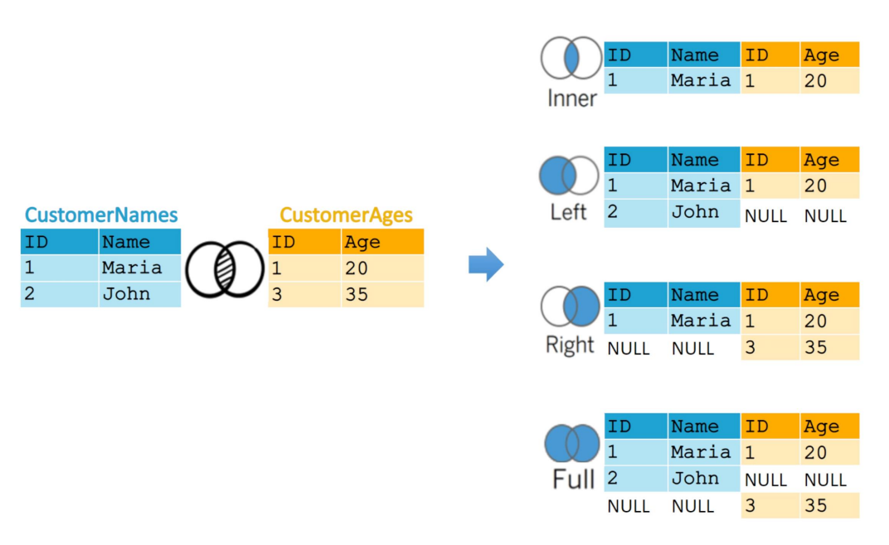 

- **join**  
**Inner Join**: Returns only the rows where there is a match in both tables.  
**Left outer Join**: Returns all the rows from the left table and matching rows from the right table.when he ask to return all the values from left table Regardless of whether there are corresponding values or not.   
**Right outer Join**: Returns all the rows from the right table and matching rows from the left table.  
**right anti join**: returns the rows from the right table that are not in the left table.  
**left anti join**: returns the rows from the left table that are not in the right table.  
**Full Outer Join**: Returns all the rows from both tables, including those where there is no match in either table.  
**Cross Join**: Returns all possible combinations of rows from both tables.  
**self join**:we consider the first row of the table is the left table and second row of the table is the right table to write the condition Easly with the above note .  
Since each row from the original table is matched with every row where the ID is the same, you get a duplication of rows. For example, if there are 4 rows with ID=1 in the original table, and 4 rows with ID=1 in the joined table, you'll get 16 rows in the result set (4x4=16). This multiplication of rows occurs for each unique ID in the original table.  
| **Join Type**       | **data exist at Left table Only**               | **data exist at Right table Only**             | **Duplicate Rows**                                                   |
| ------------------- | ------------------------------- | ------------------------------ | -------------------------------------------------------------------- |
| **INNER JOIN**      | Excluded                        | Excluded                       | Returns all matching combinations (Cartesian between duplicates)     |
| **LEFT JOIN**       | Included (with NULLs for right) | Excluded                       | Returns all matching combinations (Cartesian between duplicates) but it Includes unmatched left rows|
| **RIGHT JOIN**      | Excluded                        | Included (with NULLs for left) | Returns all matching combinations from left and right                |
| **FULL OUTER JOIN** | Included (with NULLs for right) | Included (with NULLs for left) | Returns all matching combinations and unmatched rows from both sides |
| **CROSS JOIN**      | Not applicable (no condition)   | Not applicable                 | Cartesian product of all rows in both tables                         |
| **SELF JOIN**       | Depends on condition            | Depends on condition           | Duplicates handled like normal joins—matches within the same table   |


````sql
Select order_id, c.customer_id, first_name    --select specific column
FROM orders o   -- the table comes after from and come first will be left table 
JOIN customers c -- the table comes after Join and come second will be Right table 
ON o.customer_id = c.customer_id
-- we Write the table name because the two column have the same name
````
**joining two tables that didn't have relation (primary and foreign key)**  

https://www.hackerrank.com/challenges/the-report/problem  
<div style="display: flex; justify-content: space-between;">

| ID | Name     | Marks |
|----|----------|-------|
| 1  | Julia    | 88    |
| 2  | Samantha | 68    |
| 3  | Maria    | 99    |
| 4  | Scarlet  | 78    |
| 5  | Ashley   | 63    |
| 6  | Jane     | 81    |

| Grade | Min_Mark | Max_Mark |
|-------|----------|----------|
| 1     | 0        | 9        |
| 2     | 10       | 19       |
| 3     | 20       | 29       |
| 4     | 30       | 39       |
| 5     | 40       | 49       |
| 6     | 50       | 59       |
| 7     | 60       | 69       |
| 8     | 70       | 79       |
| 9     | 80       | 89       |
| 10    | 90       | 100      |

</div>

```sql 
SELECT CASE WHEN g.Grade >= 8 THEN s.Name END AS Name, g.Grade , s.Marks
FROM students s 
JOIN grades g ON s.Marks BETWEEN g.Min_Mark AND g.Max_Mark   --- Nested loop join : it loop on all compination 
WHERE g.Grade IS NOT NULL 
ORDER BY g.Grade DESC, s.Name;

--my soultion
select case when gr>=8 then Name end,
gr,marks  
from (select  Name ,
 case when Marks between Min_Mark and Max_Mark then Grade end as gr,
 Marks
from grades ,students) as tb1
where gr is not null 
order by gr desc, Name
```   
Write a query to output the names of those students whose best friends got offered a higher salary than them. Names must be ordered by the salary amount offered to the best friends. It is guaranteed that no two students got same salary offer.  

https://www.hackerrank.com/challenges/placements/problem?isFullScreen=true  

<div style="display: flex; justify-content: space-between;">

| ID | Friend_ID |
| --- | --- |
| 1 | 2 |
| 2 | 3 |
| 3 | 4 |
| 4 | 1 |

| ID | Salary |
| --- | --- |
| 1 | 15.20 |
| 2 | 10.06 |
| 3 | 11.55 |
| 4 | 12.12 |

| ID | name |
| --- | --- |
| 1 | Ashley |
| 2 | Samantha |
| 3 | Julia |
| 4 | Scarlet |
</div>
output>>    
Samantha  
Julia  
Scarlet  

```sql 
select s.name from students s 
inner join packages p on s.id = p.id
inner join friends f on s.id=f.id
inner join packages fp on f.friend_id= fp.id
where fp.salary > p.salary
order by fp.salary;
--OR 
SELECTB S_NAME
FROM
    (
        SELECT
            STU.ID AS S_ID,
            STU.NAME AS S_NAME,
            PCK.SALARY AS S_SAL,
            FDS.FRIEND_ID AS F_ID
        FROM
            STUDENTS AS STU
            JOIN PACKAGES AS PCK ON PCK.ID = STU.ID
            JOIN FRIENDS AS FDS ON STU.ID = FDS.ID
    ) AS LV1
    JOIN (
        SELECT
            STUDENTS.ID S2_ID,
            STUDENTS.NAME F_NAME,
            PACKAGES.SALARY F_SAL
        FROM
            STUDENTS
            JOIN PACKAGES ON STUDENTS.ID = PACKAGES.ID
    ) AS LV2 ON LV1.F_ID = LV2.S2_ID
WHERE F_SAL > S_SAL
ORDER BY F_SAL
``` 


Write a solution to find the number of times each student attended each exam. Return the result table ordered by student_id and subject_name. The result format is in the following example.

https://leetcode.com/problems/students-and-examinations/description/?envType=study-plan-v2&envId=top-sql-50

Input: 
Students table:  


| student_id | student_name |  
|------------|--------------|  
| 1          | Alice        |  
| 2          | Bob          |  
| 13         | John         |  
| 6          | Alex         |  


Subjects table:  
 
| subject_name |  
|--------------|  
| Math         |  
| Physics      |
| Programming  |  
 

Examinations table:  

| student_id | subject_name |  
|------------|--------------| 
| 1          | Math         |  
| 1          | Physics      |  
| 1          | Programming  |  
| 2          | Programming  |  
| 1          | Physics      |  
| 1          | Math         |  
| 13         | Math         |  
| 13         | Programming  |  
| 13         | Physics      |  
| 2          | Math         |  
| 1          | Math         |  
 

Output:   

 
| student_id | student_name | subject_name | attended_exams |  
|------------|--------------|--------------|----------------| 
| 1          | Alice        | Math         | 3              |
| 1          | Alice        | Physics      | 2              |  
| 1          | Alice        | Programming  | 1              |  
| 2          | Bob          | Math         | 1              |
| 2          | Bob          | Physics      | 0              |  
| 2          | Bob          | Programming  | 1              |  
| 6          | Alex         | Math         | 0              |  
| 6          | Alex         | Physics      | 0              |  
| 6          | Alex         | Programming  | 0              |  
| 13         | John         | Math         | 1              |  
| 13         | John         | Physics      | 1              |  
| 13         | John         | Programming  | 1              |  
 

Explanation: 
The result table should contain all students and all subjects.
Alice attended the Math exam 3 times, the Physics exam 2 times, and the Programming exam 1 time.
Bob attended the Math exam 1 time, the Programming exam 1 time, and did not attend the Physics exam.
Alex did not attend any exams.
John attended the Math exam 1 time, the Physics exam 1 time, and the Programming exam 1 time.

```sql 
-- count >> it only count the values not null so if it is null it will return 0
SELECT s.student_id, s.student_name, sub.subject_name, COUNT(e.student_id) AS attended_exams
FROM Students AS s
CROSS JOIN Subjects AS sub
LEFT JOIN Examinations AS e ON s.student_id = e.student_id AND sub.subject_name = e.subject_name
GROUP BY s.student_id, s.student_name, sub.subject_name
ORDER BY s.student_id, sub.subject_name;

--OR 
WITH subject_cte AS(
    SELECT student_id,
        s.student_name,
        sb.subject_name
    FROM Students s
    CROSS JOIN Subjects sb
)
SELECT s.student_id, 
    s.student_name,
    s.subject_name,
    count(e.student_id) attended_exams
FROM subject_cte s 
LEFT JOIN Examinations e ON s.student_id = e.student_id AND s.subject_name = e.subject_name
GROUP BY s.student_id, 
    s.student_name,
    s.subject_name
ORDER BY 1,3


```
- **UNION**
The SELECT statements must have **the same number of columns**, and the corresponding columns in each SELECT statement must have **compatible data types**.  
UNION and UNION ALL are useful operators in SQL Server for combining the results of two or more SELECT statements into a single result set, with the main difference being that UNION removes duplicates and also sorts data while UNION ALL does not.
```SQL
SELECT column1, column2, ... FROM table1
UNION
SELECT column1, column2, ... FROM table2;

SELECT column1, column2, ... FROM table1
UNION ALL
SELECT column1, column2, ... FROM table2;
```
- **Advanced UNION example**  
for this below table like - how many matches were played by each player and in how many of these they batted and in how many of these they bowled.
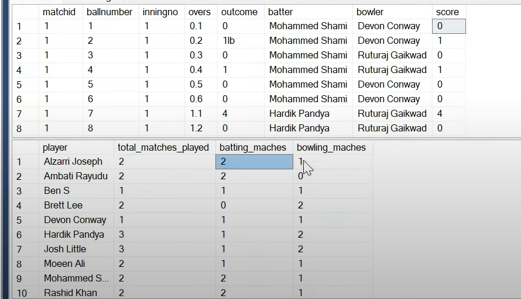 

```sql
CREATE TABLE cricket_match (
    matchid INT,
    ballnumber INT,
    inningno INT,
    overs DECIMAL(3,1),
    outcome VARCHAR(10),
    batter VARCHAR(50),
    bowler VARCHAR(50),
    score INT
);
INSERT INTO cricket_match VALUES(1,1,1,0.1,'0','Mohammed Shami','Devon Conway',0),(1,2,1,0.2,'1lb','Mohammed Shami','Devon Conway',1),(1,3,1,0.3,'0','Mohammed Shami','Ruturaj Gaikwad',0),(1,4,1,0.4,'1','Mohammed Shami','Ruturaj Gaikwad',1),(1,5,1,0.5,'0','Mohammed Shami','Devon Conway',0),(1,6,1,0.6,'0','Mohammed Shami','Devon Conway',0),(1,7,1,1.1,'4','Hardik Pandya','Ruturaj Gaikwad',4),(1,8,1,1.2,'0','Hardik Pandya','Ruturaj Gaikwad',0),(1,9,1,1.3,'4','Hardik Pandya','Ruturaj Gaikwad',4),(1,10,1,1.4,'1','Hardik Pandya','Ruturaj Gaikwad',1),(1,11,1,1.5,'1','Hardik Pandya','Devon Conway',1),(1,12,1,1.6,'1','Hardik Pandya','Ruturaj Gaikwad',1),(1,13,2,2.1,'1','Ruturaj Gaikwad','Mohammed Shami',1),(1,14,2,2.2,'w','Devon Conway','Mohammed Shami',0),(1,15,2,2.3,'0','Moeen Ali','Mohammed Shami',0),(1,16,2,2.4,'0','Moeen Ali','Mohammed Shami',0),(1,17,2,2.5,'0','Moeen Ali','Mohammed Shami',0),(1,18,2,2.6,'0','Moeen Ali','Mohammed Shami',0),(1,19,2,3.1,'6','Ruturaj Gaikwad','Josh Little',6),(1,20,2,3.2,'4','Ruturaj Gaikwad','Josh Little',4),(1,21,2,3.3,'1','Ruturaj Gaikwad','Josh Little',1),(1,22,2,3.4,'0','Moeen Ali','Josh Little',0),(1,23,2,3.5,'4','Moeen Ali','Josh Little',4),(1,24,2,3.6,'0','Moeen Ali','Josh Little',0),(2,1,1,4.1,'0','Mohammed Shami','Ruturaj Gaikwad',0),(2,2,1,4.2,'1','Mohammed Shami','Ruturaj Gaikwad',1),(2,3,1,4.3,'4','Mohammed Shami','Moeen Ali',4),(2,4,1,4.4,'1nb','Mohammed Shami','Moeen Ali',1),(2,5,1,4.4,'6','Mohammed Shami','Moeen Ali',6),(2,6,1,4.5,'4','Mohammed Shami','Moeen Ali',4),(2,7,1,4.6,'1','Mohammed Shami','Moeen Ali',1),(2,8,1,5.1,'0','Rashid Khan','Moeen Ali',0),(2,9,1,5.2,'0','Rashid Khan','Moeen Ali',0),(2,10,1,5.3,'0','Rashid Khan','Moeen Ali',0),(2,11,1,5.4,'4','Rashid Khan','Moeen Ali',4),(2,12,1,5.5,'w','Rashid Khan','Moeen Ali',0),(2,13,1,5.6,'1','Rashid Khan','Ben S',1),(2,14,2,6.1,'0','Ben S','Hardik Pandya',0),(2,15,2,6.2,'1','Ben S','Hardik Pandya',1),(2,16,2,6.3,'6','Ruturaj Gaikwad','Hardik Pandya',6),(2,17,2,6.4,'6','Ruturaj Gaikwad','Hardik Pandya',6),(2,18,2,6.5,'0','Ruturaj Gaikwad','Hardik Pandya',0),(2,19,2,6.6,'0','Ruturaj Gaikwad','Hardik Pandya',0),(2,20,2,7.1,'1','Ben S','Rashid Khan',1),(2,21,2,7.2,'1','Ruturaj Gaikwad','Rashid Khan',1),(2,22,2,7.3,'4','Ben S','Rashid Khan',4),(2,23,2,7.4,'w','Ben S','Rashid Khan',0),(2,24,2,7.5,'1','Ambati Rayudu','Rashid Khan',1),(2,25,2,7.6,'1','Ruturaj Gaikwad','Rashid Khan',1),(3,1,1,8.1,'6','Alzarri Joseph','Ruturaj Gaikwad',6),(3,2,1,8.2,'0','Alzarri Joseph','Ruturaj Gaikwad',0),(3,3,1,8.3,'0','Alzarri Joseph','Ruturaj Gaikwad',0),(3,4,1,8.4,'6','Alzarri Joseph','Ruturaj Gaikwad',6),(3,5,1,8.5,'0','Alzarri Joseph','Ruturaj Gaikwad',0),(3,6,1,8.6,'6','Alzarri Joseph','Ruturaj Gaikwad',6),(3,7,1,9.1,'0','Rashid Khan','Brett Lee',0),(3,8,1,9.2,'1','Rashid Khan','Brett Lee',1),(3,9,1,9.3,'1','Rashid Khan','Ruturaj Gaikwad',1),(3,10,1,9.4,'1','Rashid Khan','Brett Lee',1),(3,11,1,9.5,'0','Rashid Khan','Ruturaj Gaikwad',0),(3,12,1,9.6,'0','Rashid Khan','Ruturaj Gaikwad',0),(3,13,2,10.1,'0','Ambati Rayudu','Josh Little',0),(3,14,2,10.2,'0','Ambati Rayudu','Josh Little',0),(3,15,2,10.3,'0','Ambati Rayudu','Josh Little',0),(3,16,2,10.4,'1','Ambati Rayudu','Josh Little',1),(3,17,2,10.5,'0','Ruturaj Gaikwad','Josh Little',0),(3,18,2,10.6,'6','Ruturaj Gaikwad','Josh Little',6),(3,19,2,11.1,'1','Ambati Rayudu','Yash Dayal',1),(3,20,2,11.2,'0','Ruturaj Gaikwad','Yash Dayal',0),(3,21,2,11.3,'6','Ruturaj Gaikwad','Yash Dayal',6),(3,22,2,11.4,'0','Ruturaj Gaikwad','Yash Dayal',0),(3,23,2,11.5,'1','Ruturaj Gaikwad','Yash Dayal',1),(3,24,2,11.6,'6','Ambati Rayudu','Yash Dayal',6),(4,1,1,12.1,'1','Josh Little','Ruturaj Gaikwad',1),(4,2,1,12.2,'1','Josh Little','Brett Lee',1),(4,3,1,12.3,'4','Josh Little','Ruturaj Gaikwad',4),(4,4,1,12.4,'1','Josh Little','Ruturaj Gaikwad',1),(4,5,1,12.5,'w','Josh Little','Brett Lee',0),(4,6,1,12.6,'0','Josh Little','Shivam Dube',0),(4,7,1,13.1,'1','Alzarri Joseph','Ruturaj Gaikwad',1),(4,8,1,13.2,'1','Alzarri Joseph','Shivam Dube',1),(4,9,1,13.3,'1','Alzarri Joseph','Ruturaj Gaikwad',1),(4,10,1,13.4,'0','Alzarri Joseph','Shivam Dube',0),(4,11,1,13.5,'0','Alzarri Joseph','Shivam Dube',0),(4,12,1,13.6,'1','Alzarri Joseph','Shivam Dube',1),(4,13,2,14.1,'1','Shivam Dube','Hardik Pandya',1),(4,14,2,14.2,'1','Ruturaj Gaikwad','Hardik Pandya',1),(4,15,2,14.3,'4lb','Shivam Dube','Hardik Pandya',4),(4,16,2,14.4,'1','Shivam Dube','Hardik Pandya',1),(4,17,2,14.5,'0','Ruturaj Gaikwad','Hardik Pandya',0),(4,18,2,14.6,'1','Ruturaj Gaikwad','Hardik Pandya',1),(4,19,2,15.1,'1','Ruturaj Gaikwad','Alzarri Joseph',1),(4,20,2,15.2,'0','Shivam Dube','Alzarri Joseph',0),(4,21,2,15.3,'1','Shivam Dube','Alzarri Joseph',1),(4,22,2,15.4,'1','Ruturaj Gaikwad','Alzarri Joseph',1),(4,23,2,15.5,'2','Shivam Dube','Alzarri Joseph',2),(4,24,2,15.6,'2','Shivam Dube','Alzarri Joseph',2);

--= solution
WITH cte AS (
    SELECT  batter AS player,  matchid AS batting_matchid, NULL AS bowling_matchid FROM cricket_match
    UNION
    SELECT  bowler AS player, NULL AS batting_matchid, matchid AS bowling_matchid  FROM cricket_match
)
SELECT 
    player,
    COUNT(DISTINCT COALESCE(batting_matchid, bowling_matchid)) AS total_matches_played,
    COUNT(batting_matchid) AS batting_matches,
    COUNT(bowling_matchid) AS bowler_matches
FROM cte
GROUP BY player;

```

-----
- **CASE WHEN** > is used for assigning values to columns or variables based on conditions in a result set.
-- is used in queries to transform or manipulate data  
it works on a row-by-row basis. It is a conditional expression that evaluates a set of conditions and returns a result based on the first condition that is true. The CASE statement can be used in various contexts, including within a SELECT statement, in the SET clause of an UPDATE statement, or in the ORDER BY clause.
```SQL
SELECT
    column1,
    column2,
    CASE
        WHEN condition1 THEN result1
        WHEN condition2 THEN result2
        ...
        ELSE default_result
    END AS result_column
FROM
    your_table;


SELECT quantity_in_stock,
CASE 
    WHEN quantity_in_stock > 67 THEN 'Large'
    WHEN quantity_in_stock < 67 THEN 'Small'
END AS new_column
FROM products;
```
----
## **Subquery**   
- can be used in various clauses like **SELECT, WHERE, and FROM**, making them a flexible tool for data extraction.but **CTEs** Can only be referenced in the **FROM** clause (or after WITH).
- Not reusable in the same query (needs repetition). But **CTEs** Can be referenced multiple times, improving readability and performance in complex queries.  

| Type of Subquery | Description | Example |
| --- | --- | --- |
| **Scalar subquery** | Returns a single value. | SELECT COUNT(*) FROM employees WHERE salary > (SELECT AVG(salary) FROM employees) |
| **Multi-row subquery** | Returns multiple rows of results. And single column to use > or < we should use any or all and to know the equalitly use IN | SELECT column1, column2 FROM main_table WHERE column3 IN (SELECT column3 FROM sub_table WHERE condition);<br> SELECT column1, column2 FROM main_table WHERE column3 > ANY (SELECT sub_column FROM sub_table WHERE condition); <br> SELECT column1, column2 FROM main_table WHERE column3 < ALL (SELECT sub_column FROM sub_table WHERE condition);|
| **Multiple column subquery** | This type of subquery returns one or more rows and one or more columns. | SELECT column1, column2 FROM main_table <br> WHERE (column3, column4) IN ( SELECT sub_column1, sub_column2  FROM sub_table  HERE condition); |
| **Correlated subquery** (CROSS join APPLY) | Evaluated once for each row of the outer query. | SELECT  e.first_name, m.first_name , m.salary AS manager_salary FROM employees e JOIN employees m ON e.manager_id = m.employee_id WHERE e.salary > m.salary; |

### Semi Join (IN AND EXISTS) VS Anti Join (NOT IN AND NOT EXISTS) 
- **If I want to retrieve results based on a single table without returning both tables from a join, I should use a semi-join.**
    - **using join**: A regular join can result in **duplicates** because it matches every row from the left table with every matching row from the right table. Even if you use `DISTINCT`, if the **original table contains duplicates**, it will still return **incorrect results**.     
        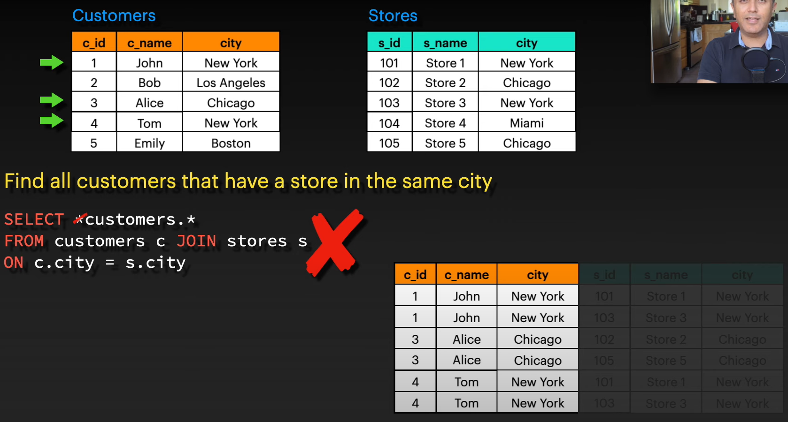 
    - **using Semi-join**: A semi-join finds results based **only on the left table**. It returns only the rows from the left table that have a match in the right table, **without including columns from the right table**. This avoids duplicates and returns only the relevant rows from the left table.   
        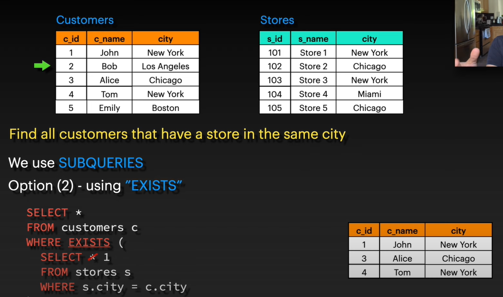

- **Semi Join**: Returns rows from the left table where a match exists in the right table.
- **Anti Join**: Returns rows from the left table where no match exists in the right table.

A **semi join** returns rows from the left table where there is a **match in the right table**, but it only returns rows from the left table. It doesn't return duplicate rows if the right table has multiple matches, and it doesn't return columns from the right table.

- **Example**: Find employees who have made a sale, but only return employee details (not the sales details).
  ```sql
  SELECT e.employee_id, e.first_name
  FROM employees e
  WHERE EXISTS (
      SELECT 1 
      FROM sales s 
      WHERE s.employee_id = e.employee_id
  );

  ```
  - Here, the `EXISTS` clause ensures that we only get employees who have matching rows in the `sales` table, but it doesn't return data from `sales`.

An **anti join** returns rows from the left table **where there is no match in the right table**. It filters out rows that have corresponding entries in the right table.

- **Example**: Find employees who have **not made any sales**.
  ```sql
  SELECT e.employee_id, e.first_name
  FROM employees e
  WHERE NOT EXISTS (
      SELECT 1 
      FROM sales s 
      WHERE s.employee_id = e.employee_id
  );
  ```

- The `NOT EXISTS` clause ensures that only employees who don't have any matching rows in the `sales` table are returned.


### IN / NOT IN vs EXISTS / NOT EXISTS
| **Aspect**                | **IN / NOT IN**                                   | **EXISTS / NOT EXISTS**                               |
|---------------------------|---------------------------------------------------|-------------------------------------------------------|
| **Main Purpose**           | Compares values with a list from the subquery.    | Checks for the existence of rows in the subquery.      |
| **Execution**              | Evaluates all rows returned by the subquery.      | Stops as soon as a match (or non-match) is found.      |
| **Performance**            | Better for small result sets.<br> Can become inefficient with large data sets.                      | Better for large result sets. <br> Generally faster for large datasets due to early exit.                        |
| **NULL Handling**          | `NOT IN` struggles with `NULL` values.            | `NOT EXISTS` handles `NULL` values efficiently.      |
| **When to Use:**      | Use `IN` when working with smaller, known sets of values.<br> Avoid `NOT IN` when the subquery can return `NULL` values and in general **`IN is Bad Practice`**   | Use `EXISTS` when dealing with larger datasets, or when you need to check for the existence of related rows.<br> prefer `NOT EXISTS` for better performance and `NULL` handling so in general **`Exists is good practice if you need to select from left table only `** |

When using `IN`, SQL must evaluate **all rows** returned by the subquery, and the outer query compares each row's value against this full set.  
```sql
SELECT employee_id, first_name
FROM employees 
WHERE department_id IN (
    SELECT department_id 
    FROM departments 
    WHERE location = 'New York'
);
```
- **Execution**: In this case, the subquery (`SELECT department_id FROM departments...`) returns a **list of all department IDs** where the location is 'New York'.
- The outer query then compares each employee's `department_id` against this full list of results.
- **All rows** from the subquery are evaluated before making any decision for each employee.

In contrast, when using `EXISTS`, SQL checks if **at least one row** satisfies the condition. As soon as a match is found, it stops further evaluation.

```sql
SELECT employee_id, first_name
FROM employees e
WHERE EXISTS (
    SELECT 1
    FROM departments d
    WHERE d.department_id = e.department_id 
    AND d.location = 'New York'
);
```
- **Execution**: For each employee, the subquery checks if **at least one** department exists where the employee's `department_id` matches and the department's location is 'New York'.
- Once SQL finds a match for an employee, it **stops searching** the `departments` table further and returns that employee in the result set.
- This can be faster, especially if the subquery can return many rows.

----
## **window function**    
is a type of function that performs a calculation across a set of rows, called a window, within the result set of a query. The window function returns a value for each row in the result set, based on the values in the window.يعنى بياخد الجدول كوبى يعمل العمليه الحسابيه على الويندو مش على الجدول الاصلى والناتج بينضاف للجدول الاصلى من غير ماتغير فى الصفوف فى الجدول الاصلى زى مابيعمل الجروب باى الى بيعمل summarize كدا   
SQL Server supports several types of window functions, including:  
    1. Ranking functions, such as ROW_NUMBER(), RANK(), and DENSE_RANK(), which assign a rank or row number to each row in the window based on the values in one or more columns.  
    2. Aggregate functions, such as SUM(), AVG(), MIN(), and MAX(), which calculate an aggregate value over the rows in the window.  
    3. Analytic functions, such as LAG(), LEAD(),NTILE() and FIRST_VALUE(), which return a value based on the value in the current row and the values in the preceding or following rows.   

بتقسم الجدول ل اجزاء وتشتغل علي كل جزء لوحده   
In SQL Server, the **PARTITION BY** clause is used in connected with the OVER clause to divide a result set into partitions and perform aggregate calculations on each partition separately.
The PARTITION BY clause is a powerful tool in SQL Server that allows you to perform calculations on subsets of data within a larger result set.It is commonly used with window functions to perform running totals, ranking,and other aggregate calculations.  

**This query give the employee that take highest salary for every department**  
```sql
WITH RankedEmployees AS (
  SELECT EmpID, EmpName, Department, EmpSalary,
         RANK() OVER (PARTITION BY Department ORDER BY EmpSalary DESC) AS EmpSalaryRank 
  FROM tblEmployee )

SELECT EmpID, EmpName, Department, EmpSalary
FROM RankedEmployees
WHERE EmpSalaryRank = 1  
 ```        
**we can use select from select(subqueries) instead of CTEs**
```sql
select * from
( select EmpID ,EmpName ,Department ,EmpSalary 
,rank() over(partition by Department order by EmpSalary desc) as EmpSalaryRank 
FROM [tblEmployee] )  tb1 
where EmpSalaryRank = 1
```

- **Running tatal** :want to calculate a running total of sales within a certain period.
    ```sql
    SELECT 
    SUM(sales) OVER (PARTITION BY store_id ORDER BY sale_date) AS running_total
    FROM sales;
    
    Input: CoffeeShop table:
    +----+------------------+
    | id | drink            |
    +----+------------------+
    | 9  | Mezcal Margarita |
    | 6  | null             |
    | 7  | null             |
    | 3  | Americano        |
    | 1  | Daiquiri         |
    | 2  | null             |
    +----+------------------+
    Output: 
    +----+------------------+
    | id | drink            |
    +----+------------------+
    | 9  | Mezcal Margarita |
    | 6  | Mezcal Margarita |
    | 7  | Mezcal Margarita |
    | 3  | Americano        |
    | 1  | Daiquiri         |
    | 2  | Daiquiri         |
    +----+------------------+

     solution

    | id | drink             | rk | Case_when | Cumulative |
    |----|-------------------|----|-------------------|-----|
    | 9  | Daiquiri          | 1  | 1                 | 1   |
    | 6  | NULL              | 2  | 0                 | 1   |
    | 7  | Americano         | 3  | 1                 | 2   |
    | 3  | NULL              | 4  | 0                 | 2   |
    | 1   | NULL             | 5  | 0                 | 2   |
    | 2  | Mezcal Margarita  | 6  | 1                 | 3   |

    WITH S AS (
        SELECT *, ROW_NUMBER() OVER (ORDER BY id) AS rk
        FROM CoffeeShop
    ),
    T AS (
        SELECT *,
            SUM(CASE WHEN drink IS NULL THEN 0 ELSE 1 END) OVER (ORDER BY rk) AS Cumulative
        FROM S
    )

    SELECT id, first_value(drink) OVER (PARTITION BY Cumulative ORDER BY rk) AS drink
    FROM T;
    ```

- **Value Comparison**: These functions allow you to compare values in a dataset, such as comparing each employee’s salary to the average salary in their department.
    ```sql
    SELECT 
    employee_id, 
    salary, 
    AVG(salary) OVER (PARTITION BY department) AS avg_department_salary
    FROM employees;
    ```
- **Windowing(moving average)**: These functions perform calculations across a range of rows relative to the current row. For example, you might want to calculate a **moving average**.
    - OVER (ORDER BY sale_date ROWS BETWEEN 1 PRECEDING AND 1 FOLLOWING): This **defines a window** over which the average is calculated. The window is ordered by sale_date, and for each row, it includes:
        - The current row (ORDER BY sale_date)
        - The row before it (1 PRECEDING)
        - The row after it (1 FOLLOWING)
    ```sql 
    SELECT 
    AVG(sales) OVER (ORDER BY sale_date ROWS BETWEEN 1 PRECEDING AND 1 FOLLOWING) AS moving_average  --You can say that sum(saies) over(order by year_order,month_order_date rows between 2 preceding and current row) as cumulative_saies
    FROM sales;
    ```
    |sale_date|	sales |	moving_average|
    | --- | --- | --- |
    |2021-01-01|	100	|150|
    |2021-01-02|	200|	133|
    |2021-01-03	|100	|116|
    |2021-01-04|	50|	75|

    - window function ALL **`ROWS BETWEEN`** usage 

    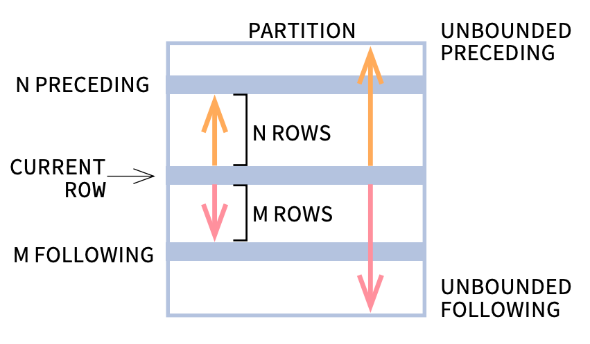 
    
- **RANK**: This function assigns a unique rank to each row within the partition, **with gaps** in the ranking for tied rows. If two or more rows tie for a rank, they receive the same rank number, and the next rank number is **incremented by the number of tied rows**. For example, if two rows are tied for rank 1, they both receive rank 1, but the next row receives rank 3, not rank 2.
- **DENSE_RANK**: This function also assigns a unique rank to each row within the partition, but **without gaps**. It increments the rank number by 1, regardless of the number of tied rows. For example, if two rows are tied for rank 1, they both receive rank 1, and the next row receives rank 2, even if there are multiple rows with the same score.
- **NTILE()**: This function divides an ordered dataset into a specified number of roughly equal groups, called ‘tiles’. For example, NTILE(4) would split the data into four groups. The function then assigns a group number to each row1.
- **LEAD()**: This function allows you to access data from the next row in the same result set, without having to join the table to itself. It’s useful for comparing current row values with those of subsequent rows2.
- **LAG()**: Similar to LEAD(), but instead of looking forward, LAG() lets you access data from a previous row. This is handy for comparing current row values with those of preceding rows3.
- **FIRST_VALUE()**: This function returns the first value in an ordered set of values within a partition. It’s useful when you need to compare other row values to the first one in the set4.
- **LAST_VALUE()**: The opposite of FIRST_VALUE(), this function returns the last value in an ordered set within a partition. It’s often used in conjunction with the ROWS or RANGE windowing clauses to specify the set’s bounds5.
- **PERCENT_RANK()**: This function calculates the relative rank of a row within a partition of a result set as a percentage. The value ranges from 0 (first row) to 1 (last row), giving you the percentile rank of a row6.
- **CUME_DIST()**: This function calculates the cumulative distribution of a value within a set of values. It returns the proportion of rows with values less than or equal to the current row’s value.

```sql 
CREATE TABLE Orderss (
    OrderID INT,
    CustomerID INT,
    OrderDate DATE,
    OrderTotal DECIMAL(10, 2)
);

INSERT INTO Orderss (OrderID, CustomerID, OrderDate, OrderTotal)
VALUES 
    (1, 101, '2024-01-10', 150.00),
    (2, 102, '2024-01-12', 200.00),
    (3, 101, '2024-02-05', 300.00),
    (4, 103, '2024-02-10', 250.00),
    (5, 102, '2024-03-01', 180.00),
    (6, 101, '2024-03-15', 350.00),
    (7, 103, '2024-03-20', 350.00),
	(8, 103, '2024-03-20', 400.00);
```
- **ROW_NUMBER, RANK, DENSE_RANK** Example
    ```sql
    SELECT 
        OrderID,
        OrderDate,
        CustomerID,
        OrderTotal,
        ROW_NUMBER() OVER (ORDER BY OrderDate) AS RowNum,
        RANK() OVER (ORDER BY OrderTotal) AS Rank,
        DENSE_RANK() OVER (ORDER BY OrderTotal) AS DenseRank
        from Orderss
    ```
    | OrderID | OrderDate  | CustomerID | OrderTotal | RowNum | Rank | DenseRank |
    | ------- | ---------- | ---------- | ---------- | ------ | ---- | --------- |
    | 1       | 2024-01-10 | 101        | 150.00     | 1      | 1    | 1         |
    | 5       | 2024-03-01 | 102        | 180.00     | 2      | 2    | 2         |
    | 2       | 2024-01-12 | 102        | 200.00     | 3      | 3    | 3         |
    | 4       | 2024-02-10 | 103        | 250.00     | 4      | 4    | 4         |
    | 3       | 2024-02-05 | 101        | 300.00     | 5      | 5    | 5         |
    | 6       | 2024-03-15 | 101        | 350.00     | 6      | 6    | 6         |
    | 7       | 2024-03-20 | 103        | 350.00     | 7      | 6    | 6         |
    | 8       | 2024-03-20 | 103        | 400.00     | 8      | 8    | 7         |

- **NTILE, LEAD, LAG** Example
    ```sql
    SELECT 
        OrderTotal,
        NTILE(4) OVER (ORDER BY OrderTotal) AS Quartile,
        LEAD(OrderTotal, 1) OVER (ORDER BY OrderTotal) AS NextOrderDate,
        LAG(OrderTotal, 1) OVER (ORDER BY OrderTotal) AS PreviousOrderDate
        from Orderss
    ```
        | OrderTotal | Quartile | NextOrderDate | PreviousOrderDate |
        | ---------- | -------- | ------------- | ----------------- |
        | 150.00     | 1        | 180.00        | NULL              |
        | 180.00     | 1        | 200.00        | 150.00            |
        | 200.00     | 2        | 250.00        | 180.00            |
        | 250.00     | 2        | 300.00        | 200.00            |
        | 300.00     | 3        | 350.00        | 250.00            |
        | 350.00     | 3        | 350.00        | 300.00            |
        | 350.00     | 4        | 400.00        | 350.00            |
        | 400.00     | 4        | NULL          | 350.00            |

- **FIRST_VALUE, LAST_VALUE ,SUM, PERCENT_RANK, CUME_DIST** Example
    ```sql
    SELECT 
        OrderID,
        OrderDate,
        CustomerID,
        OrderTotal,
        FIRST_VALUE(OrderDate) OVER (PARTITION BY CustomerID ORDER BY OrderDate) AS FirstOrderDate, --Unbounded preceding” means it starts from the very first row in the partition, and “unbounded following” means it goes all the way to the last row.
        LAST_VALUE(OrderDate) OVER (PARTITION BY CustomerID ORDER BY OrderDate ROWS BETWEEN UNBOUNDED PRECEDING AND UNBOUNDED FOLLOWING) AS LastOrderDate,
        SUM(OrderTotal) OVER (PARTITION BY CustomerID ORDER BY OrderDate) AS RunningTotal,
        PERCENT_RANK() OVER (PARTITION BY CustomerID ORDER BY OrderTotal) AS PricePercentRank,
        CUME_DIST() OVER (PARTITION BY CustomerID ORDER BY OrderTotal) AS CumulativeDistribution -- It counts how many orders have an OrderTotal that is less than or equal to 150.00. In this case, it’s just the one order itself. It then divides this count by the total number of orders. If there are three orders in total, it divides 1 by 3. so for the first row 150 = 1 /3
        from Orderss
    ```

    | OrderID | OrderDate  | CustomerID | OrderTotal | FirstOrderDate | LastOrderDate | RunningTotal | PricePercentRank | CumulativeDistribution |
    | ------- | ---------- | ---------- | ---------- | -------------- | ------------- | ------------ | ---------------- | ---------------------- |
    | 1       | 2024-01-10 | 101        | 150.00     | 2024-01-10     | 2024-03-15    | 150.00       | 0                | 0.333333333333333     |
    | 3       | 2024-02-05 | 101        | 300.00     | 2024-01-10     | 2024-03-15    | 450.00       | 0.5              | 0.666666666666667     |
    | 6       | 2024-03-15 | 101        | 350.00     | 2024-01-10     | 2024-03-15    | 800.00       | 1                | 1                      |
    | 5       | 2024-03-01 | 102        | 180.00     | 2024-01-12     | 2024-03-01    | 380.00       | 0                | 0.5                    |
    | 2       | 2024-01-12 | 102        | 200.00     | 2024-01-12     | 2024-03-01    | 200.00       | 1                | 1                      |
    | 4       | 2024-02-10 | 103        | 250.00     | 2024-02-10     | 2024-03-20    | 250.00       | 0                | 0.333333333333333     |
    | 7       | 2024-03-20 | 103        | 350.00     | 2024-02-10     | 2024-03-20    | 1000.00      | 0.5              | 0.666666666666667     |
    | 8       | 2024-03-20 | 103        | 400.00     | 2024-02-10     | 2024-03-20    | 1000.00      | 1                | 1                      |

-------
## CTEs, Function, Stored procedures , Views

- **CTEs**   
    - CTEs(veiw in memory) stands for Common Table Expressions, which is a temporary result set that is defined within the execution of a single SQL statement. In other words, CTEs allow you to create a named query that can be **referenced multiple times** within the same SQL statement **unlike the subquery** that can be referneced **one time**, SO you can **reduce redundancy** using CTEs
    - CTEs are not functions in the sense that they do not take input parameters or return values, and they do not encapsulate a block of code that can be called from different parts of your code.  
    - CTEs allow you to **simplify complex queries** by breaking them down into smaller, more manageable **readable** and **maintainable**. And increase the **performance**.
 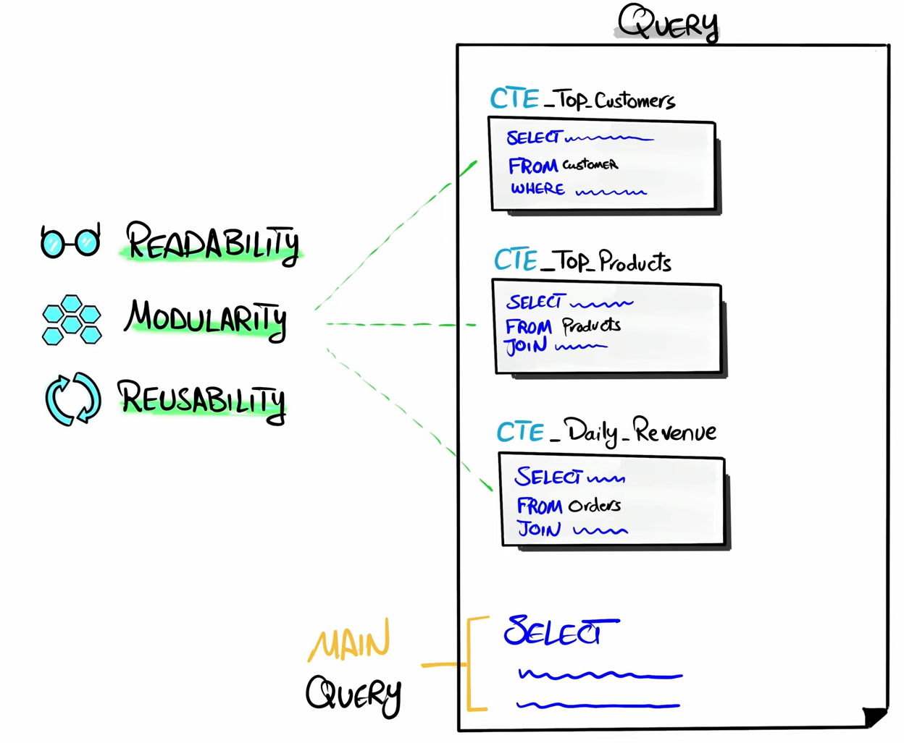 
```sql
 WITH my_cte AS (
    SELECT column1, column2, ...
    FROM my_table
    WHERE condition)
,my_cte2 AS ()

SELECT *
FROM my_cte
WHERE column1 > 100;

--ctes is like view Memory 
-- this example of self join
with Cte 
as
(
 select * from student
)
select S1.st_fname,S2.*
from Cte S1 ,Cte S2
where S2.st_id=S1.St_super

-- examples on recrcsive cte it call itself on it
CREATE VIEW [vw_DIM|Status]
AS
WITH CTE 
AS
(
SELECT 1 [StatusId], [dbo].[ufnGetSalesOrderStatusText](1) [StatusName]  -- this called Base query that run in the first
UNION ALL
SELECT [StatusId] + 1, [dbo].[ufnGetSalesOrderStatusText]([StatusId] + 1) [StatusName]    -- recrusive part of the query we should add or anything to don't make infinty loop (recrcieve Common Table Epression [CTE]) 
FROM CTE                                                                                    
WHERE [StatusId] < 6
)
SELECT [StatusId], [StatusName]
FROM CTE

-- to control the max number of recrusive iteration 
OPTION ( MAXRECURSION 5000 )


```

----

To make the code more secure you should  make any code that will executed from the data base must be either a **procedures** or a **function**.  

**Functions** are useful for encapsulating **calculations**, transformations, or lookups that need to be used in various SQL queries.  
-It can be used in where or select statement to be part of this statement.       
-**Function** can't contain any dml(insert, update, delete) **only contain select statment and insert in new table variable not table in our database**  


- **function**  
**scalar funcion** --> return one vales  
**note:** we can't use **try , catch** in the body of the function. and we can't write **excecute** as it dynamic query we can use it in s.procedures  
```sql

/* 4.Create a scalar function that takes Student ID and returns a message to user 
a.	If first name and Last name are null then display 'First name & last name are null'
b.	If First name is null then display 'first name is null'
c.	If Last name is null then display 'last name is null'
d.	Else display 'First name & last name are not null'

note that any variable by default is null  so it will return null if we entered id that isn't in our table
*/
CREATE FUNCTION CheckStudentName(@StudentID INT)
RETURNS NVARCHAR(100)
AS
BEGIN
    DECLARE @Message NVARCHAR(100)

    IF EXISTS (SELECT 1 FROM dbo.Student WHERE St_Id = @StudentID)
    BEGIN
        SELECT
            @Message = CASE
                WHEN St_Fname IS NULL AND St_Lname IS NULL THEN 'First name & last name are null'
                WHEN St_Fname IS NULL THEN 'First name is null'
                WHEN St_Lname IS NULL THEN 'Last name is null'
                ELSE 'First name & last name are not null'
            END
        FROM
            dbo.Student
        WHERE
            St_Id = @StudentID;
    END
    ELSE
    BEGIN
        SET @Message = 'Student ID does not exist';
    END

    RETURN @Message;
END;
SELECT dbo.CheckStudentName(1) AS 'Message'; -- you should write schema as sql server don't consider it as builtin function 
```
**Inline table function** --> return table. only contain select like view  
return table as a result of select statment  
```sql
--5 Create inline function that takes integer which represents manager ID and displays department name, Manager Name and hiring date 
CREATE FUNCTION GetManagerInfo( @ManagerID INT)
RETURNS TABLE
AS
RETURN
(
    SELECT
        d.Dept_Name , i.Ins_Name ,d.Manager_hiredate
    FROM dbo.Instructor i
    JOIN dbo.Department d ON i.Dept_Id = d.Dept_Id
    WHERE i.Ins_Id = @ManagerID
);

SELECT * FROM dbo.GetManagerInfo(1);
```
**multi_statment table-valued function** --> if select contain any logic like if, declare, while  
return a new table as a result of insert statment   
```sql
/* 6.	Create multi-statements table-valued function that takes a string
If string='first name' returns student first name
If string='last name' returns student last name 
If string='full name' returns Full Name from student table 
Note: Use “ISNULL” function
مهمتك تملى الجدول ده بالكود
*/

ALTER FUNCTION GetStudentInfo(@ColumnInfo NVARCHAR(50))
RETURNS @ResultTable TABLE
(
    ResultValue NVARCHAR(100)
)
AS
BEGIN
    IF @ColumnInfo = 'first name'
    BEGIN
        INSERT INTO @ResultTable (ResultValue)
        SELECT ISNULL(St_Fname, '') FROM dbo.Student;
    END
    ELSE IF @ColumnInfo = 'last name'
    BEGIN
        INSERT INTO @ResultTable (ResultValue)
        SELECT ISNULL(St_Lname, '') FROM dbo.Student;
    END
    ELSE IF @ColumnInfo = 'full name'
    BEGIN
        INSERT INTO @ResultTable (ResultValue)
        SELECT ISNULL(CONCAT(St_Fname, ' ', St_Lname), '') FROM dbo.Student;
    END
    ELSE
    BEGIN
        INSERT INTO @ResultTable (ResultValue)
        SELECT 'Invalid column info please enter those (full name,last name,first name)';
    END

    RETURN; -- you don't need to write table name he automaticly will return to the table
END;

SELECT * FROM dbo.GetStudentInfo('first name');
```
---

### NULL Handling, built in function 
- `NULL` means nothing, unknown!. **NULL is not equal to anything**. NULL is not zero, NULL is not empty string(it is stirng with lengh of 0), NULL is not blank space(string with lengh of num depend of the number of spaces).  
- `NULL` is best for performance as it is very minimal for storage but empty string occupies memory and blank  occupies memory for each space.  

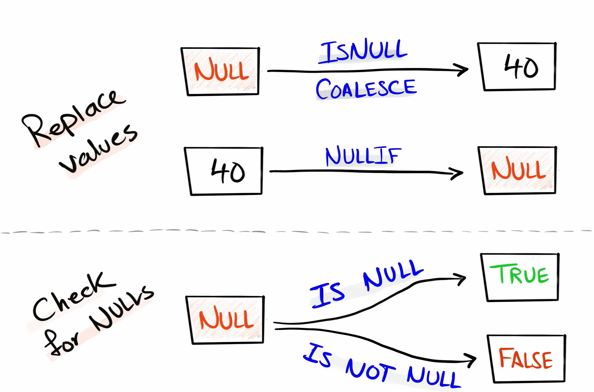 

## 1. **Checking for NULL Values**
   SQL Server uses `IS NULL` and `IS NOT NULL` to check for `NULL` values. You cannot use `=` or `!=` with `NULL` since `NULL` is not a value but a placeholder.

   - **Example (IS NULL)**:
     ```sql
     SELECT * FROM Employees WHERE ManagerID IS NULL;
     ```
     This query retrieves employees who do not have a manager (i.e., `ManagerID` is `NULL`).

   - **Example (IS NOT NULL)**:
     ```sql
     SELECT * FROM Employees WHERE ManagerID IS NOT NULL;
     ```
     This retrieves employees who have a manager.


## 2. **ISNULL Function (only handles two arguments)** 
   `ISNULL` is used to **replace** `NULL` with a specified replacement value. It works similarly to `COALESCE` but only accepts two arguments: the expression and the replacement value.

- **Syntax**:

     ```sql
        ISNULL(Value , replacement_value ) 

     ```

- **Example**:
    ```sql
    SELECT FirstName, LastName, 
       ISNULL(Email, PhoneNumber) AS ContactInfo -- replace the null from other column (if the other column is null also it will return null)
     FROM Customers;

    ISNULL(Email, 'No Contact Info') -- replace the null with static value (default value )
    ```

## 3. **COALESCE Function**

   `COALESCE` returns the first non-`NULL` value in a list of arguments. It’s useful when you want to provide a default value when a `NULL` is encountered.

- **Syntax**:
     ```sql
        COALESCE(Value , replacement_value1 ,replacement_value2 , replacement_value3 , ...... ) 

     ```
- **Example**:
     ```sql
    SELECT FirstName, LastName, 
    COALESCE(Email, PhoneNumber, 'No Contact Info') AS ContactInfo
    FROM Customers;
     ```

### Summary of Key Differences
| Feature                  | `ISNULL`                       | `COALESCE`                              |
|--------------------------|---------------------------------|-----------------------------------------|
| **Arguments**             | Exactly 2 arguments             | Can take 2 or more arguments            |
| **Performance**             | Fast for 2 arguments             | Slow ,Slightly slower when evaluating multiple arguments          |
| **Portability**           | SQL Server-specific<br> oracle >> NVL <br> Mysql  >>  IFNULL  | Part of the SQL standard (more portable For all databases) |
| **Return Type**           | Type of the first argument      | Type with the highest precedence        |
| **Example Use**           | Simple replacement of `NULL`    | Replacement with multiple fallback values <br> (so i use it as it is standard but if i have bad performance i use `ISNULL` ) |

### explain 3 polices to handle the null , empty string and blanks 
```sql 
WITH Orders AS (
    SELECT 1 Id, 'A' Category UNION
    SELECT 2, NULL UNION
    SELECT 3, '' UNION  -- this is lengh of 0 string
    SELECT 4, '  '      -- this is lengh of 3 string
)
SELECT 
    *,
    TRIM(Category) AS Policy1,  --to make blanks lengh of 0 
    NULLIF(TRIM(Category), '') AS Policy2,  -- it take less storage and performace of the query will be realy good but use it if i in the ETL
    COALESCE(NULLIF(TRIM(Category), ''), 'unknown') AS Policy3   -- IF I in the report i use it to to improve readiblity and reduce confusion.
FROM Orders;

```
| Id  | Category | Policy1 | Policy2 | Policy3 |
|-----|----------|---------|---------|---------|
| 1   | A        | A       | A       | A       |
| 2   | NULL     | NULL    | NULL    | unknown |
| 3   |          |         | NULL    | unknown |
| 4   |          |         | NULL    | unknown |

## 4. **NULLIF Function**

   `NULLIF` compares two expressions and returns `NULL` if they are equal; otherwise, it returns the first expression. It's useful for avoiding division by zero or marking specific values as `NULL`.

   - **Syntax**:
     ```sql
     NULLIF(expression1, expression2)
     ```

   - **Example**:
    
     ```sql
     SELECT ProductID, NULLIF(QuantitySold, 0) AS AdjustedQuantity  -- to give null to me not error when dividing by it
     FROM Sales;

     NULLIF(price, -1 )  -- if the price is -1 then make it null as we won't to store the price as -1  
     NULLIF(original_price , discount_price )  -- if they are equal then we should give null to flag the uncommon issue 
     ```
     If `QuantitySold` is 0, this function returns `NULL`.

## 6. **Handling NULL in (Aggregation Functions) and (the join keys)**

   - Aggregate functions like `SUM`, `COUNT`, `AVG`, `MAX`, and `MIN` ignore `NULL` values by default. However, `COUNT(*)` counts all rows, including those with `NULL`.

   - **Example (SUM ignoring NULL ,COUNT excluding NULL)**:

     ```sql
      SELECT SUM(Salary) FROM Employees;
      SELECT COUNT(Salary) FROM Employees;  -- Counts only non-NULL Salary

     ```

   - **Example (COUNT including NULL)**:

     ```sql
         SELECT COUNT(*) FROM Employees;  -- Counts all rows
     ```

- you should handle the null befor making join as the null vaules it will not be included in the join as sql can't make equlity of those values as shown in the photo it give me only two row.    

     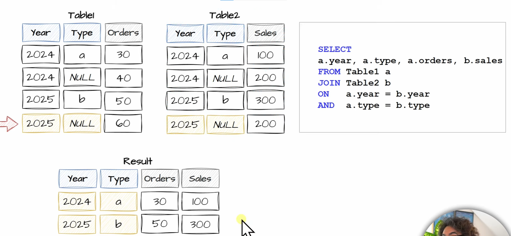 

     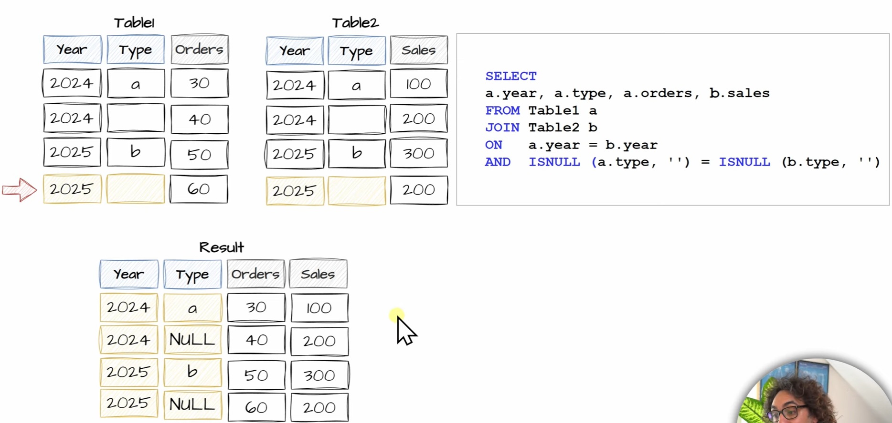 


## 7. **CASE Statement for NULL Handling**

   You can use the `CASE` statement to explicitly handle `NULL` values in complex scenarios.

   - **Example**:
     ```sql
     SELECT EmployeeID,
       CASE 
         WHEN ManagerID IS NULL THEN 'No Manager'
         ELSE 'Has Manager'
       END AS ManagerStatus
     FROM Employees;

     -- or you can use it in the sort to make the null in the bottom , you should handle the null before sorting the data 
     SELECT 
     CustomerID, Score
     FROM  Sales.Customers
     ORDER BY CASE WHEN Score IS NULL THEN 1 ELSE 0 END,  Score;

     ```

## 8. **NULL and Comparison Operators**
   When you perform comparison operations (`=`, `!=`, `>`, `<`, etc.) involving `NULL`, the result is always `NULL` (because `NULL` means unknown). To handle this, use the functions described above.

## 9. **STRING_AGG**
The `STRING_AGG` function is a powerful and flexible aggregation function introduced in SQL Server 2017 and later versions. It is used to concatenate values from multiple rows into a single string, with an optional delimiter between each value. This function simplifies scenarios where you need to combine multiple rows of data into a single, comma-separated (or other delimiter-separated) list.  
#### Example:

Consider a table `Orders`:

| order_id | product      | customer_id |
|----------|--------------|-------------|
| 1        | Laptop       | 101         |
| 2        | Mouse        | 101         |
| 3        | Keyboard     | 102         |
| 4        | Monitor      | 101         |

You want to list the products purchased by each customer as a comma-separated string.

```sql
SELECT customer_id, STRING_AGG(product, ', ') AS Products
FROM Orders
GROUP BY customer_id;
```

**Output:**

| customer_id | Products                |
|-------------|-------------------------|
| 101         | Laptop, Mouse, Monitor  |
| 102         | Keyboard                |

Here, `STRING_AGG` concatenates the `product` values for each `customer_id`, grouped by the `GROUP BY` clause.


### 2. **Ordering the Results Inside `STRING_AGG`**

By default, the values concatenated by `STRING_AGG` do not have a guaranteed order. However, you can specify the order by using the `WITHIN GROUP` clause.

#### Example:

Suppose you want to list the products purchased by each customer, but in alphabetical order.

```sql
SELECT customer_id, 
       STRING_AGG(product, ', ') WITHIN GROUP (ORDER BY product) AS Products
FROM Orders
GROUP BY customer_id;
```

**Output:**

| customer_id | Products                |
|-------------|-------------------------|
| 101         | Laptop, Monitor, Mouse  |
| 102         | Keyboard                |

Here, the `WITHIN GROUP (ORDER BY product)` ensures that the `product` values are concatenated in alphabetical order.


## 10. **PIVOT **
```SQL
    -- Basic Syntax 
    SELECT <non-pivoted column>,
        [first pivoted column] AS <column name>,
        [second pivoted column] AS <column name>,
        ...
    FROM
        (<SELECT query that produces the data>)
        AS <alias for the source query>
    PIVOT
        (
            <aggregation function>(<column being aggregated>)
            FOR <column that contains the values that will become column headers>
            IN ([first pivoted column], [second pivoted column], ...)
        ) AS <alias for the pivot table>     

```

Sure! In SQL Server, the `PIVOT` operator is used to transform rows into columns, effectively turning unique data values from one column into multiple columns in the output. This can be particularly useful when you need to create a cross-tabulation or summary table from a detailed dataset.

### How PIVOT Works
1. **Source Table**: You start with a table or a result set that typically includes rows with repetitive data that you want to summarize or reformat into a more readable structure.
2. **Aggregation**: PIVOT uses an aggregate function (like SUM, AVG, MAX, MIN, COUNT) to merge similar data into a single row and spread other related data across columns.
3. **Column Transformation**: It converts unique values from one column in the original data set into multiple columns in the output, with each column representing a unique value.
4. **Specified Values**: You need to specify which column's values to transform into columns and which column to aggregate.

### Basic Syntax
```sql
SELECT <non-pivoted column>,
    [first pivoted column] AS <column name>,
    [second pivoted column] AS <column name>,
    ...
FROM
    (<SELECT query that produces the data>)
    AS <alias for the source query>
PIVOT
    (
        <aggregation function>(<column being aggregated>)
        FOR <column that contains the values that will become column headers>
        IN ([first pivoted column], [second pivoted column], ...)
    ) AS <alias for the pivot table>
```

### Example: PIVOT Operation
Suppose you have a sales table `SalesData` that records sales amounts for different products across various months.

**SalesData Table**
| ProductName | Month   | SalesAmount |
|-------------|---------|-------------|
| Widget      | January | 1000        |
| Widget      | February| 1500        |
| Gadget      | January | 1200        |
| Gadget      | February| 1700        |

You want to pivot this table to show each product along with separate columns for sales in January and February.

#### SQL Query Using PIVOT
```sql
SELECT ProductName, [January], [February]
FROM
   (SELECT ProductName, Month, SalesAmount
    FROM SalesData) AS SourceTable
PIVOT
   (
    SUM(SalesAmount)
    FOR Month IN ([January], [February])
   ) AS PivotTable;
```

**Result**  
| ProductName | January | February |
|-------------|---------|----------|
| Widget      | 1000    | 1500     |
| Gadget      | 1200    | 1700     |


## **Stored procedures** 

**Stored procedures** can be reused across different parts of your application, reducing code duplication. To deal with our **data base**.
--Can write all query type DDL , DML , insert , update delete.  
-- have **more performance** on the **network traffic**(have less character while sending as a call from application to the DB) and **our engine** (it stored so we don't need make all cycle of execution plane again )  
-- secure because I can hide business role inside it.  
-- catch error before happen in the data base .  
-- **return**:It's not mandatory to return a value like function. it can **return** integer (number) but this number have meaning or tell us the behaviour of the SP for the database developer or application programmer.  
```sql
--==================
--when to use execute 
--==================
execute('select' + @col+ 'from' + @tab)   -- to make dynamic query we use execute
  
-- i use dynamic query if the table name Or column name is dynamic 
-- i can use variables in SELECT (as variable not column name) and in WHERE statement not in From 

-- use it in SELECT 
DECLARE @Country NVARCHAR(50) = 'USA';
DECLARE @TotalCustomers INT;

SELECT @TotalCustomers = COUNT(*) 
FROM Sales.Customers 
WHERE Country = @Country;

SELECT @TotalCustomers AS TotalCustomers;

-- Use it in Where 
DECLARE @Country NVARCHAR(50) = 'USA';

SELECT * 
FROM Sales.Customers
WHERE Country = @Country;

-- syntax error  
DECLARE @TableName NVARCHAR(50) = 'Sales.Customers';
SELECT * 
FROM @TableName; -- This will cause a syntax error.


DECLARE @ColumnName NVARCHAR(50) = 'Country';
SELECT @ColumnName 
FROM Sales.Customers; -- This will work.

--==========================================================================================================

create proc getalldata @col varchar(20) ,@tab varchar(20)
As 

execute('select' + @col+ 'from' + @tab)
--mysql
DELIMITER //       --DELIMITER //: This sets the delimiter to // so that we can use ; within the procedure definition without causing issues.
CREATE PROCEDURE GetEmployeeByDepartment(IN departmentName VARCHAR(50))
BEGIN
    SELECT emp_id, emp_name
    FROM employees
    WHERE department = departmentName;
END//
DELIMITER ;

CALL GetEmployeeByDepartment('Sales');
```
**Variables in sql server** 
 - Declaration of Variables and assign value to it using **`SET`**
 ```sql
    DECLARE @FirstName NVARCHAR(50), @LastName NVARCHAR(50);
    SET @FirstName = 'John';
    SET @LastName = 'Doe';
 ```
 - Declaration of Variables and assign value to it using **`SELECT`**
 - The **`SELECT`** statement can also be used to assign values to variables, especially **when retrieving data from a table or expression**.
 ```SQL
    DECLARE @FirstName NVARCHAR(50), @LastName NVARCHAR(50);
    SELECT @FirstName = FirstName, @LastName = LastName FROM Employees WHERE EmployeeID = 1;

 ```
**types of SP parameter** 
Stored procedures in a database can have different types of parameters, and these parameters allow you to pass values into the stored procedure when it is called. Let's explore the common types of stored procedure parameters in simple terms:

### 1. **Input Parameters:**

**Definition:**
- **Input parameters** allow you to pass values into a stored procedure when you call it.
- These values are used within the stored procedure but are not modified by it.

**Example:**
```sql
CREATE PROCEDURE GetCustomerInfo @CustomerID INT  -- @CustomerID is an input parameter
AS
BEGIN
    SELECT * FROM Customers WHERE CustomerID = @CustomerID;
END;
```

### 2. **Output Parameters:**

**Definition:**
- **Output parameters** are used to return values from a stored procedure back to the calling program.
- The stored procedure can modify the values of these parameters.

**Example:**
```sql
CREATE PROCEDURE GetNextOrderID
    @NextOrderID INT OUTPUT  -- @NextOrderID is an output parameter
AS
BEGIN
    SELECT @NextOrderID = MAX(OrderID) + 1 FROM Orders;
END;

-- how to call it , you mast declare variable to save this output from the SP

DECLARE @output INT; 
execute GetNextOrderID @output OUTPUT
select @output as outputt

```

### 3. **Input/Output Parameters:**

**Definition:**
- **Input/Output parameters** serve a dual purpose—they allow you to pass values into a stored procedure and also return modified values.

**Example:**
```sql
CREATE PROCEDURE UpdateCustomerBalance
    @CustomerID INT,
    @AmountToAdd DECIMAL(10, 2) OUTPUT  -- @AmountToAdd is an input/output parameter
AS
BEGIN
    -- Add the specified amount to the customer's balance
    UPDATE Customers SET Balance = Balance + @AmountToAdd WHERE CustomerID = @CustomerID;
    
    -- Return the updated balance through the output parameter
    SELECT @AmountToAdd = Balance FROM Customers WHERE CustomerID = @CustomerID;
END;
```

### 4. **Default Parameters:**

**Definition:**
- **Default parameters** have default values assigned to them.
- If a value is not explicitly provided when calling the stored procedure, the default value is used.

**Example:**
```sql
CREATE PROCEDURE GetOrdersByStatus
    @Status VARCHAR(20) = 'Pending'  -- @Status is a default parameter
AS
BEGIN
    SELECT * FROM Orders WHERE OrderStatus = @Status;
END;
```

### 5. **Table-Valued Parameters:**

**Definition:**
- **Table-valued parameters** allow you to pass a table structure as a parameter to a stored procedure.
- Useful when you want to pass multiple rows of data.

**Example:**
```sql
CREATE TYPE dbo.EmployeeTableType AS TABLE    --create type --> is to create a new custom data type.
(
    EmployeeID INT,
    EmployeeName NVARCHAR(50),
    -- Other columns...
);

CREATE PROCEDURE InsertEmployees
    @Employees dbo.EmployeeTableType READONLY  -- @Employees is a table-valued parameter
AS
BEGIN
    INSERT INTO Employees (EmployeeID, EmployeeName)
    SELECT EmployeeID, EmployeeName FROM @Employees;
END;    
```
### 6. **tips to organize stored procedure**
- Add a semicolon; at the end of each SQL statement
- Handle nulls before aggregating to ensure accurate results
- make styling to each step like below to make it easy to read

```sql

ALTER PROCEDURE GetCustomerSummary
    @Country NVARCHAR(50) = 'USA'
AS
BEGIN
    BEGIN TRY
        -- Declare variables to hold summary values
        DECLARE @TotalCustomers INT, @AvgScore FLOAT;

        --=================================================================
        -- Step 1: Prepare & Cleanup Data from the null to get accurate avg
        --=================================================================
        IF EXISTS (
            SELECT 1
            FROM Sales.Customers
            WHERE Score IS NULL AND Country = @Country
        )
        BEGIN
            PRINT('Updating NULL Scores to 0');

            -- We make this update only if condition comes true as if i make this udate without if it will read the table multiple times
            UPDATE Sales.Customers         
            SET Score = 0
            WHERE Score IS NULL AND Country = @Country;
        END
        ELSE
        BEGIN
            PRINT('No NULL Scores found');
        END;

        --=================================
        -- Step 2: Generate Summary Reports
        --=================================

        -- Calculate Total Customers and Average Score for the specified country
        SELECT
            @TotalCustomers = COUNT(*),
            @AvgScore = AVG(Score)
        FROM Sales.Customers
        WHERE Country = @Country;

        PRINT 'Total Customers from ' + @Country + ': ' + CAST(@TotalCustomers AS NVARCHAR);
        PRINT 'Average Score from ' + @Country + ': ' + CAST(@AvgScore AS NVARCHAR);

        -- Calculate Total Number of Orders and Total Sales for the specified country
        SELECT
            COUNT(o.OrderID) AS TotalOrders,
            SUM(o.Sales) AS TotalSales
        FROM Sales.Orders o
        JOIN Sales.Customers c ON c.CustomerID = o.CustomerID
        WHERE c.Country = @Country;

    END TRY
    BEGIN CATCH
        --================
        -- Error Handling
        --================
        PRINT('An error occurred.');
        PRINT('Error Message: ' + ERROR_MESSAGE());
        PRINT('Error Number: ' + CAST(ERROR_NUMBER() AS NVARCHAR));
        PRINT('Error Line: ' + CAST(ERROR_LINE() AS NVARCHAR));
        PRINT('Error Procedure: ' + ERROR_PROCEDURE());
    END CATCH
END;

```

- **Views**  
**Views** are **virtual tables** that are derived from the result of a SELECT query. It does not physically store the data itself; instead, it's a **saved SQL query** If the underlying data in the tables changes, the view reflects those changes immediately.  
- They are used to simplify complex queries(by saving part of our query in object(veiw) in our database) 
- encapsulate logic
- rename column to new meaningful names and **provide an abstraction layer over the underlying tables**.

types of views that serve different purposes:
- **Simple and Complex Views**: Simple views are based on a single table, while complex views can be based on multiple tables and can include joins, subqueries, and other complex operations(note in those view we make it from the **same servers** or database )
- **Partitioned Views**: These views join horizontally partitioned data from a set of member tables across one or more servers, making the data appear as if it comes from a single table.
- **local partitioned view** :joins member tables on the same instance of SQL Server.
- **Indexed Views**: These are materialized views where the view definition has been computed and the **resulting data stored** just like a table. You can create a unique **clustered index** on these views, which can improve query performance significantly, especially for queries that aggregate many rows. not best parctice if our data is regularly changed.

Views are generally read-only and used for data retrieval. You cannot directly perform data manipulation operations (e.g., UPDATE, DELETE) on a view unless it's an "updatable" view based on certain conditions. <u>could make insert and update if the other column that isn't in the view allow null value and we couldn't delete from view</u>.  
--View increase security not performance.
```sql
CREATE VIEW view_name(col1,col2,..)--to make alis name for the column 
with encryption   -- for hide view detials from user(developer)
AS
SELECT column1, column2, ...
FROM some_table
WHERE condition;
With check option       -- it make constrain it will check where condition before insert or update  

SELECT *
FROM view_name
WHERE some_column = some_value;
```
----
## CTE vs subquery vs Timp Table vs CTAS(select into) vs View
as my opinion, i first use view then ,CTEs(but don't use more than 5 ctes in one query), then somtime the subquery to help me , **if the view are slow i use CTAS(select into)** 
 

#### Real_sernario
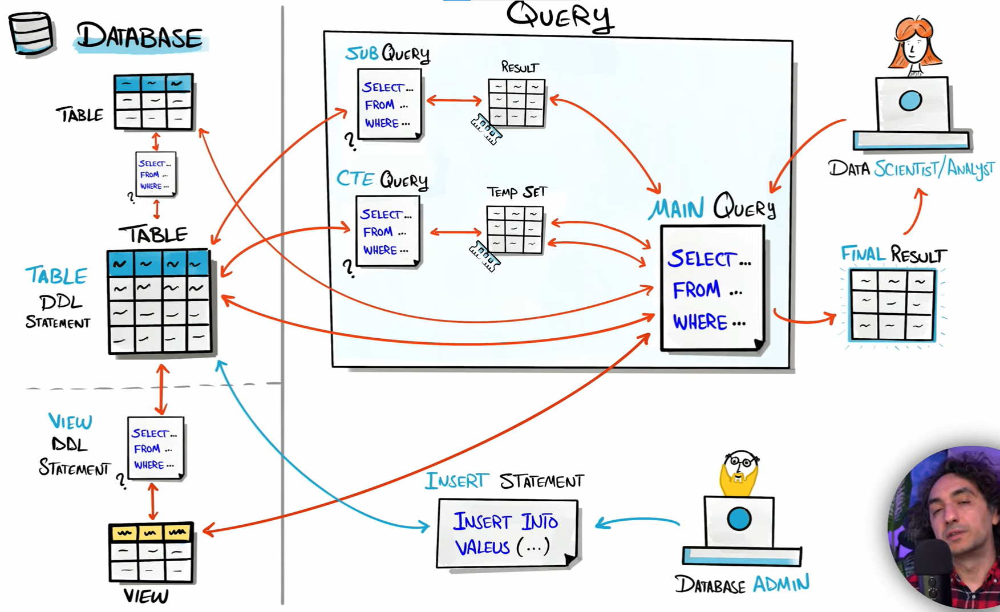

## DCL
The **GRANT** statement is used to provide specific privileges or permissions to users or roles. These privileges can include the ability to execute certain SQL statements (e.g., SELECT, INSERT, UPDATE, DELETE) on specific database objects (e.g., tables, views) or even the ability to create or drop objects.
**Grant SELECT permission on the "employees" table to a user named "john"**
```sql
Grant SELECT permission on the "employees" table to a user named "john";
Grant ALL permission on the "employees" table to a user named "john" with grant option ; --IF you want to give all (select, insert, update , delete)  to this user 
```
----
**REVOKE**: The REVOKE statement is used to remove previously granted privileges from users or roles.
**Revoke the SELECT permission on the "employees" table from the user "john"**
```sql
Revoke the SELECT permission on the "employees" table from the user "john"
```
-----
## index
The table stored on the desc as Data Pages(4k-8k) it stored row by row in every page 
Index : It solve the problem of **whole table scan** ,by using it You don't have to scan the whole table, you will **scan page** instead when using index ,so the data access faster and optimized. I make index on the column that i expect they will search on it too much to make the searching process faster .
Examples for index : **Clustered-index**  , **non-clustered-index**

**Clustered Index:** In a clustered index, the actual data rows of the table are **physically stored** in the order of the indexed column(s). There can be only one clustered index per table, as the data rows are physically rearranged to match the index order.it will build **binary tree** on the pk it will start with root page and then redirection until reach the data page

**Non-clustered Index:** A non-clustered index consists of a separate data structure that holds a **copy** of the indexed columns along with a **pointer** to the corresponding rows in the actual data pages. A table can have multiple non-clustered indexes.  

**Disadvantage** of index :indexes can also **slow down** data modification operations (INSERT, UPDATE, DELETE) for several reasons.  
Overhead: Maintaining an index requires a**dditional storage space** and computing power. Every time data is inserted, updated, or deleted, the index **needs to be updated** to reflect these changes. This adds overhead to these operations. 

-----
## order of execution

1. **FROM**: This is where the data sources are specified, including tables, views, or derived tables.

2. **JOIN**: If there are any join operations, they are processed at this stage to combine data from multiple sources.

3. **WHERE**: The conditions specified in the WHERE clause are applied to filter the rows.

4. **GROUP BY**: If a GROUP BY clause is present, the data is grouped according to the specified columns.

5. **HAVING**: The HAVING clause is used to filter the grouped data.

6. **SELECT**: The columns specified in the SELECT clause are retrieved from the processed and filtered data.

7. **DISTINCT**: If the DISTINCT keyword is used, duplicate rows are removed from the result set.[aggregation]

8. **ORDER BY**: If an ORDER BY clause is present, the result set is sorted according to the specified columns.

9. **TOP/LIMIT**: If using TOP in SQL Server or LIMIT in some other databases, the query will return only a specified number of rows.

Additionally, subqueries, common table expressions (CTEs), and window functions can complicate the order of execution, as they might introduce separate phases or modify the processing sequence.

**This query will give error because the where executed before the select so it didn't see the alias name fullname.**
```sql 
select st_fname+' '+St_Iname as fullname
From Student
where fullname= 'ahmed ali'
-- You can make it as bellow the sub-query will execute first so it will see the fullname in the where statment
select *
from (select st_fname+' '+St Iname as fullname
          from Student) as Newtable
where fullname='ahmed ali '
```


-----
**XML**, on the other hand, does not have predefined tags like html and allows users to define their own tags based on their specific requirements. This flexibility makes XML more suitable for representing complex data structures.    

**XML** is **platform-independent** and can be used to **exchange data** between systems with different architectures (SQL server, Oracle, MySQL). It's widely supported in various programming languages and technologies. We can convert table to xml (for xml) or  xml to table (open xml)  

----
## ACID
ACID Is transaction proparity   
-- **Atomicity**   All changes to data are performed as if they are a single operation. That is, all the changes are performed, or none of them are.    
-- **Consistency**: **constrain active**, Data is in a consistent state when a transaction starts and when it ends    
-- **Isolation**: - **locks**, The intermediate state of a transaction is invisible to other transactions. As a result, transactions that run concurrently appear to be serialized.  
-- **Durability**: - **rollback**,   After a transaction successfully completes, changes to data persist and are not undone, even in the event of a system failure.  

```sql
--try and catch  with transaction 

create table parent
(
pid int primary key not null
)
create table child
(
cid int references parent(pid)
)
insert into parent values(1)
insert into parent values(2)
insert into parent values(3)
insert into parent values(4)

begin try
	begin tran
		insert into child values(1)
		insert into child values(5)
		insert into child values(2)
	commit tran
	print 'transaction commited'
end try
begin catch
	rollback
	print 'transation rolled back'
	select error_number() as "number",
	error_message() as "message",
	error_line() as "line"
end catch
```
------
## Constrain VS Rule

**Constrain** **`created on the level of tables`**.It is a rule or condition applied to a set of columns in a table to maintain the integrity, accuracy, and consistency of the data stored in the databasecommon types of constraints in SQL Server:
- Primary Key Constraint    
- Foreign Key Constraint
- Unique Constraint (allow one null value)
- Check Constraint
- Default Constraint.  
1- Can't be shared.   
2- Applied on all data not on the new data only.   
3- Can make multiple of constrain.   

```sql
 CREATE TABLE Students (    
StudentID INT PRIMARY KEY,
StudentName VARCHAR(50), 
OrderID INT PRIMARY KEY,
CustomerID INT FOREIGN KEY REFERENCES Customers(CustomerID),
OrderDate DATE,
EmployeeID INT UNIQUE, 
Price DECIMAL(10, 2) CHECK (Price >= 0)
Content VARCHAR(255) DEFAULT 'No content');
```

    
**Rule** created on the level of database.  
	1- Can be shared.  
	2- Applied on the new data only.  
	3- Can't make multiple rule on one column.as the columm have one data type and we add this rule on that column.  
	4- Can create new data type.  
```sql
CREATE RULE CheckAge AS @Age >= 18 AND @Age <= 100
sp_bindrule 'CheckAge', 'Employees.Age'          -- table.column         sp_bindrule it is built in stored procedure 
sp_unbindrule 'CheckAge', 'Employees.Age'  -- to delte the rule you should unbind it 
drop rule CheckAgeAS                       -- delete it 

--creating data type 
create rule rl @x > 1000
create default defl as 5000
sp_addtype ComplexDT, ' int'
sp_bindrule rl, ComplexDT
sp_bindefault defl, ComplexDT

create table test3(
    id int,
name varchar(20),
salary ComplexDT)
``` 
------
## trigger
trigger is a **special type of stored procedure** that automatically executes in response to a specific event or action that occurs within the database.   

**DML** Triggers (Data Modification Language Triggers): at the level of tables   

**AFTER(FOR)** Triggers: These triggers fire automatically after a specified event (e.g., INSERT, UPDATE, DELETE) occurs. They are commonly used for auditingعلشان اعرف مين الى كان عاوز يعدل مش مجرد بيمنع بس , logging changes, and enforcing data integrity constraints.   

**INSTEAD OF** Triggers: These triggers fire instead of the original data modification operation. They are typically used with views to enable data modifications on views that would otherwise be read-only. 

**DDL** Triggers (Data Definition Language Triggers): at the level of database   
These triggers respond to data definition language events, such as CREATE, ALTER, or DROP statements for tables, views, or stored procedures. They are often used to enforce security policies, track schema changes, or prevent certain database actions.   
``` sql
 create trigger t5 
on course 
after update 
As
Select *  from inserted 
Select *   from deleted 

Update course 
    set crs_name= 'Cloud' ,crs_duration=45 
where crs_id=l00 
```
 
deleted Table: it contains the rows that were just deleted 
| Crs_id  | Crs_name  | Crs_duration  | top_id |
|-------|----------|----------|--------|
| 100   | HTML   | 20   |  3     | 

inserted Table: it holds the rows that were just inserted.   

| Crs_id  | Crs_name  | Crs_duration  | top_id |
|-------|----------|----------|--------|
| 100   | cloud    | 45   |  3     | 

```sql
 --6 you can't write rollback with instead of 

Alter TRIGGER PreventEmployeeInsert
ON Employee
AFTER INSERT
AS
BEGIN    
     IF EXISTS ( SELECT 1 FROM INSERTED WHERE MONTH(Bdate) = 3 )
    BEGIN
		SELECT 'Insertion into Employee table is not allowed in March.'
		ROLLBACK
    END
    ELSE
    BEGIN
        -- Insert the records as normal
        INSERT INTO Employee 
        SELECT * FROM INSERTED;
    END
END;

INSERT INTO Employee (Fname, Lname, SSN, Bdate, Address, Sex, Salary)
VALUES ('ali', 'mon', 671726665, '1980-03-15', '123 Main St', 'M', 50000);
```
-------
## cursor
In SQL Server, a cursor used to retrieve and manipulate data row by row from a result set. Think of it as a pointer or a mechanism to navigate through a set of data returned by a query.  

When you execute a SELECT statement in SQL Server, it often returns a collection of rows known as a result set. A cursor allows you to move through this result set row by row, perform operations on each row individually, and process the data sequentially.  

Here's a simple breakdown:  

1- **Declare Cursor**: First, you declare and define a cursor using a SQL query.  
2- **Declare variables** : to assign values it is often the same number of values that returned from the query.     
3- **Opening the Cursor**:it pace pointer at first row. After declaring, you open the cursor, which executes the specified query and creates a result set.   
4-**Fetching Rows**: You can fetch rows from the result set one by one or in batches. This allows you to perform operations on each row, like updating values, deleting, or processing the data.
6-**@@FETCH_STATUS**:to check the status of a cursor operation after a fetch operation. The @@FETCH_STATUS variable returns an integer value that reflects the status of the fetch operation. 0(FETCH_SUCCESS): Indicates that the fetch operation was successful,1(FETCH_ERROR): Indicates that the fetch operation failed,2(FETCH_NO_DATA): Indicates that there was no more data to fetch.    
5-**Processing**: Once you've fetched a row, you can work with its data before moving on to the next row.  
**Closing the Cursor**: save pointer and you can make another thing and return open the cursor  
**Deallocate the Cursor**: After processing all the rows, you close the cursor to release the associated resources and free up memory.  
```sql
declare c1 cursor
for select salary from Instructor
for update
declare @sal int
open c1
fetch c1 into @sal
while @@FETCH_STATUS=0
	begin
		if @sal>=3000
			update Instructor	
				set salary=@sal*1.20
			where current of c1
		else if @sal<3000
			update Instructor
				set salary=@sal*1.10
			where current of c1
		else
			delete from Instructor
			where current of c1
		fetch c1 into @sal
	end
close c1
deallocate c1
```
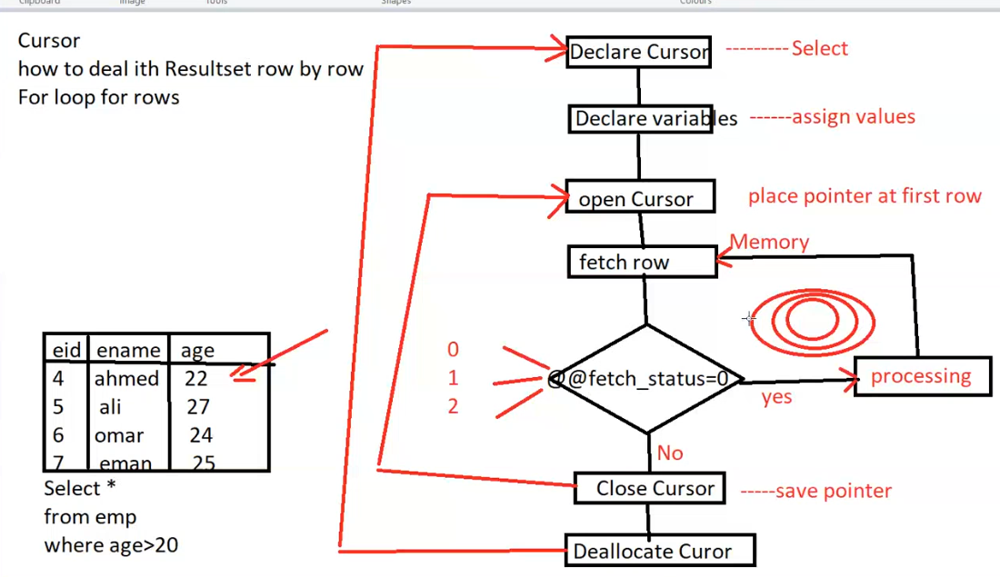

-------
## Optimization query
  ### database statistic 

table statistics in a relational database, such as SQL Server, provide information about the **distribution** of data within a table. These statistics **help the query optimizer** make informed decisions when creating execution plans for queries. Let's break it down:

### 1. What are Table Statistics?

**Definition:**
- **Table Statistics** are metadata about the data distribution in a table.
- They include information about the **number of rows**, the **distribution of values in columns**, and other relevant data characteristics.so the optmizer **make Cardinality estimation** cost based on those tables statistics.

### 2. Why are Table Statistics Important?

**Query Optimization:**
- When you submit a query to the database, the query optimizer's job is to figure out the most efficient way to retrieve or modify the data.
- Understanding the distribution of data helps the optimizer make smart decisions about how to access and process the information.

**Example:**
- Let's say you have a column in a table with mostly unique values, like customer IDs. If the optimizer knows this, it might choose a different execution plan than if the column had many duplicate values.

### 3. How are Table Statistics Generated?

**Automatic and Manual:**
- **Automatic:** In many databases, including SQL Server, statistics are automatically created and updated by the database engine. This happens during certain database operations, like when indexes are created or data is modified.
- **Manual:** In some cases, you might manually update statistics to ensure they are up-to-date, especially if your data distribution changes significantly.

**Statistics Types:**
- **Column Statistics:** Provide information about the distribution of values in a specific column.
- **Index Statistics:** Include information about the distribution of keys in an index.

### 4. How to View and Update Table Statistics?

**Viewing Statistics:**
- You can query system views or use database management tools to view statistics information. In SQL Server, you might look at the `sys.stats` view.

**Updating Statistics:**
- Statistics are usually updated automatically, but you can manually update them using a command like `UPDATE STATISTICS`.
  

### 5. Importance of Up-to-Date Statistics:

**Accurate Decisions:**
- Keeping statistics up-to-date ensures that the optimizer has accurate information to make decisions.
- Outdated statistics might lead to suboptimal query plans.

**Example:**
- If the data distribution changes significantly, the optimizer might make better decisions with updated statistics. For instance, if a column that used to have mostly unique values starts having many duplicates, the optimizer needs to be aware of this change.

In summary, table statistics are a crucial part of the database's optimization process. They provide insights into the data distribution, helping the query optimizer make intelligent choices for executing queries in the most efficient way.

## Optimization 

 **Optimizing** a query in SQL Server involves various techniques and strategies to improve Qyery performance.The query optimizer's goal is to minimize the cost of executing the query while considering various factors, and it achieves this by exploring and selecting the most efficient logical and physical plans.  

1. **Use Indexes:**
   - Cluster and non cluster
        - Ensure that appropriate indexes are created on columns that is regularly used in **WHERE clauses and JOIN conditions**.(we can use sql server profilier and sql server tuning advisor to give recommendations on column  that is regularly used in select where and join)
        - Consider covering indexes to include all columns needed for a query in the index itself.
        - if the **range** of search is very large (ex: between 1 and 2000) the optimizer could choose the whole table scan instead of the index scan as the index scan will scan alot of pages and could **scan the specific page multiple times** this could take more time than the whole table scan.and there is could be database that can store the page in there cashe so it doesn't need to make scan again.
            ```sql
            CREATE INDEX idx_example ON your_table(column1, column2);

            SELECT * FROM Sales .Orders WHERE OrderStatus = 'Delivered' ;
            CREATE NONCLUSTERED INDEX Idx_Orders_OrderStatus ON Sales.Orders(OrderStatus) ;
            ```

    - Use Columnstore Index for Aggregations on Large Table
        - A Clustered Columnstore Index in SQL Server is ideal for improving query performance on large tables, especially for aggregation-heavy queries like `COUNT`, `SUM`, and `AVG`. 

        - How it works: **Stores data in columns instead of rows**, allowing efficient compression, faster scans, and better performance for analytical workloads.
        - Use case: Suitable for large datasets and read-heavy scenarios (OLAP workloads) where aggregations or full table scans are common.
        - Performance benefits: Faster query execution, reduced storage requirements, and better parallelism.
        - Caution: Avoid for write-heavy workloads, as updates and inserts may incur overhead.

        ```sql
            SELECT CustomerID, COUNT (OrderlD) AS OrderCount
            FROM Sales.Orders
            GROUP BY CustomerID
            CREATE CLUSTERED COLUMNSTORE INDEX ldx Orders Columnstore ON Sales .Orders
        ```
        - In your example, creating a Clustered Columnstore Index on Sales.Orders optimizes the `COUNT(OrderID)` aggregation query grouped by `CustomerID`.

    - Avoid Over Indexing
    - Drop unused Indexes
    - Update Statistics (Weekly)
    - Reorganize & Rebuild Indexes (Weekly)

2. **Update Statistics and indexes:**
   - Regularly update statistics to help the query optimizer make better decisions.
   -  you should **rebuild** or update the Statistics tables or index after inserting a bulk of large data to increase performance.

   ```sql
   UPDATE STATISTICS your_table;
   ```

3. **Avoid SELECT * :**
   - Instead, specify only the columns you need. This reduces the amount of data that needs to be read.

   ```sql
   SELECT column1, column2 FROM your_table;
   ```

4. **Use JOINs Carefully:**
   - Ensure that JOIN conditions are efficient. Use INNER JOIN, LEFT JOIN, or RIGHT JOIN appropriately.
   - Avoid Cartesian products by specifying proper JOIN conditions.
   ```sql
   SELECT *
   FROM table1
   INNER JOIN table2 ON table1.id = table2.id;
   ```
   -  In Query 1, the filter e.salary = 1000 is part of the join condition, potentially reducing the number of rows considered in the join operation itself. In Query 2, the filter is applied after the join, which means the join is performed on all rows that meet the join condition, and then the result is filtered by e.salary = 1000.
    - If there is an index on e.salary, Query 2 might better leverage this index after performing the join.  Query 1 might not fully utilize the index on e.salary during the join process because the join condition is more complex.
    - SQL Server’s optimizer might still find it more efficient to evaluate the join first and then apply the filter in Query 2. Without indexes, the filtering step might not have a significant performance difference, but Query 2 maintains a clearer logical separation of join and filtering operations.
    **advice** : Filter Before Joining (Big Tables)
   ```sql
   --query 1(for small and mediam size table ) -- Filter After Join (WHERE) this more logic and readable but has same speed as query 2

    select * from Employee e  join Department d on d.dept_id=e.dept_id where e.salary=1000
        --
    SELECT c.FirstName, o.OrderID
    FROM Sales.Customers c
    INNER JOIN Sales.Orders o ON c.CustomerID = o.CustomerID
    WHERE o.OrderStatus = 'Delivered'

    --query 2 Filter During Join (ON)
    select * from Employee e  join Department d on d.dept_id=e.dept_id and e.salary=1000
      ---
    SELECT c.FirstName, o.OrderID
    FROM Sales.Customers c
    INNER JOIN Sales.Orders o
    ON c.CustomerID = o.CustomerID
    AND o.OrderStatus = 'Delivered'

    --query 3(for large tables ) Filter Before Join (SUBQUERY or CTE (more optimze) ) 
    -- Try to isolate the preparation step in a CTE or subquery 
    SELECT c.FirstName, o.OrderID
    FROM Sales.Customers c
    INNER JOIN (SELECT OrderID, CustomerID FROM Sales.Orders WHERE OrderStatus = 'Delivered') o -- you can make this in CTE instead 
    ON c.CustomerID = o.CustomerID
    ```
    - **Aggregate Before Joining (Big Tables)**
    ```sql
    -- Grouping and Joining (best practice for small and medium tables)
    SELECT c.CustomerID, c.FirstName, COUNT(o.OrderID) AS OrderCount
    FROM Sales.Customers c
    INNER JOIN Sales.Orders o
    ON c.CustomerID = o.CustomerID
    GROUP BY c.CustomerID, c.FirstName

    --Pre-aggregated Subquery (best practice for big tables)
    SELECT c.CustomerID, c.FirstName, o.OrderCount
    FROM Sales.Customers c
    INNER JOIN (
        SELECT CustomerID, COUNT(OrderID) AS OrderCount
        FROM Sales.Orders
        GROUP BY CustomerID
    ) o
    ON c.CustomerID = o.CustomerID

    --bad practice corelated 
    SELECT
    c.CustomerID,
    c.FirstName,
    (SELECT COUNT(o.OrderID)
     FROM Sales.Orders o
     WHERE o.CustomerID = c.CustomerID) AS OrderCount
    FROM Sales.Customers c
    ```
    - **Use Union Instead of OR in Joins**
    ```sql
    --Bad Practice as or can make loop and it avoid index
    SELECT o.OrderID, c.FirstName
    FROM Sales.Customers c
    INNER JOIN Sales.Orders o
    ON c.CustomerID = o.CustomerID
    OR c.CustomerID = o.SalesPersonID

    --Best Practice
    SELECT o.OrderID, c.FirstName
    FROM Sales.Customers c
    INNER JOIN Sales.Orders o
    ON c.CustomerID = o.CustomerID
    UNION
    SELECT o.OrderID, c.FirstName
    FROM Sales.Customers c
    INNER JOIN Sales.Orders o
    ON c.CustomerID = o.SalesPersonID
    ```
    - **Check for Nested Loops and Use SQL Hints to use hash join instead**
    ```sql 
    -- this query use nested loop join type
    SELECT o.OrderID, c.FirstName
    FROM Sales.Customers c
    INNER JOIN Sales.Orders o
    ON c.CustomerID = o.CustomerID

    -- Good Practice for Having Big Table & Small Table
    -- =====================================================================================
    SELECT o.OrderID, c.FirstName
    FROM Sales.Customers c
    INNER JOIN Sales.Orders o
    ON c.CustomerID = o.CustomerID
    OPTION (HASH JOIN)
    ```


5. **Limit the Result Set: and avoide use select distinct**
   - Use `TOP` or `LIMIT` clauses to limit the number of rows returned, especially if you don't need all rows. and avoide use select distinct

   ```sql
   SELECT TOP 10 column1 FROM your_table;
   ```


6. **Avoid Functions in WHERE Clauses:**
   - Functions in WHERE clauses can prevent the use of indexes. Try to avoid them if possible. don't use function in the left of the equation use it in the right side.

   ```sql
   -- Avoid this
   WHERE YEAR(date_column) = 2022;

   -- Use this
   WHERE date_column >= '2022-01-01' AND date_column < '2023-01-01';
   ```

7. **Consider Query Execution Plan:**
   - Use `EXPLAIN` or `SHOWPLAN` to understand how SQL Server is executing your query. This can help identify performance bottlenecks. and also to see the **actual time and estmated time** by the optmizer and compare them together and check why the optimizer choose these plan. 
   ```sql
   EXPLAIN SELECT column1 FROM your_table WHERE column2 = 'value';
   ```

8. **Update and Optimize SQL Server:**
   - Ensure that your SQL Server instance is up to date, and apply necessary patches and updates.
   - Use the latest version of SQL Server for performance improvements and new features.

9. **Use Stored Procedures:**
   - Stored procedures can be pre-compiled and cached, providing better performance.

10. **avoid subquery**
   - avoid subquery and use joins , CTE Or Temp table instead of that

11. **avoid using multiple OR Condition**
   - instead of using multiple OR(logical operator ) use IN(multirow operator) operator or union all
   ```sql
    -- don't use this
      WHERE state 'VA' OR 'GA'OR  'FL' 
    --use this  
    WHERE state IN ('VA' ,'GA', 'FL')      
   ```

12. **avoid using NOT**
   - Using NOT in WHERE clauses can sometimes prevent the query optimizer from effectively utilizing indexes. Try to rephrase your conditions to use positive logic whenever possible, or consider alternative approaches to achieve the same result.
     

13. **use exists instead of IN with subquery**
   - use exists instead of IN with subquery


14. **Consider Partitioning:**
    - 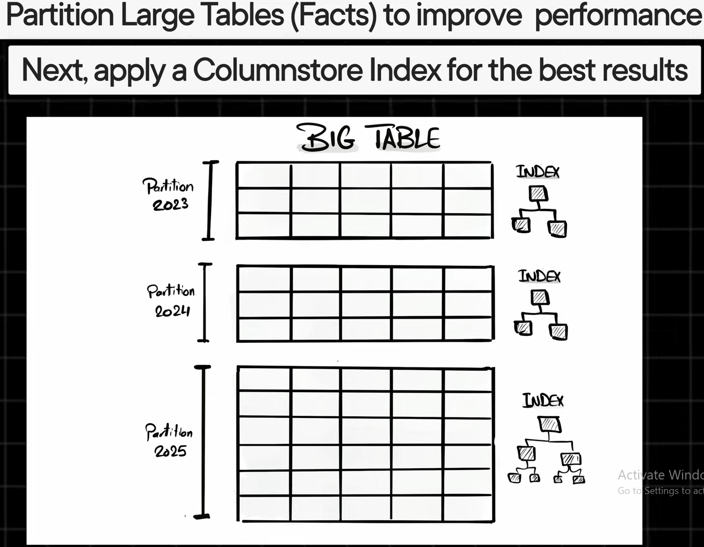  
    - For large tables, consider partitioning based on certain criteria, which can improve query performance.
    Certainly! Here's a summary of creating a partitioned table using a simplified example:
    1. Choose a Partitioning Key:
        - Select a column that will be the basis for partitioning. In this example, it's the Date column. 
        
    2. Create the Partition Function:
        - Define a partition function to determine how data will be divided into partitions. For instance, create a monthly partition function.  

    ```sql
    CREATE PARTITION FUNCTION DatePartitionFunction (DATE)
    AS RANGE LEFT FOR VALUES (
        '2023-01-01', '2023-02-01', '2023-03-01', ...
    );
    
    ```   

    3. Create the Partition Scheme:  
        - Establish a partition scheme to map partitions to physical filegroups. For simplicity, create a single filegroup.  

    ```sql   
    CREATE PARTITION SCHEME DatePartitionScheme
    AS PARTITION DatePartitionFunction
    TO ( [PRIMARY] );
    ```
    4. Alter the Table to Use Partitioning:
         - Modify the existing table to use the partition scheme. Create a clustered index on the chosen column (e.g., Date) using the partition scheme.

    ```sql   
    ALTER TABLE SalesTransactions
    DROP CONSTRAINT [PK_SalesTransactions] WITH ( ONLINE = OFF )
    GO

    CREATE CLUSTERED INDEX CIX_SalesTransactions_Date
    ON SalesTransactions (Date)
    WITH (STATISTICS_NORECOMPUTE = OFF, IGNORE_DUP_KEY = OFF, ONLINE = OFF)
    ON DatePartitionScheme(Date);
    ```  
    This process results in a partitioned table where data is organized based on the specified column (in this case, Date), and each partition corresponds to a specific range (e.g., month). Partitioning is beneficial for improving query performance, especially with large datasets.

15. **To know the time of the query**  
    you can use this and run you query it will show the time in the messange tab
    ```sql 
    SET STATISTICS TIME ON; 
    ```
    OR
    ```sql
    DECLARE @StartTime DATETIME = GETDATE();

    -- Your query here
    SELECT * FROM YourTable;

    DECLARE @EndTime DATETIME = GETDATE();
    PRINT 'Total execution time (in milliseconds): ' + CAST(DATEDIFF(MILLISECOND, @StartTime, @EndTime) AS VARCHAR);
    ```
16. **Use UNION ALL instead of using UNION**  
    - **if duplicates are acceptable or there is no duplicate in your data** : you should use union all 
        ```sql
        -- Bad Practice
        SELECT Customer1D FROM sales.orders
        UNION
        SELECT Customer1D FROM Sales.OrdersArchive

        -- Best Practice
        SELECT Customer1D FROM sales.orders
        UNION ALL
        SELECT Customer1D FROM Sales.OrdersArchive
        ```
    - **if duplicates are not acceptable** : Use UNION ALL + Distinct instead of using UNION
        ```sql
       -- Bad Practice
        SELECT CustomerID FROM Sales. Orders
        UNION
        SELECT CustomerID FROM Sales.OrdersArchive

        -- Best Practice (you should also see the execuation plan to test it if it is better from the union then use it )

        SELECT DISTINCT Customer1D
        FROM(
            SELECT Customer1D FROM Sales .Orders
            UNION ALL
            SELECT CustomerID FROM Sales.OrdersArchivel
        )  AS CombinedData
        ```
17. **Pre-Aggregate Data and store it in new Table for Reporting**
    ```sql
    SELECT MONTH(OrderDate) OrderYear,
    INTO Sales. SalesSummary
    FROM Sales .Orders
    GROUP BY MONTH(OrderDate)
    SUM(Sa1es) AS TotalSa1es
    SELECT OrderYear, TotalSa1es FROM Sales. SalesSummary
    ```
18. **Avoid Redundant Logic in Your Query**

```sql
    -- Bad Practice
    SELECT EmployeeID, FirstName, 'Above Average' Status
    FROM Sales.Employees
    WHERE Salary > (SELECT AVG(Sa1ary) FROM Sales.Employees )
    UNION ALL
    SELECT EmployeeID, FirstName, 'Below Average'   Status
    FROM Sales.Employees
    WHERE Salary < (SELECT AVG(Sa1ary) FROM Sales.Employees)

    -- Good Practice if you see redundant logic as above thik of CTE or Window function to remove this redundant
    SELECT
    EmployeeID,
    FirstName,
    CASE
    WHEN Salary > AVG(SaIary) OVER () THEN 'Above Average'
    WHEN Salary < AVG(Sa1ary) OVER () THEN 'Below Average'
    ELSE  'Average' End as Status
    FROM Sales.Employees

```

19. **DDL Optimization**
- Avoid Data Types VARCHAR & TEXT
- Avoid (MAX) unnecessarily large lengths in data types
- Use the NOT NULL constraint where applicable
- Ensure all your tables have a Clustered Primary Key
- Create a non-clustered index for foreign keys that are used frequently
```sql
    -- bad practice 
    CREATE TABLE CustomersInfo (
    CustomerID INT,
    FirstName VARCHAR(MAX),
    LastName TEXT,
    Country VARCHAR(255),
    TotalPurchases FLOAT,
    Score VARCHAR(255),
    BirthDate VARCHAR(255),
    EmployeeID INT,
    CONSTRAINT FK_CustomersInfo_EmployeeID FOREIGN KEY (EmployeeID)
    REFERENCES Sales.Employees(EmployeeID)
);

-- best Practice 
CREATE TABLE CustomersInfo (
    CustomerID INT PRIMARY KEY CLUSTERED,
    FirstName VARCHAR(50) NOT NULL,
    LastName VARCHAR(50) NOT NULL,
    Country VARCHAR(50) NOT NULL,s
    TotalPurchases FLOAT,
    Score INT,
    BirthDate DATE,
    EmployeeID INT,
    CONSTRAINT FK_CustomersInfo_EmployeeID FOREIGN KEY (EmployeeID)
    REFERENCES Sales.Employees(EmployeeID)
);

CREATE NONCLUSTERED INDEX IX_CustomersInfo_EmployeeID
ON CustomersInfo(EmployeeID);


```

## query lifecycle how optimizer work 

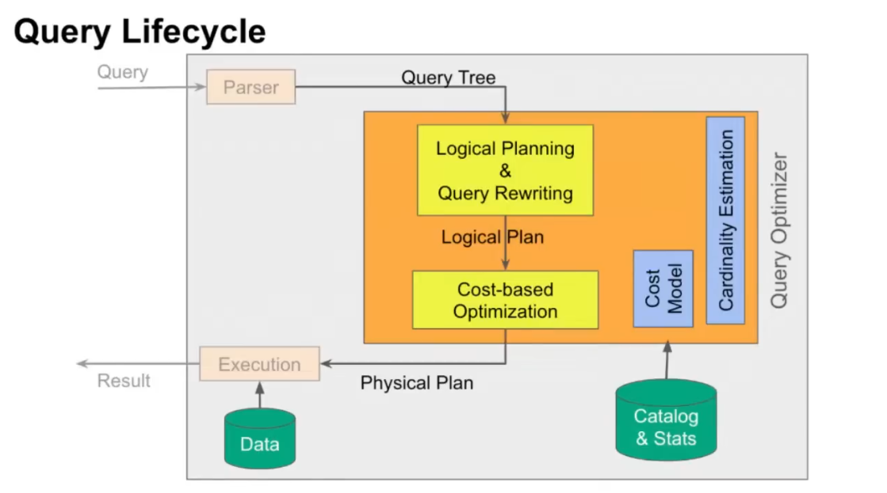

Certainly! The process of query optimization involves the generation of both logical and physical execution plans. Let's delve into each of them in detail:

### 1. Logical Query Plan:

**Definition:**
- The logical query plan represents the high-level, abstract description of how the database engine should retrieve or modify the data to fulfill the query.
- It focuses on the logical **relationships between tables** and the **operations that need** to be performed.

**Key Components:**
- **Table Access Methods:** Describes how tables are accessed, such as full table scans or index seeks.
- **Join Methods:** Specifies how tables are joined, whether it's through nested loops, hash joins, or merge joins.
- **Filtering Conditions:** Includes conditions specified in the WHERE clause, indicating the filtering criteria for rows.
- **Aggregation and Grouping:** If applicable, it outlines how data should be aggregated or grouped.

**Example:**
Consider a simple query like:

```sql
SELECT Customers.CustomerID, Orders.OrderID
FROM Customers
INNER JOIN Orders ON Customers.CustomerID = Orders.CustomerID
WHERE Customers.Country = 'USA';
```

The logical plan might describe the following operations:
- Access Customers table and filter rows where Country is 'USA'.
- Access Orders table and perform an inner join on CustomerID.
- Retrieve CustomerID and OrderID columns.

### 2. Physical Query Plan:

**Definition:**
- The physical query plan details the actual steps and methods the database engine will use to execute the query efficiently.
- It involves decisions on **how to access data**, which indexes to use, and the **order of operations**.

**Key Components:**
- **Index Usage:** Specifies which indexes will be utilized for table access or joins.
- **Join Order:** Determines the sequence in which tables are joined.
- **Access Methods:** Describes how data is retrieved from tables, whether it's a full table scan, index seek, or other methods.
- **Parallelism:** Indicates if parallel processing should be used to execute parts of the query concurrently.

**Example:**
For the same query, a physical plan might involve:
- Using an index on the Customers table to filter rows based on the Country.
- Performing an index seek on the Orders table using the CustomerID.
- Executing the join operation using a nested loop join.

### Query Optimization Process:

1. **Parsing and Validation:**
   - The optimizer starts by parsing the SQL query, ensuring its correctness and validity.

2. **Query Rewriting:**
   - The query may undergo transformations to simplify or rewrite it. This can involve things like converting subqueries into joins for better performance.

3. **Generation of Multiple Logical Plans:**
   - The optimizer explores different ways to logically represent the query. It considers various access paths, join methods, and filtering strategies.

4. **Cost Estimation:**
   - Each logical plan is assigned a cost based on estimated resource usage, such as CPU, I/O, and memory.

5. **Selection of the Best Logical Plan:**
   - The optimizer chooses the logical plan with the lowest estimated cost.

6. **Transformation to Physical Plan:**
   - The chosen logical plan is then transformed into a physical plan that outlines the specific steps and methods to execute the query efficiently.

7. **Final Optimization:**
   - The physical plan is further optimized based on factors like available indexes, statistics, and system resources.

8. **Execution:**
   - The optimized physical plan is executed to retrieve or modify the data.


