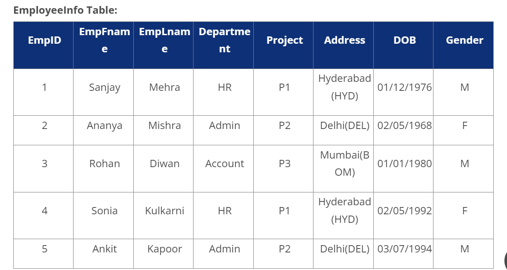
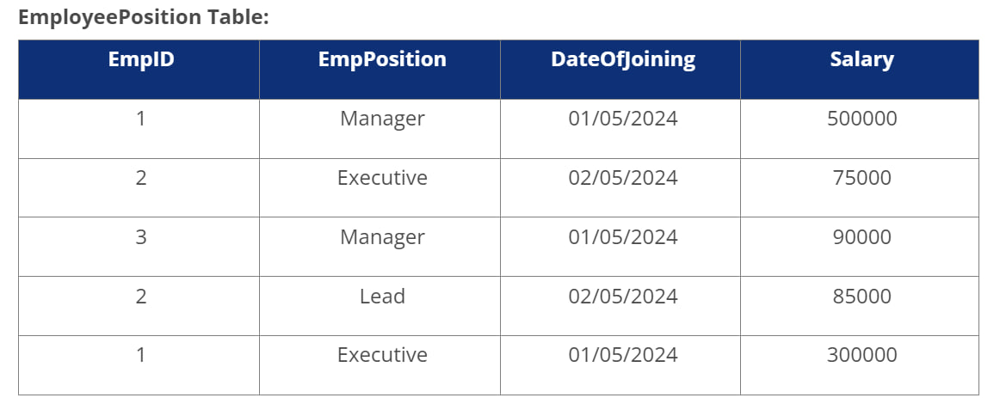
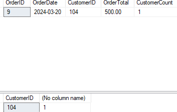
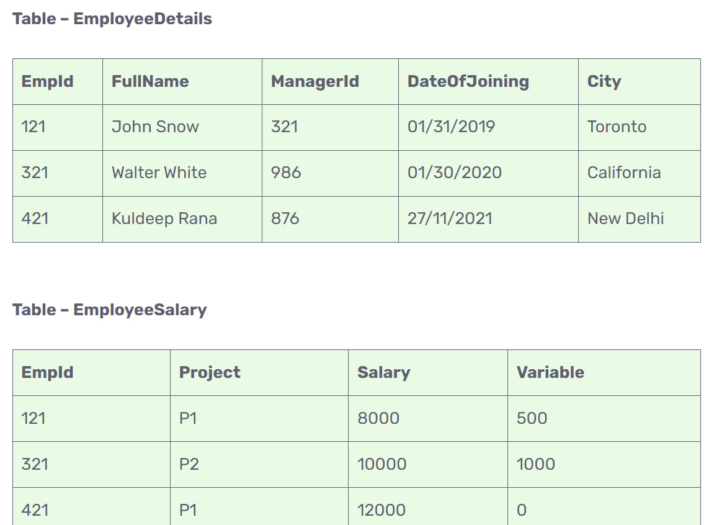
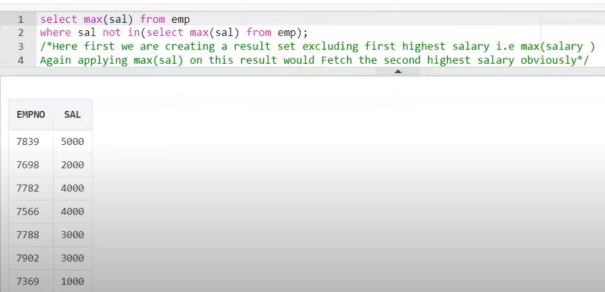
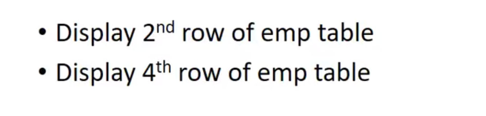
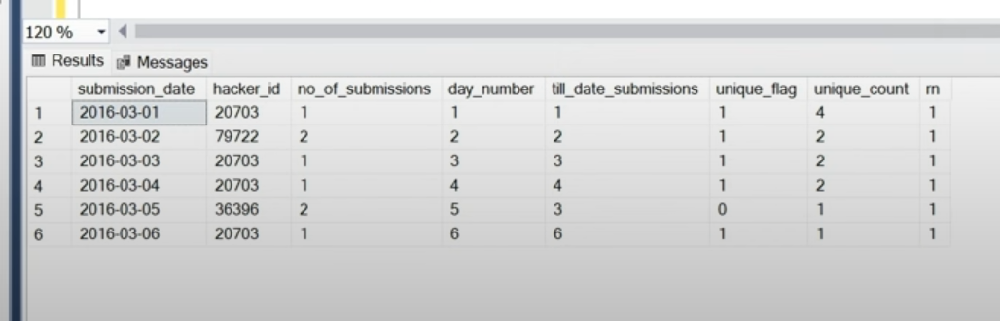
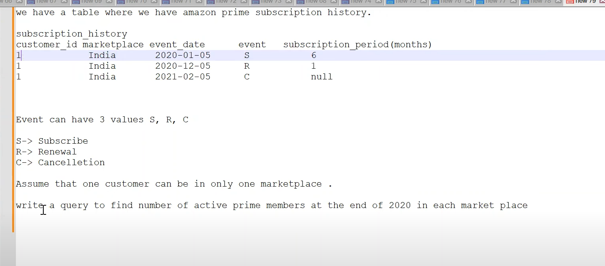
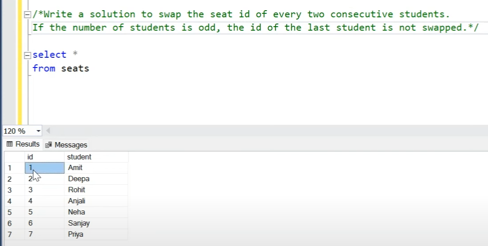

**SQL Query Interview**
---





**Q1. Write a query to get the current date.**
You can write a query as follows in SQL Server:
```sql
SELECT GETDATE();
```
You can write a query as follows in MySQL:
```sql
SELECT SYSTDATE();
```
**Q2. Write a query to retrieve the first four characters of  EmpLname from the EmployeeInfo table.**
```sql
SELECT SUBSTRING(EmpLname, 1, 4) FROM EmployeeInfo;
```
**Q3. Write a query to fetch only the place name(string before brackets) from the Address column of EmployeeInfo table.**
Using the MID function in MySQL
```sql
SELECT MID(Address, 0, LOCATE('(',Address)) FROM EmployeeInfo;
```
Using SUBSTRING
```sql
SELECT SUBSTRING(Address, 1, CHARINDEX('(',Address)) FROM EmployeeInfo;
```
**Q4. Write a query to create a new table which consists of data and structure copied from the other table.**
Using the SELECT INTO command:
```sql
SELECT * INTO NewTable FROM EmployeeInfo WHERE 1 = 0;
```
Using the CREATE command in MySQL:
```sql
CREATE TABLE NewTable AS SELECT * FROM EmployeeInfo;
```
**Q5. Write a query to fetch the EmpFname from the EmployeeInfo table in upper case and use the ALIAS name as EmpName.**
```sql
SELECT UPPER(EmpFname) AS EmpName FROM EmployeeInfo;
```
**Q6. Write a query to fetch the number of employees working in the department "HR".**
```sql
SELECT COUNT(*) FROM EmployeeInfo WHERE Department = 'HR';
```
**Q7. Write q query to find all the employees whose salary is between 50000 to 100000.**
```sql
SELECT * FROM EmployeePosition WHERE Salary BETWEEN '50000' AND '100000';
```
**Q8. Write a query to find the names of employees that begin with "S"**
```sql
SELECT * FROM EmployeeInfo WHERE EmpFname LIKE 'S%';
```
**Q9. Write a query to fetch top N records.**
By using the TOP command in SQL Server:
```sql
SELECT TOP N * FROM EmployeePosition ORDER BY Salary DESC;
```
By using the LIMIT command in MySQL:
```sql
SELECT * FROM EmpPosition ORDER BY Salary DESC LIMIT N;
```
**Q10. Write a query to retrieve the EmpFname and EmpLname in a single column as "FullName". The first name and the last name must be separated with space.**
```sql
SELECT CONCAT(EmpFname, ' ', EmpLname) AS 'FullName' FROM EmployeeInfo;
```
**Q11. Write a query find number of employees whose DOB is between 02/05/1970 to 31/12/1975 and are grouped according to gender**
```sql
SELECT COUNT(*), Gender FROM EmployeeInfo WHERE DOB BETWEEN '02/05/1970 ' AND '31/12/1975' GROUP BY Gender;
```
**Q12. Write a query to fetch all the records from the EmployeeInfo table ordered by EmpLname in descending order and Department in the ascending order.**
To order the records in ascending and descnding order, you have to use the ORDER BY statement in SQL.
```sql
SELECT * FROM EmployeeInfo ORDER BY EmpFname desc, Department asc;
```
**Q13. Write a query to fetch details of employees whose EmpLname ends with an alphabet "A" and contains five alphabets.**
To fetch details mathcing a certain value, you have to use the LIKE operator in SQL.
```sql
SELECT * FROM EmployeeInfo WHERE EmpLname LIKE '____a';
```
**Q14. Write a query to fetch details of all employees excluding the employees with first names, "Sanjay" and "Sonia" from the EmployeeInfo table.**
```sql
SELECT * FROM EmployeeInfo WHERE EmpFname NOT IN ('Sanjay','Sonia');
```
**Q15. Write a query to fetch details of employees with the address as "DELHI(DEL)".**
```sql
SELECT * FROM EmployeeInfo WHERE Address LIKE 'DELHI(DEL)%';
```
**Q16. Write a query to fetch all employees who also hold the managerial position.**
```sql
SELECT E.EmpFname, E.EmpLname, P.EmpPosition 
FROM EmployeeInfo E INNER JOIN EmployeePosition P ON
E.EmpID = P.EmpID AND P.EmpPosition IN ('Manager');
```
**Q17. Write a query to fetch the department-wise count of employees sorted by department's count in ascending order.**
```sql
SELECT Department, count(EmpID) AS EmpDeptCount 
FROM EmployeeInfo GROUP BY Department 
ORDER BY EmpDeptCount ASC;
```
**Q18. Write a query to calculate the even and odd records from a table.**
To retrieve the even records from a table, you have to use the MOD() function as follows:
```sql
SELECT * FROM  EmployeeInfo WHERE MOD(Empid,2)=0;

SELECT * FROM  EmployeeInfo WHERE MOD(Empid,2)=1;
```

**Q19. Write a SQL query to retrieve employee details from EmployeeInfo table who have a date of joining in the EmployeePosition table.**
```sql
SELECT * FROM EmployeeInfo E 
WHERE EXISTS 
(SELECT * FROM EmployeePosition P WHERE E.EmpId = P.EmpId);

--OR
SELECT *
FROM EmployeeInfo
JOIN EmployeePosition ON EmployeeInfo.EmployeeID = EmployeePosition.EmployeeID
WHERE EmployeePosition.DateOfJoining IS NOT NULL;

```
**Q20. Write a query to retrieve two minimum and maximum salaries from the EmployeePosition table.**
```sql
-- Two minimum salaries
SELECT TOP 2 Salary
FROM EmployeePosition
ORDER BY Salary;

-- Two maximum salaries
SELECT TOP 2 Salary
FROM EmployeePosition
ORDER BY Salary DESC;

--OR
--To retrieve two minimum salaries, you can write a query as below:
SELECT DISTINCT Salary FROM EmployeePosition E1 
 WHERE 2 >= (SELECTCOUNT(DISTINCT Salary)FROM EmployeePosition E2 
  WHERE E1.Salary >= E2.Salary) ORDER BY E1.Salary DESC;

--To retrieve two maximum salaries, you can write a query as below: 
SELECT DISTINCT Salary FROM EmployeePosition E1 
 WHERE 2 >= (SELECTCOUNT(DISTINCT Salary) FROM EmployeePosition E2 
  WHERE E1.Salary <= E2.Salary) ORDER BY E1.Salary DESC;
```
**Q21. Write a query to find the Nth highest salary from the table without using TOP/limit keyword.**
```sql
SELECT DISTINCT Salary
FROM EmployeePosition e1
WHERE N = (
    SELECT COUNT(DISTINCT Salary)
    FROM EmployeePosition e2
    WHERE e1.Salary <= e2.Salary);

--OR
WITH RankedSalaries AS (
    SELECT
        Salary,
        DENSE_RANK() OVER (ORDER BY Salary DESC) AS SalaryRank
    FROM YourTableName
)

SELECT Salary
FROM RankedSalaries
WHERE SalaryRank = N;

```
**Q22. Write a query to retrieve duplicate records from a table.**
```sql
SELECT EmpID, EmpFname, Department, COUNT(*) 
FROM EmployeeInfo GROUP BY EmpID, EmpFname, Department 
HAVING COUNT(*) > 1;
```
**Write a query to delete duplicate records from a table.**
```sql
WITH CTE AS (
  SELECT employee_id, employee_name,
         ROW_NUMBER() OVER (PARTITION BY employee_name ORDER BY (SELECT 0)) AS RowNum
  FROM Employee
)
DELETE FROM CTE WHERE RowNum > 1;

------OR-------
DELETE FROM Employee
WHERE (employee_name) NOT IN (
    SELECT employee_name
    FROM Employee
    GROUP BY employee_name
    HAVING COUNT(*) > 1);
```
- **window functions** may be faster than group by, especially if you want to perform **multiple calculations**( ranking, percentage, difference, or cumulative sum) on the same group of rows.
- **group by** may be faster than window functions, especially if you only want to perform a **single calculation**(average, maximum, or count.) on each group of rows 
- **use window function** :If there are **many distinct groups** in your dataset and only a few duplicates within each group,This is because window functions operate on a per-row basis and don't require grouping the entire dataset. 
- **use GROUP BY**: if there are **few distinct groups** with a significant number of duplicates within each group, as it aggregates the data based on the grouped column directly.
- if you want to see the **duplicated values** you should use **window function** but if you want to see the **uniqe value** you should use **group by**


```sql
-- you should group by or PARTITION BY the column that you wnat to remover the duplicated value or show it from this column  
--using group by 
SELECT ename, COUNT(*) AS Frequency
FROM emp
GROUP BY ename
HAVING COUNT(*) > 1; -- Filter to include only duplicated values
HAVING COUNT(*) = 1;  -- Filter to include only unique values

--using window function 
-- if you want to see the duplicated values you should use window function but if you want to see the uniqe value you should use group by:
WITH CTE AS (
    SELECT ename,
			eadress,       
           ROW_NUMBER() OVER (PARTITION BY ename ORDER BY (SELECT NULL)) AS row_num
    FROM emp
)
SELECT ename, eadress, row_num
FROM CTE
WHERE row_num > 1 ; -- can't filter on row_num = 1 >> as it will give all distinct value not unique  
```

**Q22. Write a query to retrieve the unique values and hasn't been duplicated before .**

```sql
SELECT *
FROM (
    SELECT OrderID,
           OrderDate,
           CustomerID,
           OrderTotal,
           COUNT(*) OVER (PARTITION BY CustomerID) AS CustomerCount
    FROM Orderss
) AS tb1
WHERE CustomerCount = 1;

select 
    CustomerID, count(*)
from Orderss
group by CustomerID
having count(*) =1
```

```sql
CREATE TABLE Orderss (
    OrderID INT,
    CustomerID INT,
    OrderDate DATE,
    OrderTotal DECIMAL(10, 2)
);

INSERT INTO Orderss (OrderID, CustomerID, OrderDate, OrderTotal)
VALUES 
    (1, 101, '2024-01-10', 150.00),
    (2, 102, '2024-01-12', 200.00),
    (3, 101, '2024-02-05', 300.00),
    (4, 103, '2024-02-10', 250.00),
    (5, 102, '2024-03-01', 180.00),
    (6, 101, '2024-03-15', 350.00),
    (7, 103, '2024-03-20', 350.00),
	(8, 103, '2024-03-20', 400.00),
	(9, 104, '2024-03-20', 500.00);
```


------
**Q23. Write a query to retrieve the list of employees working in the same department.**
```sql
Select DISTINCT E.EmpID, E.EmpFname, E.Department 
FROM EmployeeInfo E, Employee E1 
WHERE E.Department = E1.Department AND E.EmpID != E1.EmpID;
```
**Q24. Write a query to retrieve the last 3 records from the EmployeeInfo table.**
```sql
SELECT TOP 3 *
FROM EmployeeInfo
ORDER BY EmployeeID DESC;

SELECT *
FROM EmployeeInfo
ORDER BY EmployeeID DESC
LIMIT 3;

SELECT * FROM EmployeeInfo WHERE
EmpID <=3 UNION SELECT * FROM
(SELECT * FROM EmployeeInfo E ORDER BY E.EmpID DESC) 
AS E1 WHERE E1.EmpID <=3;
```
**Q25. Write a query to find the third-highest salary from the EmpPosition table.**
```sql
SELECT TOP 1 salary
FROM(
SELECT TOP 3 salary
FROM employee_table
ORDER BY salary DESC) AS emp
ORDER BY salary ASC;
```
**Q26. Write a query to display the first and the last record from the EmployeeInfo table.**
To display the first record from the EmployeeInfo table, you can write a query as follows:
```sql
-- First Record
SELECT TOP 1 *
FROM EmployeeInfo
ORDER BY EmployeeID;

SELECT * FROM EmployeeInfo WHERE EmpID = (SELECT MIN(EmpID) FROM EmployeeInfo);
```
To display the last record from the EmployeeInfo table, you can write a query as follows:
```sql
-- Last Record
SELECT TOP 1 *
FROM EmployeeInfo
ORDER BY EmployeeID DESC;

SELECT * FROM EmployeeInfo WHERE EmpID = (SELECT MAX(EmpID) FROM EmployeeInfo);
```
**Q27. Write a query to add email validation to your database**
```sql
SELECT Email FROM EmployeeInfo WHERE NOT REGEXP_LIKE(Email, '[A-Z0-9._%+-]+@[A-Z0-9.-]+.[A-Z]{2,4}', 'i');
```
**Q28. Write a query to retrieve Departments who have less than 2 employees working in it.**
```sql
SELECT DEPARTMENT, COUNT(EmpID) as 'EmpNo' FROM EmployeeInfo GROUP BY DEPARTMENT HAVING COUNT(EmpD) < 2;
```
**Q29. Write a query to retrieve EmpPostion along with total salaries paid for each of them.**
```sql
SELECT EmpPosition, SUM(Salary) from EmployeePosition GROUP BY EmpPosition;
```
**Q30. Write a query to fetch 50% records from the EmployeeInfo table.**
```sql
SELECT TOP 50 PERCENT *
FROM EmployeeInfo
ORDER BY EmployeeID;

SELECT * 
FROM EmployeeInfo WHERE
EmpID <= (SELECT COUNT(EmpID)/2 from EmployeeInfo);
```


---



**Q1. Write an SQL query to display the total salary of each employee adding the Salary with Variable value.**
Here, we can simply use the '+' operator in SQL.
```sql
SELECT EmpId,
Salary+Variable as TotalSalary 
FROM EmployeeSalary;
```

**Q2. Write an SQL query to fetch the employees whose name begins with any two characters, followed by a text "hn" and ends with any sequence of characters.**
```sql
SELECT FullName
FROM EmployeeDetails
WHERE FullName LIKE '__hn%';
```

**Q3. Write an SQL query to fetch all the EmpIds which are present in either of the tables 'EmployeeDetails' and 'EmployeeSalary'.**
```sql
SELECT EmpId FROM EmployeeDetails
UNION 
SELECT EmpId FROM EmployeeSalary;
```

**Q4. Write an SQL query to fetch common records between two tables.**
```sql
SELECT * FROM EmployeeSalary
INTERSECT
SELECT * FROM ManagerSalary;

SELECT EmpId FROM 
EmployeeDetails 
where EmpId IN 
(SELECT EmpId FROM EmployeeSalary);

```

**Q5. Write an SQL query to fetch records that are present in one table but not in another table.**
```sql
SELECT * FROM EmployeeSalary
except
SELECT * FROM ManagerSalary;

SELECT EmpId FROM 
EmployeeDetails 
where EmpId Not IN 
(SELECT EmpId FROM EmployeeSalary);
```

**Q6. Write an SQL query to update the employee names by removing leading and trailing spaces.**
```sql
UPDATE EmployeeDetails 
SET FullName = LTRIM(RTRIM(FullName));
```
**Q7. Fetch all the employees who are not working on any project.**
```sql
SELECT EmpId 
FROM EmployeeSalary 
WHERE Project IS NULL;
```

**Q8. Write a query to fetch employee names and salary records. Display the employee details even if the salary record is not present for the employee.**
```sql
SELECT E.FullName, S.Salary 
FROM EmployeeDetails E 
LEFT JOIN 
EmployeeSalary S
ON E.EmpId = S.EmpId;
```
**Q9. Write an SQL query to fetch all the Employees who are also managers from the EmployeeDetails table.**
```sql
SELECT DISTINCT E.FullName
FROM EmployeeDetails E
INNER JOIN EmployeeDetails M
ON E.EmpID = M.ManagerID;
```
**Q10. Consider a SalesData with columns SaleID, ProductID, RegionID, SaleAmount. Write a query to find the total sales amount for each product in each region.**
```sql
SELECT ProductID, RegionID, SUM(SaleAmount) AS TotalSales 
FROM SalesData 
GROUP BY ProductID, RegionID;
```
**Q11. Write a query to find employees who earn more than their managers.**
```sql
SELECT E.Name AS EmployeeName, 
M.Name AS ManagerName, 
E.Salary AS EmployeeSalary, 
M.Salary AS ManagerSalary 
FROM EmployeeDetails E JOIN EmployeeDetails M 
ON E.ManagerID = M.EmployeeID 
WHERE E.Salary > M.Salary;
```

**Q12. Consider a StudentGrades table with columns StudentID, CourseID, Grade. Write a query to find students who have scored an 'A' in more than three courses.**
```sql
SELECT StudentID FROM StudentGrades 
WHERE Grade = 'A' 
GROUP BY StudentID 
HAVING COUNT(*) > 3;
```

**Q13. Consider a table PatientVisits with Columns VisitID, PatientID, DoctorID, VisitDate, Diagnosis.Write a query to find the latest visit date for each patient.**
```sql
SELECT PatientID, MAX(VisitDate) AS LatestVisitDate 
FROM PatientVisits 
GROUP BY PatientID;
```

**Q14. Consider a table FoodOrders with columns  OrderID, TableID, MenuItemID, OrderTime, Quantity. Write a query to find the most ordered menu item.**
```sql
SELECT TOP 1 MenuItemID, COUNT(*) AS OrderCount
FROM FoodOrders
GROUP BY MenuItemID
ORDER BY OrderCount DESC;
```
**Q15. Consider a table Transactions with columns – TransactionID, CustomerID, ProductID, TransactionDate, Amount. Write a query to find the total transaction amount for each month.**
```sql
SELECT MONTH(TransactionDate) AS Month, 
SUM(Amount) AS TotalAmount 
FROM Transactions 
GROUP BY MONTH(TransactionDate);
```
**Q16. Consider a table EmployeeAttendance with columns AttendanceID, EmployeeID, Date, Status. Write a query to find employees with more than 5 absences in a month.**
```sql
SELECT EmployeeID, 
MONTH(Date) AS Month, 
COUNT(*) AS Absences 
FROM EmployeeAttendance 
WHERE Status = 'Absent' 
GROUP BY EmployeeID, MONTH(Date) 
HAVING COUNT(*) > 5;
```

---
**Questions**

```sql
WITH RankedSalaries AS (
    SELECT Salary, ROW_NUMBER() OVER (ORDER BY Salary DESC) AS SalaryRank
    FROM Employee
)
SELECT Salary
FROM RankedSalaries
WHERE SalaryRank = 2;


SELECT TOP 1 Salary
FROM (
    SELECT DISTINCT TOP 2 Salary
    FROM Employee
    ORDER BY Salary DESC
) AS SecondHighestSalary
ORDER BY Salary ASC;
```


```sql
WITH RankedSalaries AS (
    SELECT
        FirstName,
        Salary,
        DepartmentID,
        ROW_NUMBER() OVER (PARTITION BY DepartmentID ORDER BY Salary DESC) AS SalaryRank
    FROM Employee
)
SELECT
    FirstName,
    Salary,
    DepartmentID
FROM RankedSalaries
WHERE SalaryRank = 1;


SELECT
    DepartmentID,
    MAX(Salary) AS MaxSalary
FROM Employee
GROUP BY DepartmentID;
```


```sql
WITH AlternateRecords AS (
    SELECT
        *,
        ROW_NUMBER() OVER (ORDER BY (SELECT NULL)) AS RowNum
    FROM YourTable
)
SELECT *
FROM AlternateRecords
WHERE RowNum % 2 = 1; -- Selects alternate records (odd row numbers)
```


```sql
SELECT ename
FROM emp
where ename like '%N'


SELECT ename
FROM emp
where ename Not like '%N'


SELECT ename -- name contains 4 letters only
FROM emp
where ename Not like '____'


SELECT ename -- second letter is l
FROM emp
where ename Not like '_l%'
```


```sql
SELECT TOP 1 *
FROM emp
ORDER BY employee_id
OFFSET 1 ROW; --OFFSET 3 ROW


SELECT *
FROM (
    SELECT
        *,
        ROW_NUMBER() OVER (ORDER BY (SELECT NULL)) AS RowNum
    FROM emp
) AS RankedEmp
WHERE RowNum = 2; -- RowNum = 4
```


```sql
-- Display the first row
SELECT *
FROM (
    SELECT
        *,
        ROW_NUMBER() OVER (ORDER BY (SELECT NULL)) AS RowNumAsc
    FROM YourTable
) AS FirstRow
WHERE RowNumAsc = 1;

-- Display the last row
SELECT *
FROM (
    SELECT
        *,
        ROW_NUMBER() OVER (ORDER BY (SELECT NULL)) AS RowNumDesc
    FROM YourTable
) AS LastRow
WHERE RowNumDesc = (SELECT COUNT(*) FROM YourTable);


--OR
-- Display the first row
SELECT TOP 1 *
FROM YourTable
ORDER BY (SELECT NULL); -- The query you have written is used to select the first row from a table without any specific order. The SELECT NULL part is a dummy expression that does not affect the result, but is required by the syntax of the ORDER BY clause.

-- Display the last row
SELECT TOP 1 *
FROM YourTable
ORDER BY (SELECT NULL) DESC;
```

---------
## sql ideas

### to get the rate of occurance of any element('confirmed') in any column (action) like this question , so in genral way if you want to get the aggregate of any element in specific column with condition you should use case when or iif inside the aggregate

1- The confirmation rate of a user is the number of 'confirmed' messages divided by the total number of requested confirmation messages. The confirmation rate of a user that did not request any confirmation messages is 0. Round the confirmation rate to two decimal places.

Write a solution to find the confirmation rate of each user.
Return the result table in any order.
The result format is in the following example.

https://leetcode.com/problems/confirmation-rate/?envType=study-plan-v2&envId=top-sql-50 

Input: 
Signups table:

| user_id | time_stamp          |
|---------|---------------------|
| 3       | 2020-03-21 10:16:13 |
| 7       | 2020-01-04 13:57:59 |
| 2       | 2020-07-29 23:09:44 |
| 6       | 2020-12-09 10:39:37 |

Confirmations table:

| user_id | time_stamp          | action    |
|---------|---------------------|-----------|
| 3       | 2021-01-06 03:30:46 | timeout   |
| 3       | 2021-07-14 14:00:00 | timeout   |
| 7       | 2021-06-12 11:57:29 | confirmed |
| 7       | 2021-06-13 12:58:28 | confirmed |
| 7       | 2021-06-14 13:59:27 | confirmed |
| 2       | 2021-01-22 00:00:00 | confirmed |
| 2       | 2021-02-28 23:59:59 | timeout   |

Output: 

| user_id | confirmation_rate |
|---------|-------------------|
| 6       | 0.00              |
| 3       | 0.00              |
| 7       | 1.00              |
| 2       | 0.50              |

```sql
/* Write your T-SQL query statement below */
SELECT s.user_id,
       ROUND(AVG(CASE WHEN c.action = 'confirmed' THEN 1.00 ELSE 0.00 END),2) AS confirmation_rate
FROM Signups AS s
LEFT JOIN Confirmations AS c
ON s.user_id = c.user_id
GROUP BY s.user_id
```

2- Write an SQL query to find for each month and country, the number of transactions and their total amount, the number of approved transactions and their total amount.
Return the result table in any order.
The query result format is in the following example.  

https://leetcode.com/problems/monthly-transactions-i/?envType=study-plan-v2&envId=top-sql-50  

Input: 
Transactions table:
| id   | country | state    | amount | trans_date |
|------|---------|----------|--------|------------|
| 121  | US      | approved | 1000   | 2018-12-18 |
| 122  | US      | declined | 2000   | 2018-12-19 |
| 123  | US      | approved | 2000   | 2019-01-01 |
| 124  | DE      | approved | 2000   | 2019-01-07 |

Output: 
| month    | country | trans_count | approved_count | trans_total_amount | approved_total_amount |
|----------|---------|-------------|----------------|--------------------|-----------------------|
| 2018-12  | US      | 2           | 1              | 3000               | 1000                  |
| 2019-01  | US      | 1           | 1              | 2000               | 2000                  |
| 2019-01  | DE      | 1           | 1              | 2000               | 2000                  |

```sql
/* Write your T-SQL query statement below */
SELECT
    LEFT(CAST(trans_date AS  nvarchar), 7) AS month,
    country,
    COUNT(*) AS trans_count,
    SUM(IIF(state = 'approved', 1, 0)) AS approved_count,
    SUM(amount) AS trans_total_amount,
    SUM(IIF(state = 'approved', amount, 0)) AS approved_total_amount

FROM Transactions

GROUP BY LEFT(CAST(trans_date AS  nvarchar), 7), country
```

--------

### to get first element or second or any order of it use rank() in cte to get you table then filter on it down or   to get also the Nth of any element in specific group(partition) use windown function 
 
https://leetcode.com/problems/immediate-food-delivery-ii/?envType=study-plan-v2&envId=top-sql-50  

If the customer's preferred delivery date is the same as the order date, then the order is called immediate; otherwise, it is called scheduled.
The first order of a customer is the order with the earliest order date that the customer made. It is guaranteed that a customer has precisely one first order.
Write a solution to find the percentage of immediate orders in the first orders of all customers, rounded to 2 decimal places.
The result format is in the following example.


Input: 
Delivery table:
| delivery_id | customer_id | order_date | customer_pref_delivery_date |
|-------------|-------------|------------|-----------------------------|
| 1           | 1           | 2019-08-01 | 2019-08-02                  |
| 2           | 2           | 2019-08-02 | 2019-08-02                  |
| 3           | 1           | 2019-08-11 | 2019-08-12                  |
| 4           | 3           | 2019-08-24 | 2019-08-24                  |
| 5           | 3           | 2019-08-21 | 2019-08-22                  |
| 6           | 2           | 2019-08-11 | 2019-08-13                  |
| 7           | 4           | 2019-08-09 | 2019-08-09                  |

Output: 
| immediate_percentage |
|----------------------|
| 50.00                |

Explanation: 
The customer id 1 has a first order with delivery id 1 and it is scheduled.
The customer id 2 has a first order with delivery id 2 and it is immediate.
The customer id 3 has a first order with delivery id 5 and it is scheduled.
The customer id 4 has a first order with delivery id 7 and it is immediate.
Hence, half the customers have immediate first orders. 

```sql
 /* Write your T-SQL query statement below */
WITH cte AS (
    SELECT
        customer_id,
        order_date,
        RANK() OVER (PARTITION BY customer_id ORDER BY order_date) AS r,  -- to get the first order for the customer 
        customer_pref_delivery_date
    FROM
        Delivery
)
SELECT
    ROUND(
        CAST(100*COUNT(CASE WHEN order_date = customer_pref_delivery_date THEN 1 END) AS decimal) /
        CAST(COUNT(customer_id) AS decimal),
    2) AS immediate_percentage
FROM
    cte
WHERE r = 1;
```

2-Display the highest payed employees in each department

```sql
WITH RankedSalaries AS (
    SELECT
        FirstName,
        Salary,
        DepartmentID,
        ROW_NUMBER() OVER (PARTITION BY DepartmentID ORDER BY Salary DESC) AS SalaryRank
    FROM Employee
)
SELECT
    FirstName,
    Salary,
    DepartmentID
FROM RankedSalaries
WHERE SalaryRank = 1;
```

----

### to compare between the value of element and the next value of it or the previous value use lag, lead

Write a solution to find all dates' Id with higher temperatures compared to its previous dates (yesterday).
Return the result table in any order.
The result format is in the following example.

https://leetcode.com/problems/rising-temperature/?envType=study-plan-v2&envId=top-sql-50


Input: 
Weather table:
| id | recordDate | temperature |
|----|------------|-------------|
| 1  | 2015-01-01 | 10          |
| 2  | 2015-01-02 | 25          |
| 3  | 2015-01-03 | 20          |
| 4  | 2015-01-04 | 30          |

Output: 
| id |
|----|
| 2  |
| 4  |
Explanation: 
In 2015-01-02, the temperature was higher than the previous day (10 -> 25).  
In 2015-01-04, the temperature was higher than the previous day (20 -> 30).


```sql
SELECT ID FROM (
    SELECT ID,
        Temperature,
        recordDate ,
        LAG(Temperature, 1) OVER (ORDER BY recordDate) AS prev_temp
        ,lag(recordDate ,1) over (ORDER BY recordDate) as next_date
    FROM weather
) resultt
WHERE  datediff(day, next_date,  recordDate)=1 and  Temperature >prev_temp ;
```
https://leetcode.com/problems/game-play-analysis-iv/description/?envType=study-plan-v2&envId=top-sql-50  

Write a solution to report the fraction of players that logged in again on the day after the day they first logged in, rounded to 2 decimal places. In other words, you need to count the number of players that logged in for at least two consecutive days starting from their first login date, then divide that number by the total number of players.
The result format is in the following example.

 
Input: 
Activity table:
| player_id | device_id | event_date | games_played |
|-----------|-----------|------------|--------------|
| 1         | 2         | 2016-03-01 | 5            |
| 1         | 2         | 2016-03-02 | 6            |
| 2         | 3         | 2017-06-25 | 1            |
| 3         | 1         | 2016-03-02 | 0            |
| 3         | 4         | 2018-07-03 | 5            |
Output: 

| fraction  |
|-----------|
| 0.33      |

Explanation: 
Only the player with id 1 logged back in after the first day he had logged in so the answer is 1/3 = 0.33
```sql
WITH ConsecutiveNumbers AS (
    SELECT
		player_id,
        event_date,
        LEAD(event_date, 1) OVER (partition by player_id ORDER BY player_id ) AS next_number
    FROM activity
)

SELECT  round(count(distinct player_id )/(select  Count( distinct player_id)*1.0 from Activity),2) as fraction
FROM ConsecutiveNumbers
WHERE datediff(day,event_date,next_number) = 1
```
----

### to use the condition in the same table and we have only one table you should use self join 

The time to complete a process is the 'end' timestamp minus the 'start' timestamp. The average time is calculated by the total time to complete every process on the machine divided by the number of processes that were run.
The resulting table should have the machine_id along with the average time as processing_time, which should be rounded to 3 decimal places.
Return the result table in any order.
The result format is in the following example.

https://leetcode.com/problems/average-time-of-process-per-machine/description/?envType=study-plan-v2&envId=top-sql-50

Input: 
Activity table:

| machine_id | process_id | activity_type | timestamp |
|------------|------------|---------------|-----------|
| 0          | 0          | start         | 0.712     |
| 0          | 0          | end           | 1.520     |
| 0          | 1          | start         | 3.140     |
| 0          | 1          | end           | 4.120     |
| 1          | 0          | start         | 0.550     |
| 1          | 0          | end           | 1.550     |
| 1          | 1          | start         | 0.430     |
| 1          | 1          | end           | 1.420     |
| 2          | 0          | start         | 4.100     |
| 2          | 0          | end           | 4.512     |
| 2          | 1          | start         | 2.500     |
| 2          | 1          | end           | 5.000     |

Output: 

| machine_id | processing_time |
|------------|-----------------|
| 0          | 0.894           |
| 1          | 0.995           |
| 2          | 1.456           |

Explanation: 
There are 3 machines running 2 processes each.
Machine 0's average time is ((1.520 - 0.712) + (4.120 - 3.140)) / 2 = 0.894
Machine 1's average time is ((1.550 - 0.550) + (1.420 - 0.430)) / 2 = 0.995
Machine 2's average time is ((4.512 - 4.100) + (5.000 - 2.500)) / 2 = 1.456

**self join**: we consider the first row of the table is the left table and second row of the table is the right table to write the condition Easly with the above note .  
Since each row from the original table is matched with every row where the ID is the same, you get a duplication of rows. For example, if there are 4 rows with ID=1 in the original table, and 4 rows with ID=1 in the joined table, you'll get 16 rows in the result set (4x4=16). This multiplication of rows occurs for each unique ID in the original table.  

```sql 
/* Write your T-SQL query statement below */
select a.machine_id,
round(avg(b.timestamp - a.timestamp),3) as processing_time
from activity a, activity b
where a.machine_id = b.machine_id
and a.process_id = b.process_id
and a.activity_type = 'start'
and b.activity_type = 'end'
group by a.machine_id
```

2- Write a solution to find managers with at least five direct reports.
Return the result table in any order.
The result format is in the following example.

https://leetcode.com/problems/managers-with-at-least-5-direct-reports/?envType=study-plan-v2&envId=top-sql-50

Input: 
Employee table:
| id  | name  | department | managerId |  
|-----|-------|------------|-----------|
| 101 | John  | A          | null      |
| 102 | Dan   | A          | 101       |
| 103 | James | A          | 101       |
| 104 | Amy   | A          | 101       |
| 105 | Anne  | A          | 101       |
| 106 | Ron   | B          | 101       |

Output: 

| name |
|------|
| John |


```sql
SELECT ma.name
FROM Employee em
INNER JOIN Employee ma
ON em.managerid= ma.id  -- the compiler see what you want to replace in the left table (em) , it replace em.managerid so the em table will contains Employee data and will replace ma.id with the mangerid
GROUP BY ma.name, ma.id
HAVING COUNT(em.id)>=5
```
3- 579. Find Cumulative Salary of an Employee : Write a SQL to get the cumulative sum of an employee's salary over a period of 3 months but exclude the most recent month.
The result should be displayed by 'Id' ascending, and then by 'Month' descending.

Input

| Id | Month | Salary |
|----|-------|--------|
| 1  | 1     | 20     |
| 2  | 1     | 20     |
| 1  | 2     | 30     |
| 2  | 2     | 30     |
| 3  | 2     | 40     |
| 1  | 3     | 40     |
| 3  | 3     | 60     |
| 1  | 4     | 60     |
| 3  | 4     | 70     |
Output

| Id | Month | Salary |
|----|-------|--------|
| 1  | 3     | 90     |
| 1  | 2     | 50     |
| 1  | 1     | 20     |
| 2  | 1     | 20     |
| 3  | 3     | 100    |
| 3  | 2     | 40     |
 

Explanation
Employee '1' has 3 salary records for the following 3 months except the most recent month '4': salary 40 for month '3', 30 for month '2' and 20 for month '1'
So the cumulative sum of salary of this employee over 3 months is 90(40+30+20), 50(30+20) and 20 respectively.

| Id | Month | Salary |
|----|-------|--------|
| 1  | 3     | 90     |
| 1  | 2     | 50     |
| 1  | 1     | 20     |
Employee '2' only has one salary record (month '1') except its most recent month '2'.
| Id | Month | Salary |
|----|-------|--------|
| 2  | 1     | 20     |
 

Employ '3' has two salary records except its most recent pay month '4': month '3' with 60 and month '2' with 40. So the cumulative salary is as following.
| Id | Month | Salary |
|----|-------|--------|
| 3  | 3     | 100    |
| 3  | 2     | 40     |

```sql
select e.id, e1.month,sum(e2.salary) Salary
from Employee e
join Employee e2
on e1.id = e2.id and e.month >= e2.month and (e.month - e2.month <= 2)
where e.month < (select max(month) from Employee where id = e.id) group by e.Id, e.month
order by 1, 2 desc;

--or 
with cte1 as 
(
SELECT 
    Id,
    Month,
    SUM(Salary) OVER (PARTITION BY Id ORDER BY Month) AS Salary
	,LAST_VALUE(Month) OVER (PARTITION BY Id order by(select null) ) lsalary
FROM YourTable
)
select id, month , salary
from cte1
where Month < lsalary
order by id , month desc
```

---
### cross join

Write a solution to find the number of times each student attended each exam.
Return the result table ordered by student_id and subject_name.
The result format is in the following example.


Input: 
Students table:

| student_id | student_name |
|------------|--------------|
| 1          | Alice        |
| 2          | Bob          |
| 13         | John         |
| 6          | Alex         |
Subjects table:

| subject_name |
|--------------|
| Math         |
| Physics      |
| Programming  |

Examinations table:

| student_id | subject_name |
|------------|--------------|
| 1          | Math         |
| 1          | Physics      |
| 1          | Programming  |
| 2          | Programming  |
| 1          | Physics      |
| 1          | Math         |
| 13         | Math         |
| 13         | Programming  |
| 13         | Physics      |
| 2          | Math         |
| 1          | Math         |

Output: 

| student_id | student_name | subject_name | attended_exams |
|------------|--------------|--------------|----------------|
| 1          | Alice        | Math         | 3              |
| 1          | Alice        | Physics      | 2              |
| 1          | Alice        | Programming  | 1              |
| 2          | Bob          | Math         | 1              |
| 2          | Bob          | Physics      | 0              |
| 2          | Bob          | Programming  | 1              |
| 6          | Alex         | Math         | 0              |
| 6          | Alex         | Physics      | 0              |
| 6          | Alex         | Programming  | 0              |
| 13         | John         | Math         | 1              |
| 13         | John         | Physics      | 1              |
| 13         | John         | Programming  | 1              |

Explanation: 
The result table should contain all students and all subjects.
Alice attended the Math exam 3 times, the Physics exam 2 times, and the Programming exam 1 time.
Bob attended the Math exam 1 time, the Programming exam 1 time, and did not attend the Physics exam.
Alex did not attend any exams.
John attended the Math exam 1 time, the Physics exam 1 time, and the Programming exam 1 time.

```sql
/* Write your T-SQL query statement below */
WITH subject_cte AS(
    SELECT student_id,
        s.student_name,
        sb.subject_name
    FROM Students s
    CROSS JOIN Subjects sb
)
SELECT s.student_id, 
    s.student_name,
    s.subject_name,
    count(e.student_id) attended_exams
FROM subject_cte s 
LEFT JOIN Examinations e ON s.student_id = e.student_id AND s.subject_name = e.subject_name
GROUP BY s.student_id, 
    s.student_name,
    s.subject_name
ORDER BY 1,3
```

---
### median 

569. Median Employee Salary
The Employee table holds all employees. The employee table has three columns: Employee Id, Company Name, and Salary.


|Id   | Company    | Salary |
|-----|------------|--------|
|1    | A          | 2341   |
|2    | A          | 341    |
|3    | A          | 15     |
|4    | A          | 15314  |
|5    | A          | 451    |
|6    | A          | 513    |
|7    | B          | 15     |
|8    | B          | 13     |
|9    | B          | 1154   |
|10   | B          | 1345   |
|11   | B          | 1221   |
|12   | B          | 234    |
|13   | C          | 2345   |
|14   | C          | 2645   |
|15   | C          | 2645   |
|16   | C          | 2652   |
|17   | C          | 65     |

Write a SQL query to find the median salary of each company. Bonus points if you can solve it without using any built-in SQL functions.


|Id   | Company    | Salary |
|-----|------------|--------|
|5    | A          | 451    |
|6    | A          | 513    |
|12   | B          | 234    |
|9    | B          | 1154   |
|14   | C          | 2645   |


```sql
WITH OrderedData AS (
    SELECT Company, Salary,
    ROW_NUMBER() OVER (PARTITION BY Company ORDER BY Salary asc,Id asc) AS RowAsc,
   ROW_NUMBER() OVER (PARTITION BY Company ORDER BY Salary DESC,id DESC) AS RowDesc
    FROM employee
)
SELECT *
FROM OrderedData
WHERE RowAsc = RowDesc OR RowAsc + 1 = RowDesc OR RowAsc = RowDesc + 1 

--or
where RowAsc IN (RowDesc, RowDesc - 1, RowDesc + 1)

```

----

The cancellation rate is computed by dividing the number of canceled (by client or driver) requests with unbanned users by the total number of requests with unbanned users on that day.
Write a solution to find the cancellation rate of requests with unbanned users (both client and driver must not be banned) each day between "2013-10-01" and "2013-10-03". Round Cancellation Rate to two decimal points.
Return the result table in any order.
The result format is in the following example.

https://leetcode.com/problems/trips-and-users/


Input: 
Trips table:

| id | client_id | driver_id | city_id | status              | request_at |
|----|-----------|-----------|---------|---------------------|------------|
| 1  | 1         | 10        | 1       | completed           | 2013-10-01 |
| 2  | 2         | 11        | 1       | cancelled_by_driver | 2013-10-01 |
| 3  | 3         | 12        | 6       | completed           | 2013-10-01 |
| 4  | 4         | 13        | 6       | cancelled_by_client | 2013-10-01 |
| 5  | 1         | 10        | 1       | completed           | 2013-10-02 |
| 6  | 2         | 11        | 6       | completed           | 2013-10-02 |
| 7  | 3         | 12        | 6       | completed           | 2013-10-02 |
| 8  | 2         | 12        | 12      | completed           | 2013-10-03 |
| 9  | 3         | 10        | 12      | completed           | 2013-10-03 |
| 10 | 4         | 13        | 12      | cancelled_by_driver | 2013-10-03 |

Users table:

| users_id | banned | role   |
|----------|--------|--------|
| 1        | No     | client |
| 2        | Yes    | client |
| 3        | No     | client |
| 4        | No     | client |
| 10       | No     | driver |
| 11       | No     | driver |
| 12       | No     | driver |
| 13       | No     | driver |

Output: 

| Day        | Cancellation Rate |
|------------|-------------------|
| 2013-10-01 | 0.33              |
| 2013-10-02 | 0.00              |
| 2013-10-03 | 0.50              |

Explanation: 
On 2013-10-01:
  - There were 4 requests in total, 2 of which were canceled.
  - However, the request with Id=2 was made by a banned client (User_Id=2), so it is ignored in the calculation.
  - Hence there are 3 unbanned requests in total, 1 of which was canceled.
  - The Cancellation Rate is (1 / 3) = 0.33
On 2013-10-02:
  - There were 3 requests in total, 0 of which were canceled.
  - The request with Id=6 was made by a banned client, so it is ignored.
  - Hence there are 2 unbanned requests in total, 0 of which were canceled.
  - The Cancellation Rate is (0 / 2) = 0.00
On 2013-10-03:
  - There were 3 requests in total, 1 of which was canceled.
  - The request with Id=8 was made by a banned client, so it is ignored.
  - Hence there are 2 unbanned request in total, 1 of which were canceled.
  - The Cancellation Rate is (1 / 2) = 0.50


```sql
WITH not_banned as (
    SELECT users_id FROM users
    WHERE banned = 'No'
) 
SELECT
    request_at as Day,
    ROUND( SUM( CASE WHEN status LIKE 'cancelled%'
                     THEN 1.00
                     ELSE 0 END) / COUNT(*), 2)
    AS "Cancellation Rate"
FROM Trips
WHERE
    client_id IN (SELECT users_id FROM not_banned)
    AND driver_id IN (SELECT users_id FROM not_banned)
    AND request_at BETWEEN '2013-10-01' AND '2013-10-03'
GROUP BY request_at
```

------

https://www.hackerrank.com/challenges/15-days-of-learning-sql/problem  
https://www.youtube.com/watch?v=zrCIWGHnLao  
Julia conducted a  days of learning SQL contest. The start date of the contest was March 01, 2016 and the end date was March 15, 2016.
Write a query to print total number of unique hackers who made at least  submission each day (starting on the first day of the contest), and find the hacker_id and name of the hacker who made maximum number of submissions each day. If more than one such hacker has a maximum number of submissions, print the lowest hacker_id. The query should print this information for each day of the contest, sorted by the date.

```sql
CREATE TABLE Submissions (
    submission_date DATE,
    submission_id INT PRIMARY KEY,
    hacker_id INT,
    score INT
);

INSERT INTO Submissions (submission_date, submission_id, hacker_id, score) VALUES
('2016-03-01', 8494, 20703, 0),
('2016-03-01', 22403, 53473, 15),
('2016-03-01', 23965, 79722, 60),
('2016-03-01', 30173, 36396, 70),
('2016-03-02', 34928, 20703, 0),
('2016-03-02', 38740, 15758, 60),
('2016-03-02', 42769, 79722, 25),
('2016-03-02', 44364, 79722, 60),
('2016-03-03', 45440, 20703, 0),
('2016-03-03', 49050, 36396, 70),
('2016-03-03', 50273, 79722, 5),
('2016-03-04', 50344, 20703, 0),
('2016-03-04', 51360, 44065, 90),
('2016-03-04', 54404, 53473, 65),
('2016-03-04', 61533, 79722, 15),
('2016-03-05', 72852, 20703, 0),
('2016-03-05', 74546, 38289, 0),
('2016-03-05', 76487, 62529, 0),
('2016-03-05', 82439, 36396, 10),
('2016-03-05', 90006, 36396, 40),
('2016-03-06', 90404, 20703, 0);

Sample Output

2016-03-01 4 20703 Angela
2016-03-02 2 79722 Michael
2016-03-03 2 20703 Angela
2016-03-04 2 20703 Angela
2016-03-05 1 36396 Frank
2016-03-06 1 20703 Angela


--solotion 

with cte as(
select submission_date, hacker id , count(*) no_of_submissions
,dense_RANK() over(order by submission_date) as day_number
from Submissions
group by submission_date, hacker_id
)
,cte2 as(
select *,
count(*) over(partition by hacker_id order by submission_date) as till_date_submissions,
case when day_number=count(*) over(partition by hacker_id order by submission_date) then 1 else 0 end as unique_flag
from cte
)
,cte3 as(
select * 
sum (unique_flag) over(partition by submission_date) as unique_count
, ROW_NUMBER() over(partition by submission_date order by no_of_submissions desc, hacker_id) as rn
from cte2
)

select submission_date, unique_count, hacker_id
from cte3
where rn=1
order by submission_date

```


------

Write a solution to report the customer ids from the Customer table that bought all the products in the Product table.
Return the result table in any order. The result format is in the following example.

 

Example 1:

Input: 
Customer table:
| customer_id | product_key |
|-------------|-------------|
| 1           | 5           |
| 2           | 6           |
| 3           | 5           |
| 3           | 6           |
| 1           | 6           |

Product table:
| product_key |
|-------------|
| 5           |
| 6           |

Output: 

| customer_id |
|-------------|
| 1           |
| 3           |

Explanation: 
The customers who bought all the products (5 and 6) are customers with IDs 1 and 3.

```sql
select customer_id
from customer 
group by customer_id
having count(distinct Product_key)>= (select count(*) from product)

-- or 

select
customer_id
from customer c
join product p
on c.product_key = p.product_key
group by customer_id
having count (distinct c.product_key) = (select count(product_key) from product)

```

---



```sql
with cte as (select * ,
row_number() over(partition by customer_id order by event_date desc) as rn
from subscription_history
where event_date <= '2020-12-31') 

select count(*)
from cte
where rn=1 and event !='C' and DATEADD (month,subscription_period,event_date)>= '2020-12-31'
```


-------
 

```sql
create table assessments
(
id int,
experience int,
sql int,
algo int,
bug_fixing int
)
delete from assessments
insert into assessments values 
(1,3,100,null,50),
(2,5,null,100,100),
(3,1,100,100,100),
(4,5,100,50,null),
(5,5,100,100,100)

delete from assessments
insert into assessments values 
(1,2,null,null,null),
(2,20,null,null,20),
(3,7,100,null,100),
(4,3,100,50,null),
(5,2,40,100,100);

--== solution 1 using case when 
SELECT 
    experience, 
    COUNT(id) AS total_students,
    COUNT(CASE 
             WHEN (sql = 100 OR sql IS NULL) 
                  AND (algo = 100 OR algo IS NULL) 
                  AND (bug_fixing = 100 OR bug_fixing IS NULL) 
             THEN 1 
          END) AS Max_score_student
FROM assessments
GROUP BY experience;

--== solution 2 using union all

WITH cte AS (
    SELECT id, experience, sql AS score, 'sql' AS subject
    FROM assessments
    UNION ALL
    SELECT id, experience, algo AS score, 'algo' AS subject
    FROM assessments
    UNION ALL
    SELECT id, experience, bug_fixing AS score, 'bug_fixing' AS subject
    FROM assessments
)
SELECT experience, 
       SUM(perfect_score_flag) AS max_score_students,
       COUNT(*) AS total_students
FROM (
    SELECT id, 
           experience, 
           CASE 
               WHEN SUM(CASE WHEN score IS NULL OR score = 100 THEN 1 ELSE 0 END) = 3 
-- i can make this = (select COUNT(distinct subject) from cte) not 3 to make it dynamic if i add new one to union all the query will work correctly 
               THEN 1 ELSE 0 
           END AS perfect_score_flag
    FROM cte
    GROUP BY id, experience
) a
GROUP BY experience;
;

```

----
### Swap the student 
 
the question 

```sql 

CREATE TABLE seats (
    id INT,
    student VARCHAR(10)
);

INSERT INTO seats VALUES 
(1, 'Amit'),
(2, 'Deepa'),
(3, 'Rohit'),
(4, 'Anjali'),
(5, 'Neha'),
(6, 'Sanjay'),
(7, 'Priya');

```

```sql
-- using update 
WITH CTE_NewSeats AS (
    SELECT *,
    CASE 
        WHEN id % 2 = 0 THEN LAG(id, 1, id) OVER (ORDER BY id)
        ELSE LEAD(id, 1, id) OVER (ORDER BY id)
    END AS new_id
FROM seats
)
UPDATE seats
SET seats.id = CTE_NewSeats.new_id
FROM CTE_NewSeats
WHERE seats.id = CTE_NewSeats.id;

-- using select into 
-- When creating a table using SELECT INTO, the rows are inserted in no particular order, regardless of any ORDER BY clause in the query.
WITH CTE_NewSeats AS (
    SELECT *,
    CASE 
        WHEN id % 2 = 0 THEN LAG(id, 1, id) OVER (ORDER BY id)
        ELSE LEAD(id, 1, id) OVER (ORDER BY id)
    END AS new_id
FROM seats

)
SELECT 
   CTE_NewSeats.new_id, seats.student
INTO SeatsUpdated
FROM seats
JOIN CTE_NewSeats
ON seats.id = CTE_NewSeats.id

--order by CTE_NewSeats.new_id

```

### unique number

```sql 
create table phone_numbers (num varchar(20));
insert into phone_numbers values
('1234567780'),
('2234578996'),
('+1-12244567780'),
('+32-2233567889'),
('+2-23456987312'),
('+91-9087654123'),
('+23-9085761324'),
('+11-8091013345');
```

```sql

WITH cte AS (
    SELECT 
        num,
        CASE 
            WHEN CHARINDEX('-', num) = 0 THEN num
            ELSE SUBSTRING(num, CHARINDEX('-', num) + 1, LEN(num))
        END AS new_num
    FROM phone_numbers
)
, cte2 as (
SELECT 
    new_num, 
    SUBSTRING(new_num, number, 1) AS split_char
FROM cte
CROSS APPLY (
    SELECT TOP (LEN(new_num)) ROW_NUMBER() OVER (ORDER BY (SELECT NULL)) AS number
    FROM master.dbo.spt_values
) AS num_sequence)
, cte3 as (
SELECT new_num, COUNT(split_char) as digits_douplicated , count(DISTINCT split_char) as  digits_without_douplicated
from cte2
GROUP by new_num)

SELECT * 
FROM cte3
WHERE  digits_douplicated = digits_without_douplicated

```


