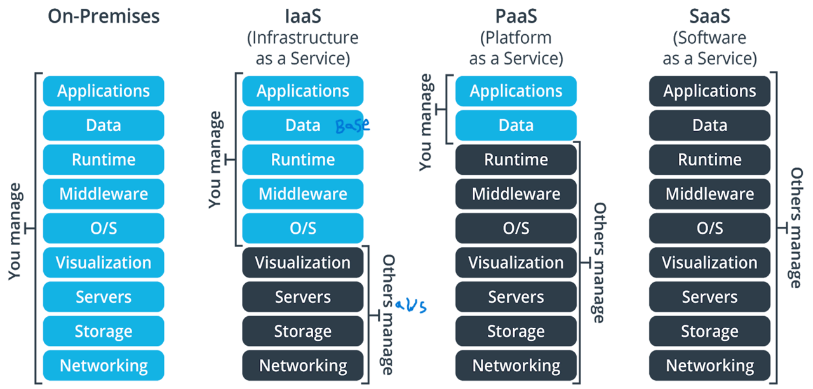
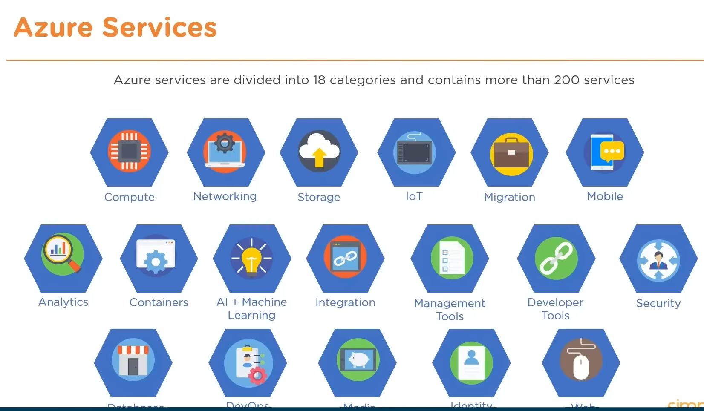
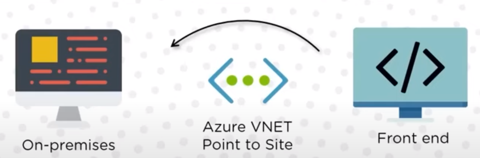

https://www.youtube.com/watch?v=wUMgvQISy0k&t=5120s

**Cloud computing models** vary: Infrastructure as a Service (IaaS), Platform as a Service (PaaS), and Software as a Service (SaaS). Manage your cloud computing service level via the surrounding management layer.  

**IaaS stands for Infrastructure-as-a-Service**, which means that you can access and use cloud-based resources such as servers, storage, and networking on demand, without having to buy or manage them yourself. You only pay for what you use, and you have full control over the configuration and operation of the resources. You are responsible for installing and maintaining the operating system, middleware, applications, and data on the resources. Some use cases for IaaS are:
- like Azure Virtual Machine You have full control and responsibility over the configuration and operation of the VMs, including the operating system, middleware, applications, and data.
- Hosting websites or web applications that need to scale up or down quickly according to demand
- Running big data analytics or high-performance computing workloads that require large amounts of processing power or storage
- Creating test or development environments that can be easily provisioned and disposed of
- Implementing disaster recovery or backup solutions that can replicate data across multiple locations

**PaaS stands for Platform-as-a-Service**, which means that you can access and use cloud-based tools and services to develop, run, and manage applications without having to worry about the underlying infrastructure. The cloud provider manages and maintains the servers, storage, networking, operating system, middleware, and runtime environment for you. You only pay for the platform services that you use, and you have more flexibility and productivity in developing and deploying applications. You are responsible for writing and managing the code, data, and application logic of your applications. Some use cases for PaaS are:

- Developing and hosting web or mobile applications that can leverage built-in features such as security, scalability, availability, and integration
- Creating and running microservices or container-based applications that can be easily deployed and orchestrated across multiple environments
- Building and testing applications using various languages, frameworks, and tools that are supported by the platform
- Automating business processes or workflows using cloud-based software components or APIs.  

**SaaS stands for Software-as-a-Service**, which means that you can access and use cloud-based  application software that is ready to use and delivered over the internet. The cloud provider manages and maintains the infrastructure, platform, and software for you. You only pay for the software service that you use, and you have no control or responsibility over the technical aspects of the software. You can access the software from any device and location, and you can benefit from the features and updates that the provider offers. You are responsible for configuring and using the software according to your needs and preferences. Some use cases for SaaS are:
- Using online office applications such as email, word processing, spreadsheet, or presentation software that can be accessed from any browser or device
- Using online collaboration tools such as video conferencing, file sharing, or project management software that can facilitate teamwork and communication
- Using online business applications such as customer relationship management (CRM), enterprise resource planning (ERP), or human resource management (HRM) software that can automate and optimize various business functions
- Using online entertainment applications such as streaming music, video, or gaming software that can provide content and services on demand 

The **middleware layer** is software that lies between the operating system and the applications, enabling communication and data management for distributed applications. The **runtime layer** is the environment in which the applications execute and interact with the hardware and the operating system.  

---------
**Deploying Public, Private, Or Hybrid Clouds**
Cloud Computing happens on a public cloud, private cloud, or hybrid cloud. Governance and security are crucial to computing on the cloud, whether the cloud is in your company’s firewall or not.  

**Public clouds** are virtualized data centers outside of your company’s firewall. Generally, a service provider makes resources available to companies, on demand, over the public Internet.  
**Private** clouds are virtualized cloud data centers inside your company’s firewall. It may also be a private space dedicated to your company within a cloud provider’s data center.  
**Hybrid** clouds combine aspects of both public and private clouds. 

------
**Cloud Computing Characteristics and its advantages**  
**Measured service**: You only pay for the cloud resources you use, and you can **monitor** and **control** your usage and costs (on demand and pay-as-you-go ).  
**self-service and Broad network access**: 
- You can access and use cloud services **whenever** you need them, without having to contact the provider or wait for approval.
- You can access cloud services from **anywhere** and from any device, as long as you have an internet connection.  

**Resource pooling**: The provider uses a large **pool of resources** (such as servers, storage, and networks) to serve multiple customers, and allocates them dynamically according to demand(you can **configration** any server based on your need).  
**Rapid elasticity**: You can **scale up or down** the amount of cloud resources you use, depending on your needs, without any limitations or delays.  
**Standardized interfaces**. Cloud services should have standardized APIs, which provide instructions on how two application or data sources can communicate with each other. A standardized interface lets the customer more easily link cloud services together.  
**Reliability and availability**: You can avoid downtime and data loss by using cloud services that have backup, recovery, and redundancy features. You can also access your data and applications from anywhere, anytime.every region (it is the country) has number of availabilty zone to make redundancy. 
**Innovation and scalability**: You can experiment and test new ideas and solutions by using cloud services that are flexible and customizable. You can also grow and expand your business by using cloud services that are scalable and adaptable.  

-------

**Cloud Computing Issues**
Cloud computing issues span models (IaaS, PaaS, or SaaS) and types (public, private, or hybrid). Computing on the cloud requires vigilance about security, manageability, standards, governance, and compliance:

**Downtime**: Since cloud computing depends on the internet connection, any network or service outage can affect your access to the cloud services. This can cause disruption, delay, or loss of data for your business. According to a survey, 25% of businesses reported that average hourly downtime costs them between $301,000 and $400,0001.  
**Security and privacy**: When you use cloud computing, you entrust your data and applications to a third-party provider, which may pose some risks to their security and privacy. Although cloud providers use encryption, authentication, and firewall features to protect your data, they may still be vulnerable to cyberattacks, data breaches, or insider threats. You also need to comply with the regulations and standards of the regions where your data is stored and processed.  
**Vendor lock-in**: When you use cloud computing, you may become dependent on the specific features, tools, and services of your cloud provider. This can make it difficult or costly to switch to another provider or migrate back to your own infrastructure. You may also face compatibility issues or performance degradation when you use different cloud platforms or services.  
**Limited control and flexibility**: When you use cloud computing, you have less control and flexibility over the technical aspects of the cloud infrastructure, platform, and software. You have to accept the policies, updates, and changes that the cloud provider imposes on you. You may also have limited customization options or configuration settings for the cloud services.  

----
## AWS
EC2 stands for Elastic Compute Cloud, which is a service that provides scalable and flexible computing resources on demand. EC2 instances are virtual servers that run on the AWS cloud infrastructure. You can launch, stop, and terminate instances as needed, and only pay for the resources you use.

**Serverless** in AWS means that you can run your code or applications in the cloud without having to provision or manage any servers. AWS provides the infrastructure and services that handle the execution, scaling, and availability of your code or applications. You only pay for the resources you use when your code or applications are running. Some examples of serverless services in AWS are AWS Lambda, Amazon API Gateway, Amazon S3, and Amazon DynamoDB. 

**A fully managed service** is a cloud service that does everything for you, from setup to maintenance. You just use the service and pay for it. For example, Azure SQL Database is a fully managed service for relational databases. You don’t have to worry about the software, servers, or networking. Azure handles them for you. You just write and run SQL queries. A fully managed service is different from a self-managed or partially managed service, where you have some control and responsibility. It is also different from a serverless service, where you don’t use any servers, and the service scales automatically. A fully managed service may use servers, but you don’t see them.  

**The difference between a fully managed service and a serverless service** is the level of abstraction and automation they provide for hosting and running applications in the cloud. A fully managed service gives you more visibility and control over the underlying resources, such as servers, storage, or networking, but also requires you to manage some aspects of the service, such as scaling, availability, or updates. A serverless service hides the underlying resources from you, and handles the execution, scaling, and availability of your code or applications automatically. You only pay for the resources you use when your code or applications are running. For example, Azure SQL Database is a fully managed service that lets you create and use relational databases in the cloud, but you still have to choose the size, performance, and location of your database. Azure Functions is a serverless service that lets you create and run functions in the cloud, but you don’t have to worry about the infrastructure, platform, or software behind the functions.  

There are five main types of EC2 instances, each optimized for a different use case. They are:

**General Purpose**: CPU to memory ratio is balanced. Provides low to medium traffic web servers, small to medium databases and is ideal for testing and development.Largest instance size: Standard_D64 v3 256 GB Memory and 1600 GB SSD Temp Storage.  
**Compute Optimized**: High CPU to memory ratio. Best suited for medium traffic web servers, application servers, batch processes and network appliances.Largest instance size: Standard_F72s V2 144 GB Memory and 576 GB SSD Temp Storage.   
**Memory Optimized**: High memory to CPU ratio. Best suited for relational database servers, in-memory analytics and medium to large caches.Largest instance size: Standard_M128m 3892 GB Memory and 14,336 GB SSD Temp Storage.
**GPU**: Virtual Machines that specialize in heavy graphic rendering and video editing. It also helps with model training and inferencing with deep learning. Largest instance size: Standard_ND24rs 448 GB Memory and 2948 GB SSD Temp Storage 4 GPUs and 96 GB Memory.   
**Storage Optimized**: Provides high disk IO and throughput. Best suited for Big Data, NoSQL and SQL Databases.Largest instance size:Standard_L32s 256 GB Memory and 5630 GB SSD Temp Storage. 
**High Performance Compute**:Provides Azure's fastest and powerful CPU virtual machines with optional high throughput interfaces.Largest instance size: Standard_L32s224 GB Memory and 2000 GB SSD Temp Storage.
To choose the best EC2 instance type and size for your needs(this is determined by **solution architect** who determined it based on the appliction needs), you need to consider several factors, such as:

- The requirements of your application or workload, such as the amount of CPU, memory, storage, and networking resources needed, the type of processing or computation involved, and the scalability and availability needs.   
- The budget and cost-effectiveness of your solution, such as the amount of money you are willing to spend, the pricing model and options available, and the trade-off between performance and cost.   
- The features and capabilities of the instance type and size, such as the generation, processor, accelerator, storage, and networking options, and the compatibility and support for your operating system and software.  

----
## azure 
Integral Microsoft Azure service domains are the core areas of cloud computing services that Azure offers to its customers. They are:

**Compute**: This domain provides the ability to run applications and workloads on virtual machines, containers, or serverless platforms. Azure offers various compute services, such as Azure Virtual Machines, Azure Kubernetes Service, Azure Functions, and Azure App Service. 
- **Virtual machines** are like computers that run in the cloud. You can choose the size, operating system, and software of your virtual machines, and you can access them from anywhere. Azure Virtual Machines is a service that lets you create and manage virtual machines in Azure.
- **Containers** are like packages that contain everything your application needs to run, such as code, libraries, and settings. You can run multiple containers on the same virtual machine or across different virtual machines. Azure Kubernetes Service is a service that lets you create and manage clusters of containers in Azure using Kubernetes, which is a popular open-source tool for orchestrating containers.
- **Serverless platforms** are like environments that run your code without requiring you to manage any servers or infrastructure. You only pay for the resources you use when your code is executed. Azure Functions is a service that lets you create and run serverless functions in Azure, which are small pieces of code that can be triggered by events, such as HTTP requests, timers, or messages. Azure App Service is a service that lets you create and run serverless web apps, mobile app backends, or APIs in Azure, which are applications that can handle requests from users or other applications.  
- **Cloud service** is a service that lets you create and deploy scalable web and worker roles as virtual machines. Web roles are used for hosting web applications, and worker roles are used for background tasks. Cloud service handles the provisioning, load balancing, and health monitoring of the virtual machines for you. You can use Cloud service to run applications that require high availability, scalability, and compatibility with the Windows platform1.
- **Service fabric** is a service that lets you create and manage clusters of microservices and containers. Microservices are small, independent, and loosely coupled services that communicate with each other. Containers are packages that contain everything your application needs to run, such as code, libraries, and settings. Service fabric provides features such as service discovery, orchestration, state management, and fault tolerance for your microservices and containers. You can use Service fabric to run applications that require high performance, reliability, and flexibility across different platforms2.
- **Functions** is a service that lets you create and run serverless functions in the cloud. Serverless functions are small pieces of code that are triggered by events, such as HTTP requests, timers, or messages. Functions handles the scaling, hosting, and execution of the functions for you. You only pay for the resources you use when your functions are running. You can use Functions to run applications that require low latency, high scalability, and minimal infrastructure 

**Networking**: This domain provides the ability to connect and secure applications and resources across Azure and other locations. Azure offers various networking services, such as Azure Virtual Network, Azure Load Balancer, Azure VPN Gateway, and Azure Firewall.  
- **Azure CDN** is a service that lets you deliver web content to users faster and more reliably by caching it on edge servers that are closer to the users. Azure CDN can also optimize dynamic content that can’t be cached by using network enhancements. You can use Azure CDN to improve the performance, availability, and security of your web applications, such as websites, streaming media, or gaming software. 
- **Azure VNET** is a service that lets you create and manage **private networks** in Azure, where you can deploy and communicate with your Azure resources, such as virtual machines, containers, or web apps. You can also connect your Azure VNET to your **on-premises network** or to other Azure VNETs using VPN, ExpressRoute, or peering1. Azure VNET provides features such as address space, subnets, regions, subscription, and network security groups to help you segment and secure your network2. Azure VNET is the fundamental building block for your private network in Azure 
- **Azure Virtual Network**: This service lets you create and manage private networks in Azure, where you can deploy and communicate with your Azure resources, such as virtual machines, containers, or web apps. You can also connect your virtual networks to your on-premises network or to other virtual networks using VPN, ExpressRoute, or peering.
- **Azure ExpressRoute**: This service lets you create and manage dedicated and private connections from your on-premises network to your Azure virtual network using a third-party provider. You can use it to achieve higher bandwidth, lower latency, and more reliability than VPN connections. You can also use it to access other Microsoft cloud services, such as Office 365 or Dynamics 365.  
- **Azure DNS**: This service lets you host and manage your domain names in Azure, which are the names that identify your websites or applications on the internet. You can use it to register, renew, or transfer your domain names, and to configure your DNS records, such as A, CNAME, or MX records. You can also use it to ensure fast and reliable DNS responses and availability for your domain names.  

**Storage**: This domain provides the ability to store and access data in different formats and scenarios. Azure offers various storage services, such as Azure Blob Storage, Azure File Storage, Azure Disk Storage, and Azure Data Lake Storage.  
- **Azure Blob Storage**: This service lets you store and retrieve large amounts of unstructured data, such as images, videos, documents, or logs. You can use it for scenarios such as backup, archiving, data lake, or media streaming1 with their metadata.    
**Azure Disk Storage**: This service lets you attach virtual disks to your virtual machines, where you can store and run your applications and data. You can use it for scenarios such as databases, file systems, or web servers2.
- **Azure File Storage**: This service lets you create and share file shares in the cloud, where you can store and access files using the SMB protocol. You can use it for scenarios such as migrating legacy applications, sharing data across on-premises and cloud, or implementing distributed file systems3.
- **Azure Data Lake Storage**: This service lets you store and analyze large amounts of structured and unstructured data in a scalable and secure data lake. You can use it for scenarios such as big data analytics, machine learning, or data warehousing4.
- **Azure Queue Storage**: This service lets you create and manage queues of messages, where you can exchange data between different applications or services. You can use it for scenarios such as decoupling components, enabling asynchronous processing, or implementing workflows.
- **Azure Table Storage**: This service lets you store and query structured or semi-structured data using a key-value or NoSQL model. You can use it for scenarios such as storing application settings, logging data, or metadata. 

**Database**: This domain provides the ability to store and manage structured and unstructured data using relational and non-relational databases. Azure offers various database services, such as Azure SQL Database, Azure Cosmos DB, Azure Database for MySQL, and Azure Database for PostgreSQL. 
- **Azure SQL Database**: This service lets you create and use relational databases that are compatible with **SQL Server**. You can use it to store and query structured or semi-structured data using SQL language. You can also benefit from features such as high availability, scalability, security, and intelligence1.Uses **built-in intelligence** to learn about the user's database patterns and helps improve performance and protection.Users can **import** and **migrate** bulk data with ease, so that it can be used for analytics, reporting and intelligent applications.
- **Azure Cosmos DB**: This service lets you create and use non-relational databases that support multiple data models and APIs. You can use it to store and query unstructured or schema-less data using SQL, MongoDB, Cassandra, Gremlin, or Table APIs. You can also benefit from features such as global distribution, low latency, and consistency2.
- **Azure Database for MySQL**: This service lets you create and use relational databases that are compatible with MySQL. You can use it to store and query structured or semi-structured data using MySQL language. You can also benefit from features such as high availability, scalability, security, and performance3.
- **Azure Database for PostgreSQL**: This service lets you create and use relational databases that are compatible with PostgreSQL. You can use it to store and query structured or semi-structured data using PostgreSQL language. You can also benefit from features such as high availability, scalability, security, and performance4.
- **Azure Database for MariaDB**: This service lets you create and use relational databases that are compatible with MariaDB. You can use it to store and query structured or semi-structured data using MariaDB language. You can also benefit from features such as high availability, scalability, security, and performance5.
- **Azure Cache for Redis**: This service lets you create and use in-memory databases that are compatible with Redis. You can use it to store and access data using key-value pairs or other data structures. You can also benefit from features such as high performance, scalability, and integration.

**Analytics**: This domain provides the ability to process and analyze large amounts of data using various tools and frameworks. Azure offers various analytics services, such as Azure Synapse Analytics, Azure Databricks, Azure HDInsight, and Azure Data Factory.

- **Azure Synapse Analytics**: This service lets you create and use a limitless analytics service that combines data warehousing, data lake, and data integration. You can use it to query and analyze structured and unstructured data using SQL, Spark, or other languages. You can also benefit from features such as serverless on-demand queries, dedicated SQL pools, and code-free data pipelines1.
- **Azure Databricks**: This service lets you create and use a fast, easy, and collaborative Apache Spark based analytics service. You can use it to process and analyze big data using Spark, Python, R, or Scala. You can also benefit from features such as interactive notebooks, integrated workflows, and enterprise-grade security
- **Azure Stream Analytics**: This service lets you create and use a real-time data stream processing service that can handle millions of events per second. You can use it to analyze data from various sources, such as IoT devices, sensors, or applications. You can also benefit from features such as time windowing, complex event processing, and built-in machine learning.
- **Azure Data Factory**: This service lets you create and use a hybrid data integration service to orchestrate and automate data movement and transformation. You can use it to connect to various data sources, such as Azure Blob Storage, Azure SQL Database, or Azure Cosmos DB. You can also benefit from features such as code-free data pipelines, data lineage, and data quality
- **Azure Data Lake Storage**: This service lets you create and use a scalable and secure data lake for high-performance analytics. You can use it to store and access large amounts of structured and unstructured data using the Hadoop Distributed File System (HDFS) protocol. You can also benefit from features such as multi-protocol access, hierarchical namespace, and encryption.

**AI and Machine Learning**: This domain provides the ability to build and deploy intelligent applications and models using artificial intelligence and machine learning. Azure offers various AI and ML services, such as Azure Machine Learning, Azure Cognitive Services, Azure Bot Service, and Azure Cognitive Search.  
**IoT and Edge**: This domain provides the ability to connect and manage devices and sensors, and run applications and analytics at the edge. Azure offers various IoT and edge services, such as Azure IoT Hub, Azure IoT Central, Azure IoT Edge, and Azure Sphere.
**Identity and Security**: This domain provides the ability to protect and manage the identity and access of users and resources, and to monitor and respond to threats and incidents. Azure offers various identity and security services, such as Azure Active Directory, Azure Key Vault, Azure Sentinel, and Azure Security Center.  
**Development and DevOps**: This domain provides the ability to develop, test, deploy, and manage applications and services using various tools and methodologies. Azure offers various development and DevOps services, such as Azure DevOps, Azure GitHub, Azure Visual Studio, and Azure PowerShell.  

-----
**azure use cases**  
- Hosting websites or web applications that can scale up or down according to demand and traffic
- Storing and processing large amounts of data using databases, data lakes, or analytics tools
- Building and deploying intelligent applications using artificial intelligence and machine learning
- Developing, testing, deploying, and managing applications and services using various tools and methodologies
- Connecting and managing devices and sensors, and running applications at the edge of the network
- Protecting and managing the identity and access of users and resources, and monitoring and responding to threats and incidents

----
**What are the deployment environments offered by Azure?**  

**Staging Environment**  
- It provides a platform to validate changes to your application before it can be made live in the production environment.  
- In this stage, the app can be identified using the Azure's Globally Unique Identifier (GUID) in URL form (GUID.cloudapp.net).

**Production Environment**  
- This environment is used to store the live application  
- It can be differentiated from the staging environment with an URL that's more DNS friendly (servicename.cloudapp.net).

**What are the advantages of Scaling in Azure?**
- Azure performs scaling with the help of a feature known as Autoscaling. Autoscaling helps to deal with changing demands in Cloud Services, Mobile Services, Virtual Machines and Websites.Maximizes application performance.Scale up or down based on demand.Schedule scaling to particular time periods. Highly cost-effective.

**How can Azure handle this situation?** A client wants the front end of his/ her application to be hosted on Azure, but wants the
database to be hosted on-premises
- The ideal solution in this scenario is to use Azure VNET based "Point to Site". It's best suited for scenarios where there are only a limited number of resources that need to be connected

